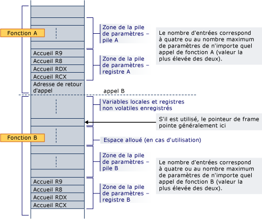

# Allocation de piles
Prologue d’une fonction est responsable de l’allocation d’espace de pile pour les variables locales, les registres enregistrés, paramètres de la pile et les paramètres de Registre.  
  
 La zone paramètre est toujours en bas de la pile (même si alloca est utilisé), afin qu’il s’agit toujours adjacente à l’adresse de retour pendant un appel de fonction. Il contient au moins quatre entrées, mais toujours suffisamment d’espace pour contenir tous les paramètres requis par n’importe quelle fonction qui peut être appelée. Notez que l’espace est toujours alloué pour les paramètres de Registre, même si les paramètres proprement dits ne sont jamais hébergés dans la pile ; un appelant est garanti qu’espace a été alloué pour tous ses paramètres. Adresses personnelles sont requis pour les arguments de Registre pour une zone contiguë soit disponible au cas où la fonction appelée doit prendre l’adresse de la liste d’arguments (va_list) ou un argument particulier. Cette zone fournit également un emplacement pratique pour enregistrer des arguments de Registre pendant l’exécution de la conversion de code et en tant qu’option de débogage (par exemple, rend les arguments faciles à trouver pendant le débogage s’ils sont stockés à leur adresse d’origine dans le code de prologue). Même si la fonction appelée possède moins de 4 paramètres, ces 4 emplacements de pile sont en réalité détenus par la fonction appelée et peuvent être utilisées par la fonction appelée à d’autres fins que l’enregistrement des valeurs de registres de paramètre.  Par conséquent, l’appelant peut enregistrer les informations dans cette région de pile après un appel de fonction.  
  
 Si l’espace alloué dynamiquement (alloca) dans une fonction, un Registre non volatil doit être utilisé comme pointeur de frame pour marquer la base de la partie fixe de la pile et qui s’inscrivent doit être enregistré et initialisé dans le prologue. Notez que lorsque alloca est utilisé, les appels au même appelé à partir de l’appelant même peuvent avoir des adresses d’origine différentes pour leurs paramètres de Registre.  
  
 La pile sera toujours maintenue 16 octets alignés, sauf dans le prologue (par exemple, une fois que l’adresse de retour est l’objet d’un push) et à l’endroit indiqué dans [Types de fonction](../build/function-types.md) pour une certaine classe de fonctions de trame.  
  
 Voici un exemple de la disposition de pile où la fonction A appelle un non-feuille fonction prologue de B. la fonction A a déjà alloué espace pour tous les paramètres de Registre et de pile requis par B en bas de la pile. L’appel exécute un push de l’adresse de retour et le prologue de B alloue de l’espace pour ses variables locales, les registres non volatils et l’espace nécessaire pour qu’il puisse appeler les fonctions. Si B utilise alloca, l’espace est alloué entre le Registre local de la variable/non volatile zone de sauvegarde et de la zone paramètre de la pile.  
  
   
  
 Lorsque la fonction B appelle une autre fonction, l’adresse de retour est envoyée juste en dessous de l’adresse personnelle pour RCX.  
  
## Voir aussi  
 [Utilisation de la pile](../build/stack-usage.md)