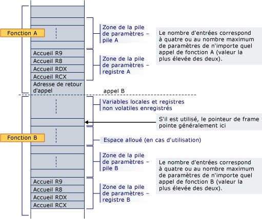

# Utilisation de la pile x64

Toute mémoire au-delà de l’adresse actuelle du RER est considérée comme volatile : l’OS, ou un débbuggeur, peut remplacer cette mémoire lors d’une session de débâage de l’utilisateur, ou un gestionnaire d’interruption. Ainsi, le RER doit toujours être réglé avant d’essayer de lire ou d’écrire des valeurs sur un cadre de pile.

Cette section traite de l’attribution de l’espace de pile pour les variables locales et de **l’alloca** intrinsèque.

## Allocation de piles

Le prolog d’une fonction est responsable de l’attribution de l’espace de pile pour les variables locales, les registres enregistrés, les paramètres de pile et les paramètres d’enregistrement.

La zone de paramètre est toujours au `alloca` bas de la pile (même si elle est utilisée), de sorte qu’elle sera toujours adjacente à l’adresse de retour lors de tout appel de fonction. Il contient au moins quatre entrées, mais toujours assez d’espace pour contenir tous les paramètres nécessaires par toute fonction qui peut être appelé. Notez que l’espace est toujours alloué pour les paramètres du registre, même si les paramètres eux-mêmes ne sont jamais homé à la pile; un callee est garanti que l’espace a été alloué pour tous ses paramètres. Les adresses à domicile sont requises pour les arguments du registre afin qu’une zone contigue soit disponible au cas où la fonction appelée doit prendre l’adresse de la liste d’arguments (va_list) ou d’un argument individuel. Cette zone fournit également un endroit pratique pour enregistrer les arguments d’enregistrement pendant l’exécution de thunk et comme une option de débogage (par exemple, il rend les arguments faciles à trouver pendant le débogage s’ils sont stockés à leurs adresses à la maison dans le code de prolog). Même si la fonction appelée a moins de 4 paramètres, ces 4 emplacements de pile sont effectivement possédés par la fonction appelée, et peuvent être employés par la fonction appelée à d’autres fins en plus d’enregistrer les valeurs de registre des paramètres.  Ainsi, l’appelant ne peut pas enregistrer d’informations dans cette région de pile à travers un appel de fonction.

Si l’espace est`alloca`alloué dynamiquement ( ) dans une fonction, alors un registre non volatile doit être utilisé comme pointeur de cadre pour marquer la base de la partie fixe de la pile et que le registre doit être enregistré et paralysé dans le prolog. Notez `alloca` que lorsqu’il est utilisé, les appels à la même callee à partir du même appelant peuvent avoir des adresses à domicile différentes pour leurs paramètres de registre.

La pile sera toujours maintenue 16-byte aligné, sauf dans le prolog (par exemple, après l’adresse de retour est poussé), et sauf lorsqu’il est indiqué dans [les types](#function-types) de fonction pour une certaine classe de fonctions de cadre.

Ce qui suit est un exemple de la disposition de la pile où la fonction A appelle une fonction non-feuille B. Fonction A prolog a déjà alloué de l’espace pour tous les paramètres de registre et de pile requis par B au bas de la pile. L’appel pousse l’adresse de retour et le prolog de B alloue de l’espace pour ses variables locales, les registres non volatiles, et l’espace nécessaire pour qu’il appelle des fonctions. Si B `alloca`utilise, l’espace est alloué entre la zone d’enregistrement variable/nonvolatile locale et la zone de pile de paramètres.

Lorsque la fonction B appelle une autre fonction, l’adresse de retour est poussée juste en dessous de l’adresse d’accueil pour RCX.

## Construction dynamique de la zone de pile de paramètres

Si un pointeur de cadre est utilisé, l’option existe pour créer dynamiquement la zone de pile de paramètres. Cela ne se fait pas actuellement dans le compilateur x64.

## Types de fonction

Il existe essentiellement deux types de fonctions. Une fonction qui nécessite un cadre de pile est appelée *fonction de cadre.* Une fonction qui ne nécessite pas un cadre de pile est appelée *fonction de feuille.*

Une fonction de cadre est une fonction qui alloue de l’espace de pile, appelle d’autres fonctions, enregistre des registres non volontaires, ou utilise la manipulation d’exception. Il nécessite également une entrée de table de fonction. Une fonction de cadre nécessite un prolog et une épilog. Une fonction de cadre peut répartir dynamiquement l’espace de pile et peut employer un pointeur de cadre. Une fonction cadre a toutes les capacités de cette norme d’appel à sa disposition.

Si une fonction de cadre n’appelle pas une autre fonction, elle n’est pas tenue d’aligner la pile (référencée dans [l’allocation de pile de](#stack-allocation)section ).

Une fonction de feuille est une fonction qui ne nécessite pas une entrée de table de fonction. Il ne peut pas apporter de modifications à des registres non volontaires, y compris le RER, ce qui signifie qu’il ne peut pas appeler des fonctions ou allouer de l’espace de pile. Il est permis de laisser la pile non alignée pendant qu’elle s’exécute.

## alignement malloc

[malloc](../c-runtime-library/reference/malloc.md) est garanti de retourner la mémoire qui est convenablement aligné pour stocker tout objet qui a un alignement fondamental et qui pourrait tenir dans la quantité de mémoire qui est allouée. Un *alignement fondamental* est un alignement qui est inférieur ou égal au plus grand alignement qui est soutenu par la mise en œuvre sans spécification d’alignement. (Dans Visual C, c’est l’alignement requis `double`pour un , ou 8 octets. Dans le code qui cible les plates-formes 64 bits, c’est 16 octets.) Par exemple, une allocation de quatre pare-soi serait alignée sur une limite qui prend en charge tout objet à quatre ou moins.

Visual CMMD permet les types qui ont *un alignement étendu,* qui sont également connus sous le nom de types *suralignés.* Par exemple, les [__m128](../cpp/m128.md) types de `__m256`LSS __m128 et, `__declspec(align( n ))` `n` et les types qui sont déclarés en utilisant où est supérieur à 8, ont un alignement étendu. L’alignement de mémoire sur une limite qui convient à `malloc`un objet qui nécessite un alignement prolongé n’est pas garanti par . Pour allouer la mémoire pour les types suralignés, utilisez [_aligned_malloc](../c-runtime-library/reference/aligned-malloc.md) et fonctions connexes.

## alloca

[_alloca](../c-runtime-library/reference/alloca.md) est nécessaire d’être aligné 16-byte et en outre nécessaire pour utiliser un pointeur de cadre.

La pile qui est allouée doit inclure de l’espace après lui pour les paramètres des fonctions appelées ultérieurement, comme discuté dans [Stack Allocation](#stack-allocation).

## Voir aussi

[Conventions des logiciels x64](../build/x64-software-conventions.md) 
[Aligner](../cpp/align-cpp.md) 
[__declspec](../cpp/declspec.md)
