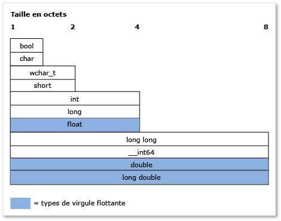

# <a name="c-type-system"></a>C++ type system

The concept of *type* is very important in C++. Chaque variable, argument de fonction et valeur de retour de fonction doit avoir un type pour être compilé. En outre, chaque expression (y compris les valeurs littérales) reçoit implicitement un type du compilateur avant d'être évaluée. Some examples of types include **int** to store integral values, **double** to store floating-point values (also known as *scalar* data types), or the Standard Library class [std::basic_string](../standard-library/basic-string-class.md) to store text. You can create your own type by defining a **class** or **struct**. Le type spécifie la quantité de mémoire qui sera allouée à la variable (ou au résultat de l’expression), les types de valeurs qui peuvent être stockés dans cette variable, la façon dont ces valeurs (en tant que séries de bits) sont interprétées et les opérations qu’il y est possible d’exécuter. Cet article contient une présentation informelle des principales fonctionnalités du système de type C++.

## <a name="terminology"></a>Terminologie

**Variable**: The symbolic name of a quantity of data so that the name can be used to access the data it refers to throughout the scope of the code where it is defined. In C++, *variable* is generally used to refer to instances of scalar data types, whereas instances of other types are usually called *objects*.

**Object**: For simplicity and consistency, this article uses the term *object* to refer to any instance of a class or structure, and when it is used in the general sense includes all types, even scalar variables.

**POD type** (plain old data): This informal category of data types in C++ refers to types that are scalar (see the Fundamental types section) or are *POD classes*. Une classe POD ne comporte pas de données membres static qui ne sont pas également des POD et ne comporte également aucun constructeur défini par l'utilisateur, aucun destructeur défini par l'utilisateur ou aucun opérateur d'assignation défini par l'utilisateur. En outre, une classe POD n'a aucune fonction virtuelle, aucune classe de base et aucune donnée membre non static privée ou protégée. Les types POD sont souvent utilisés pour l'échange de données externes, par exemple avec un module écrit en langage C (disposant de types POD uniquement).

## <a name="specifying-variable-and-function-types"></a>Spécification des types de variable et de fonction

C++ is a *strongly typed* language and it is also *statically-typed*; every object has a type and that type never changes (not to be confused with static data objects).
**When you declare a variable** in your code, you must either specify its type explicitly, or use the **auto** keyword to instruct the compiler to deduce the type from the initializer.
**When you declare a function** in your code, you must specify the type of each argument and its return value, or **void** if no value is returned by the function. L’exception se produit lorsque vous utilisez des modèles de fonction, qui autorisent les arguments de types arbitraires.

Après avoir commencé par déclarer une variable, vous ne pouvez pas modifier son type à un stade ultérieur. Toutefois, vous pouvez copier la valeur de la variable ou la valeur de retour d'une fonction dans une autre variable d'un type différent. Such operations are called *type conversions*, which are sometimes necessary but are also potential sources of data loss or incorrectness.

Lorsque vous déclarez une variable de type POD, nous vous recommandons fortement de l'initialiser, ce qui permet de lui attribuer une valeur initiale. Tant que vous n'avez pas initialisé une variable, elle a la valeur « garbage » qui se compose des bits, quels qu'ils soient, présents précédemment dans cet emplacement mémoire. Il s'agit d'un aspect important de C++ à ne pas oublier, surtout si vous venez d'un autre langage qui gère automatiquement l'initialisation. Lorsque vous déclarez une variable de type de classe non POD, le constructeur traite l'initialisation.

L'exemple suivant présente des déclarations de variable simples avec quelques descriptions. L'exemple montre également comment le compilateur utilise les informations de type pour autoriser ou interdire certaines opérations ultérieures sur la variable.

```cpp
int result = 0;              // Declare and initialize an integer.
double coefficient = 10.8;   // Declare and initialize a floating
                             // point value.
auto name = "Lady G.";       // Declare a variable and let compiler
                             // deduce the type.
auto address;                // error. Compiler cannot deduce a type
                             // without an intializing value.
age = 12;                    // error. Variable declaration must
                             // specify a type or use auto!
result = "Kenny G.";         // error. Can’t assign text to an int.
string result = "zero";      // error. Can’t redefine a variable with
                             // new type.
int maxValue;                // Not recommended! maxValue contains
                             // garbage bits until it is initialized.
```

## <a name="fundamental-built-in-types"></a>Types fondamentaux (intégrés)

Contrairement à certains langages, C++ n'a aucun type de base universel dont tous les autres types sont dérivés. The language includes many *fundamental types*, also known as *built-in types*. This includes numeric types such as **int**, **double**, **long**, **bool**, plus the **char** and **wchar_t** types for ASCII and UNICODE characters, respectively. Most fundamental types (except **bool**, **double**, **wchar_t** and related types) all have unsigned versions, which modify the range of values that the variable can store. For example, an **int**, which stores a 32-bit signed integer, can represent a value from -2,147,483,648 to 2,147,483,647. An **unsigned int**, which is also stored as 32-bits, can store a value from 0 to 4,294,967,295. Le nombre total de valeurs possibles dans chaque cas est identique ; seule la plage est différente.

Les types fondamentaux sont identifiés par le compilateur, qui dispose de règles intégrées régissant les opérations que vous pouvez exécuter sur ces types, ainsi que la façon dont ces types peuvent être convertis en d'autres types fondamentaux. For a complete list of built-in types and their size and numeric limits, see [Fundamental Types](../cpp/fundamental-types-cpp.md).

L'illustration suivante montre les tailles relatives des types intégrés :



Le tableau suivant répertorie les types fondamentaux les plus souvent utilisés :

|Tapez|Size|Commentaire|
|----------|----------|-------------|
|int|4 octets|Choix par défaut pour les valeurs intégrales.|
|double|8 octets|Choix par défaut pour les valeurs à virgule flottante.|
|bool|1 octet|Représente des valeurs qui peuvent être true ou false.|
|char|1 octet|À utiliser pour les caractères ASCII dans les chaînes de style C plus anciennes ou les objets std::string qui ne devront jamais être convertis en UNICODE.|
|wchar_t|2 octets|Représente les valeurs à caractères « larges » qui peuvent être encodées au format UNICODE (UTF-16 sur Windows, mais peut varier sur les autres systèmes d'exploitation). Type de caractère utilisé dans les chaînes de type `std::wstring`.|
|unsigned&nbsp;char|1 octet|C++ n'a aucun type `byte` intégré.  Utilisez le caractère non signé pour représenter une valeur d'octet.|
|unsigned int|4 octets|Option par défaut pour les bits indicateurs.|
|long long|8 octets|Représente des valeurs entières très grandes.|

## <a name="the-void-type"></a>Type void

The **void** type is a special type; you cannot declare a variable of type **void**, but you can declare a variable of type __void \*__ (pointer to **void**), which is sometimes necessary when allocating raw (un-typed) memory. However, pointers to **void** are not type-safe and generally their use is strongly discouraged in modern C++. In a function declaration, a **void** return value means that the function does not return a value; this is a common and acceptable use of **void**. While the C language required functions that have zero parameters to declare **void** in the parameter list, for example, `fou(void)`, this practice is discouraged in modern C++ and should be declared `fou()`. For more information, see [Type Conversions and Type Safety](../cpp/type-conversions-and-type-safety-modern-cpp.md).

## <a name="const-type-qualifier"></a>qualificateur de type const

Tout type intégré ou défini par l'utilisateur peut être qualifié par le mot clé const. Additionally, member functions may be **const**-qualified and even **const**-overloaded. The value of a **const** type cannot be modified after it is initialized.

```cpp

const double PI = 3.1415;
PI = .75 //Error. Cannot modify const variable.
```

The **const** qualifier is used extensively in function and variable declarations and "const correctness" is an important concept in C++; essentially it means to use **const** to guarantee, at compile time, that values are not modified unintentionally. For more information, see [const](../cpp/const-cpp.md).

A **const** type is distinct from its non-const version; for example, **const int** is a distinct type from **int**. You can use the C++ **const_cast** operator on those rare occasions when you must remove *const-ness* from a variable. For more information, see [Type Conversions and Type Safety](../cpp/type-conversions-and-type-safety-modern-cpp.md).

## <a name="string-types"></a>Types chaîne

Strictly speaking, the C++ language has no built-in string type; **char** and **wchar_t** store single characters - you must declare an array of these types to approximate a string, adding a terminating null value (for example, ASCII `'\0'`) to the array element one past the last valid character (also called a *C-style string*). Les chaînes de style C exigent beaucoup plus de code pour être écrites ou l'utilisation de fonctions de bibliothèque d'utilitaires de chaînes externes. But in modern C++, we have the Standard Library types `std::string` (for 8-bit **char**-type character strings) or `std::wstring` (for 16-bit **wchar_t**-type character strings). These C++ Standard Library containers can be thought of as native string types because they are part of the standard libraries that are included in any compliant C++ build environment. Utilisez simplement la directive `#include <string>` pour rendre ces types disponibles dans votre programme. (If you are using MFC or ATL, the CString class is also available, but is not part of the C++ standard.) The use of null-terminated character arrays (the C-style strings previously mentioned) is strongly discouraged in modern C++.

## <a name="user-defined-types"></a>Types définis par l'utilisateur

When you define a **class**, **struct**, **union**, or **enum**, that construct is used in the rest of your code as if it were a fundamental type. Il a une taille connue en mémoire, et certaines règles relatives à son utilisation s’appliquent à celui-ci pour la vérification au moment de la compilation et, au moment de l’exécution, pour la durée de vie de votre programme. Les principales différences entre les types intégrés fondamentaux et les types définis par l'utilisateur sont les suivantes :

- Le compilateur n'a pas connaissance de manière intégrée d'un type défini par l'utilisateur. It learns of the type when it first encounters the definition during the compilation process.

- Vous spécifiez les opérations qui peuvent être exécutées sur votre type et comment il peut être converti en d'autres types, en définissant (via la surcharge) les opérateurs appropriés, comme membres de classe ou comme fonctions non membres. For more information, see [Function Overloading](function-overloading.md)

## <a name="pointer-types"></a>Types de pointeur

Comme dans les toutes premières versions du langage C, C++ continue à vous permettre de déclarer une variable d'un type pointeur en utilisant le déclarateur spécial `*` (astérisque). Un type pointeur stocke l'adresse de l'emplacement dans la mémoire où la valeur réelle des données est stockée. In modern C++, these are referred to as *raw pointers*, and are accessed in your code through special operators `*` (asterisk) or `->` (dash with greater-than). This is called *dereferencing*, and which one that you use depends on whether you are dereferencing a pointer to a scalar or a pointer to a member in an object. L'utilisation des types pointeur a longtemps été l'un des aspects les plus importants et les plus perturbants du développement de programmes en C et C++. This section outlines some facts and practices to help use raw pointers if you want to, but in modern C++ it’s no longer required (or recommended) to use raw pointers for object ownership at all, due to the evolution of the [smart pointer](../cpp/smart-pointers-modern-cpp.md) (discussed more at the end of this section). Il est toujours utile et plus sûr d’utiliser des pointeurs bruts pour observer les objets. Toutefois, si vous devez les utiliser pour la propriété des objets, agissez avec précaution et tenez compte de la façon dont les objets détenus sont créés et détruits.

La première chose que vous devez savoir est que la déclaration d'une variable pointeur brut alloue uniquement la mémoire requise pour stocker une adresse de l'emplacement mémoire auquel le pointeur fait référence lorsqu'il est déréférencé. Allocation of the memory for the data value itself (also called *backing store*) is not yet allocated. En d'autres termes, lorsque vous déclarez une variable de pointeur brut, vous créez une variable d'adresse mémoire et pas une variable de données réelle. Déréférencer une variable de pointeur avant de s'assurer qu'elle contient une adresse valide pour un magasin de stockage provoque un comportement indéfini (généralement une erreur irrécupérable) dans votre programme. L'exemple suivant illustre ce type d'erreur :

```cpp
int* pNumber;       // Declare a pointer-to-int variable.
*pNumber = 10;      // error. Although this may compile, it is
                    // a serious error. We are dereferencing an
                    // uninitialized pointer variable with no
                    // allocated memory to point to.
```

L'exemple déréférence un type pointeur sans avoir de mémoire allouée pour stocker les données entières réelles, ni d'adresse mémoire valide assignée. Le code suivant corrige les erreurs suivantes :

```cpp
    int number = 10;          // Declare and initialize a local integer
                              // variable for data backing store.
    int* pNumber = &number;   // Declare and initialize a local integer
                              // pointer variable to a valid memory
                              // address to that backing store.
...
    *pNumber = 41;            // Dereference and store a new value in
                              // the memory pointed to by
                              // pNumber, the integer variable called
                              // "number". Note "number" was changed, not
                              // "pNumber".
```

L'exemple de code corrigé utilise la mémoire de la pile locale pour créer le magasin de stockage vers lequel pointe `pNumber`. Nous utilisons un type fondamental pour des raisons de simplicité. In practice, the backing store for pointers are most often user-defined types that are dynamically-allocated in an area of memory called the *heap* (or *free store*) by using a **new** keyword expression (in C-style programming, the older `malloc()` C runtime library function was used). Once allocated, these variables are usually referred to as objects, especially if they are based on a class definition. Memory that is allocated with **new** must be deleted by a corresponding **delete** statement (or, if you used the `malloc()` function to allocate it, the C runtime function `free()`).

However, it is easy to forget to delete a dynamically-allocated object- especially in complex code, which causes a resource bug called a *memory leak*. Pour cette raison, l'utilisation des pointeurs bruts est vivement déconseillée dans le C++ moderne. It is almost always better to wrap a raw pointer in a [smart pointer](../cpp/smart-pointers-modern-cpp.md), which will automatically release the memory when its destructor is invoked (when the code goes out of scope for the smart pointer); by using smart pointers you virtually eliminate a whole class of bugs in your C++ programs. Dans l'exemple suivant, supposez que `MyClass` est un type défini par l'utilisateur qui a une méthode `DoSomeWork();`publique

```cpp
void someFunction() {
    unique_ptr<MyClass> pMc(new MyClass);
    pMc->DoSomeWork();
}
  // No memory leak. Out-of-scope automatically calls the destructor
  // for the unique_ptr, freeing the resource.
```

For more information about smart pointers, see [Smart Pointers](../cpp/smart-pointers-modern-cpp.md).

For more information about pointer conversions, see [Type Conversions and Type Safety](../cpp/type-conversions-and-type-safety-modern-cpp.md).

For more information about pointers in general, see [Pointers](../cpp/pointers-cpp.md).

## <a name="windows-data-types"></a>Types de données Windows

Dans la programmation Win32 classique pour C et C++, la plupart des fonctions utilisent des typedefs spécifiques de Windows et des macros #define (définies dans `windef.h`) pour spécifier les types des paramètres et valeurs de retour. These Windows data types are mostly just special names (aliases) given to C/C++ built-in types. For a complete list of these typedefs and preprocessor definitions, see [Windows Data Types](/windows/win32/WinProg/windows-data-types). Certains de ces typedefs, par exemple HRESULT et LCID, sont utiles et descriptifs. D'autres, par exemple INT, n'ont aucune signification particulière et sont simplement des alias pour les types C++ fondamentaux. D'autres types de données Windows ont des noms qui proviennent de l'époque de la programmation en C et des processeurs 16 bits ; ils n'ont aucune finalité ou signification particulière par rapport au matériel ou aux systèmes d'exploitation modernes. There are also special data types associated with the Windows Runtime Library, listed as [Windows Runtime base data types](/windows/win32/WinRT/base-data-types). En C++ moderne, la règle générale consiste à préférer les types fondamentaux C++ sauf si le type Windows communique une certaine signification supplémentaire sur la manière dont la valeur doit être interprétée.

## <a name="more-information"></a>Informations complémentaires

Pour plus d'informations sur le système de types C++, consultez les rubriques suivantes.

|||
|-|-|
|[Types valeur](../cpp/value-types-modern-cpp.md)|Describes *value types* along with issues relating to their use.|
|[Type Conversions and Type Safety](../cpp/type-conversions-and-type-safety-modern-cpp.md)|Décrit les problèmes de conversion des types courants et indique comment les éviter.|

## <a name="see-also"></a>Voir aussi

[Welcome back to C++](../cpp/welcome-back-to-cpp-modern-cpp.md)<br/>
[Informations de référence sur le langage C++](../cpp/cpp-language-reference.md)<br/>
[Bibliothèque C++ standard](../standard-library/cpp-standard-library-reference.md)
