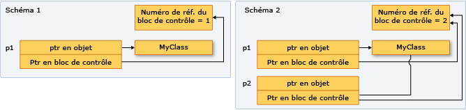

# <a name="how-to-create-and-use-sharedptr-instances"></a>Procédure : Créer et utiliser des instances shared_ptr

Le type `shared_ptr` est un pointeur intelligent de la bibliothèque standard C++ conçu pour des scénarios dans lesquels plusieurs propriétaires peuvent devoir gérer la durée de vie de l'objet en mémoire. Après avoir initialisé `shared_ptr`, vous pouvez le copier, le passer par valeur dans des arguments de fonction et l'assigner à d'autres instances `shared_ptr`. Toutes les instances pointent vers le même objet et partagent l'accès à un "bloc de contrôle" qui incrémente et décrémente le nombre de références chaque fois qu'un nouvel `shared_ptr` est ajouté, est hors de portée ou est réinitialisé. Lorsque le nombre de références atteint zéro, le bloc de contrôle supprime la ressource mémoire et lui-même.

L'illustration suivante représente plusieurs instances `shared_ptr` qui pointent vers un emplacement de mémoire.



## <a name="example-setup"></a>Exemple de configuration

Tous les exemples qui suivent supposent que vous avez inclus les en-têtes nécessaires et déclaré les types nécessaires, comme illustré ici :

```cpp
// shared_ptr-examples.cpp
// The following examples assume these declarations:
#include <algorithm>
#include <iostream>
#include <memory>
#include <string>
#include <vector>

struct MediaAsset
{
    virtual ~MediaAsset() = default; // make it polymorphic
};

struct Song : public MediaAsset
{
    std::wstring artist;
    std::wstring title;
    Song(const std::wstring& artist_, const std::wstring& title_) :
        artist{ artist_ }, title{ title_ } {}
};

struct Photo : public MediaAsset
{
    std::wstring date;
    std::wstring location;
    std::wstring subject;
    Photo(
        const std::wstring& date_,
        const std::wstring& location_,
        const std::wstring& subject_) :
        date{ date_ }, location{ location_ }, subject{ subject_ } {}
};

using namespace std;

int main()
{
    // The examples go here, in order:
    // Example 1
    // Example 2
    // Example 3
    // Example 4
    // Example 6
}
```

## <a name="example-1"></a>Exemple 1

Quand c’est possible, utilisez la fonction [make_shared](../standard-library/memory-functions.md#make_shared) pour créer un objet `shared_ptr` quand la ressource mémoire est créée pour la première fois. `make_shared` est protégé contre les exceptions. Elle utilise le même appel pour allouer de la mémoire pour le bloc de contrôle et pour la ressource, ce qui réduit la charge liées à la construction. Si vous n’utilisez pas `make_shared`, vous devez utiliser une expression `new` explicite pour créer l’objet avant de le passer au constructeur `shared_ptr`. L'exemple suivant indique différentes façons de déclarer et d'initialiser `shared_ptr` avec un nouvel objet.

[!code-cpp[stl_smart_pointers#1](../cpp/codesnippet/CPP/how-to-create-and-use-shared-ptr-instances_1.cpp)]

## <a name="example-2"></a>Exemple 2

L'exemple suivant montre comment déclarer et initialiser les instances `shared_ptr` qui prennent en charge la propriété partagée d'un objet qui a déjà été alloué par un autre `shared_ptr`. Supposons que `sp2` est un `shared_ptr` initialisé.

[!code-cpp[stl_smart_pointers#2](../cpp/codesnippet/CPP/how-to-create-and-use-shared-ptr-instances_2.cpp)]

## <a name="example-3"></a>Exemple 3

`shared_ptr` est également utile dans les conteneurs de la bibliothèque standard C++ quand vous utilisez des algorithmes qui copient des éléments. Vous pouvez encapsuler des éléments dans un `shared_ptr`, puis le copier dans d'autres conteneurs à condition que la mémoire sous-jacente soit valide tant que cela est nécessaire, et pas plus longtemps. L'exemple suivant montre comment utiliser les algorithmes `replace_copy_if` sur des instances `shared_ptr` au sein d'un vecteur.

[!code-cpp[stl_smart_pointers#4](../cpp/codesnippet/CPP/how-to-create-and-use-shared-ptr-instances_3.cpp)]

## <a name="example-4"></a>Exemple 4

Utilisez `dynamic_pointer_cast`, `static_pointer_cast` et `const_pointer_cast`, pour caster un `shared_ptr`. Ces fonctions sont semblables aux opérateurs `dynamic_cast`, `static_cast` et `const_cast`. L'exemple suivant indique comment tester le type dérivé de chaque élément dans un vecteur de `shared_ptr` de classes de base, puis copier les éléments et afficher les informations les concernant.

[!code-cpp[stl_smart_pointers#5](../cpp/codesnippet/CPP/how-to-create-and-use-shared-ptr-instances_4.cpp)]

## <a name="example-5"></a>Exemple 5

Vous pouvez passer `shared_ptr` à une autre fonction des façons suivantes :

- Passez `shared_ptr` par valeur. Il appelle le constructeur de copie, incrémente le nombre de références et fait de l'appelé un propriétaire. Cette opération induit une petite surcharge, qui peut être significative selon le nombre d’objets `shared_ptr` que vous passez. Utilisez cette option quand le contrat de code implicite ou explicite entre l’appelant et l’appelé nécessite que l’appelé soit un propriétaire.

- Passez `shared_ptr` par référence ou référence const. Dans ce cas, le nombre de références n’est pas incrémenté, et l’appelé peut accéder au pointeur tant que l’appelant n’est pas en dehors de l’étendue. Sinon, l’appelé peut décider de créer un `shared_ptr` basé sur la référence, et de devenir un propriétaire partagé. Utilisez cette option lorsque l'appelant n'a pas connaissance de l'appelé, ou lorsque vous devez passer un `shared_ptr` et que vous voulez empêcher l'opération de copie pour des raisons de performance.

- Passez le pointeur ou une référence sous-jacent(e) à l'objet sous-jacent. Ceci permet à l’appelé d’utiliser l’objet, mais ne lui permet pas de partager la propriété ou d’étendre la durée de vie. Si l’appelé crée un `shared_ptr` à partir du pointeur brut, le nouveau `shared_ptr` est indépendant de l’original et ne contrôle pas la ressource sous-jacente. Utilisez cette option lorsque le contrat entre l'appelant et l'appelé spécifie clairement que l'appelant conserve la propriété de la durée de vie de `shared_ptr`.

- Quand vous décidez comment passer un `shared_ptr`, déterminez si l’appelé doit partager la propriété de la ressource sous-jacente. Un "propriétaire" est un objet ou une fonction qui peut garder la ressource sous-jacente active tant qu'il en a besoin. Si l'appelant doit garantir que l'appelé peut prolonger la vie du pointeur au delà de la durée de vie de la fonction, utilisez le première option. Si vous ne vous préoccupez pas de si l'appelé étend la durée de vie ou non, alors effectuez une transmission par référence et laissez l'appelé la copier ou non.

- Si vous devez donner un accès à la fonction helper au pointeur sous-jacent, et que vous savez que cette fonction helper utilise simplement le pointeur et retourne avant la fonction appelante, cette fonction ne doit pas partager la propriété du pointeur sous-jacent. Elle doit simplement accéder au pointeur dans la durée de vie du `shared_ptr`de l'appelant. Dans ce cas, cela ne pose pas de problème de passer le `shared_ptr` par référence, ou de passer le pointeur brut ou une référence à l’objet sous-jacent. Passer de cette façon fournit un léger avantage en termes de performances et peut également vous aider à exprimer votre intention de programmation.

- Parfois, par exemple dans un `std::vector<shared_ptr<T>>`, vous devrez peut-être passer chaque `shared_ptr` à une expression Lambda ou un objet fonction nommé. Si l’expression lambda ou la fonction ne stocke pas le pointeur, passez le `shared_ptr` par référence pour éviter d’appeler le constructeur de copie pour chaque élément.

## <a name="example-6"></a>Exemple 6

L'exemple suivant montre comment `shared_ptr` surcharge différents opérateurs de comparaison pour activer des comparaisons de pointeur dans la mémoire qui est possédée par les instances `shared_ptr`.

[!code-cpp[stl_smart_pointers#3](../cpp/codesnippet/CPP/how-to-create-and-use-shared-ptr-instances_6.cpp)]

## <a name="see-also"></a>Voir aussi

[Pointeurs intelligents (C++ moderne)](../cpp/smart-pointers-modern-cpp.md)
