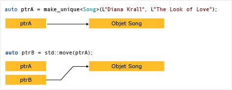

# Comment : créer et utiliser des instances unique_ptr

Un [unique_ptr](../standard-library/unique-ptr-class.md) ne partage pas son pointeur. Il ne peut pas être copié vers un autre `unique_ptr`, passé par valeur à une fonction, ou C++ utilisé dans un algorithme de bibliothèque standard qui nécessite des copies. Un `unique_ptr` peut uniquement être déplacé. Cela signifie que la propriété de la ressource mémoire est transférée à un autre `unique_ptr` et que le `unique_ptr` d'origine ne le possède plus. Il est recommandé de restreindre un objet à un seul propriétaire, car la multiplicité des propriétaires ajoute de la complexité à la logique du programme. Par conséquent, lorsque vous avez besoin d’un pointeur intelligent C++ pour un objet brut, utilisez `unique_ptr`, et lorsque vous construisez un `unique_ptr`, utilisez la fonction d’assistance [make_unique](../standard-library/memory-functions.md#make_unique) .

Le diagramme suivant illustre le transfert de propriété entre deux instances `unique_ptr`.

`unique_ptr` est défini dans l’en-tête `<memory>` C++ de la bibliothèque standard. Elle est aussi efficace qu’un pointeur brut et peut être utilisée dans les C++ conteneurs de bibliothèque standard. L’ajout d’instances de `unique_ptr` C++ à des conteneurs de bibliothèque standard est efficace, car le constructeur de déplacement du `unique_ptr` élimine la nécessité d’une opération de copie.

## Exemple 1

L'exemple suivant montre comment créer des instances `unique_ptr` et les passer entre des fonctions.

[!code-cpp[stl_smart_pointers#210](codesnippet/CPP/how-to-create-and-use-unique-ptr-instances_1.cpp)]

Ces exemples illustrent cette caractéristique de base de `unique_ptr` : il peut être déplacé, mais pas copié. Le « déplacement » transfère la propriété à un nouvel `unique_ptr` et réinitialise l'ancien `unique_ptr`.

## Exemple 2

L'exemple suivant montre comment créer des instances `unique_ptr` et les utiliser dans un vecteur.

[!code-cpp[stl_smart_pointers#211](codesnippet/CPP/how-to-create-and-use-unique-ptr-instances_2.cpp)]

Dans la boucle for de plage, remarquez que `unique_ptr` est passé par référence. Si vous essayez d'effectuer un passage par valeur ici, le compilateur génère une erreur, car le constructeur de copie `unique_ptr` est supprimé.

## Exemple 3

L'exemple suivant montre comment initialiser un `unique_ptr` qui est un membre de classe.

[!code-cpp[stl_smart_pointers#212](codesnippet/CPP/how-to-create-and-use-unique-ptr-instances_3.cpp)]

## Exemple 4

Vous pouvez utiliser [make_unique](../standard-library/memory-functions.md#make_unique) pour créer un `unique_ptr` à un tableau, mais vous ne pouvez pas utiliser `make_unique` pour initialiser les éléments du tableau.

[!code-cpp[stl_smart_pointers#213](codesnippet/CPP/how-to-create-and-use-unique-ptr-instances_4.cpp)]

Pour plus d’exemples, consultez [make_unique](../standard-library/memory-functions.md#make_unique).

## Voir aussi

[Pointeurs intelligents (C++ moderne)](smart-pointers-modern-cpp.md) 
[make_unique](../standard-library/memory-functions.md#make_unique)
