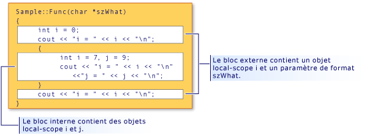

# <a name="scope-c"></a>Portée (C++)

Lorsque vous déclarez un élément de programme tel qu’une classe, une fonction ou une variable, son nom ne peut être « visible » et utilisé dans certaines parties de votre programme. Le contexte dans lequel un nom est visible est appelé sa *portée*. Par exemple, si vous déclarez une variable `x` dans une fonction, `x` est visible uniquement dans le corps de cette fonction. Il a une *portée locale*. Vous pouvez avoir d’autres variables portant le même nom dans votre programme ; tant qu’elles se trouvent dans des portées différentes, elles ne violent pas la règle de définition et aucune erreur n’est générée.

Pour les variables non statiques automatiques, la portée détermine également quand elles sont créées et détruites dans la mémoire du programme.

Il existe six types d’étendue :

- **Portée globale** Un nom global est un nom qui est déclaré en dehors d’une classe, d’une fonction ou d’un espace de noms. Toutefois, dans C++, même ces noms existent avec un espace de noms global implicite. La portée des noms globaux s’étend du point de déclaration jusqu’à la fin du fichier dans lequel ils sont déclarés. Pour les noms globaux, la visibilité est également régie par les règles de [liaison](program-and-linkage-cpp.md) qui déterminent si le nom est visible dans d’autres fichiers du programme.

- **Portée espace de noms** Un nom qui est déclaré dans un [espace de noms](namespaces-cpp.md), en dehors d’une définition de classe ou d’enum ou d’un bloc de fonction, est visible à partir de son point de déclaration jusqu’à la fin de l’espace de noms. Un espace de noms peut être défini dans plusieurs blocs dans différents fichiers.

- **Portée locale** Un nom déclaré dans une fonction ou une expression lambda, y compris les noms de paramètres, ont une portée locale. Elles sont souvent appelées « variables locales ». Elles sont uniquement visibles à partir de leur point de déclaration jusqu’à la fin de la fonction ou du corps lambda. L’étendue locale est un type d’étendue de bloc, qui est abordé plus loin dans cet article.

- **Portée** de la classe Les noms des membres de classe ont une portée de classe, qui s’étend sur toute la définition de la classe, quel que soit le point de déclaration. L’accessibilité des membres de classe est contrôlée par les **`public`** **`private`** **`protected`** Mots clés, et. Les membres publics ou protégés sont accessibles uniquement à l’aide des opérateurs de sélection de membres (**.** ou **->** ) ou des opérateurs de pointeur vers membre (**.** <strong>\*</strong> ou **->** <strong>\*</strong> ).

- **Portée** de l’instruction Les noms déclarés dans une **`for`** **`if`** instruction,, **`while`** ou **`switch`** sont visibles jusqu’à la fin du bloc d’instructions.

- **Portée** de la fonction Une [étiquette](labeled-statements.md) a une portée de fonction, ce qui signifie qu’elle est visible dans l’ensemble d’un corps de fonction avant son point de déclaration. La portée de la fonction permet d’écrire des instructions comme `goto cleanup` avant la déclaration de l' `cleanup` étiquette.

## <a name="hiding-names"></a>Masquage des noms

Vous pouvez masquer un nom en le déclarant dans un bloc englobé. Dans l'illustration suivante, `i` est redéclaré dans le bloc interne, masquant ainsi la variable associée à `i` dans la portée de bloc externe.

 <br/>
Masquage de l’étendue et du nom

La sortie du programme représentée dans l'illustration est la suivante :

```cpp
i = 0
i = 7
j = 9
i = 0
```

> [!NOTE]
> L’argument `szWhat` est considéré comme étant dans la portée de la fonction. Par conséquent, il est traité comme s'il avait été déclaré dans le bloc le plus à l'extérieur de la fonction.

## <a name="hiding-class-names"></a>Masquage des noms de classes

Vous pouvez masquer les noms de classe en déclarant une fonction, un objet, une variable ou un énumérateur dans la même portée. Toutefois, le nom de la classe est toujours accessible lorsqu’il est préfixé par le mot clé **`class`** .

```cpp
// hiding_class_names.cpp
// compile with: /EHsc
#include <iostream>
using namespace std;

// Declare class Account at global scope.
class Account
{
public:
    Account( double InitialBalance )
        { balance = InitialBalance; }
    double GetBalance()
        { return balance; }
private:
    double balance;
};

double Account = 15.37;            // Hides class name Account

int main()
{
    class Account Checking( Account ); // Qualifies Account as
                                       //  class name

    cout << "Opening account with a balance of: "
         << Checking.GetBalance() << "\n";
}
//Output: Opening account with a balance of: 15.37
```

> [!NOTE]
> Chaque fois que le nom de la classe ( `Account` ) est appelé, la classe de mots clés doit être utilisée pour le différencier du compte de la variable de portée globale. Cette règle ne s’applique pas lorsque le nom de classe apparaît à gauche de l’opérateur de résolution de portée (::). Les noms à gauche de l'opérateur de résolution de portée sont toujours considérés comme des noms de classe.

L’exemple suivant montre comment déclarer un pointeur vers un objet de type `Account` à l’aide du **`class`** mot clé :

```cpp
class Account *Checking = new class Account( Account );
```

La `Account` dans l’initialiseur (entre parenthèses) de l’instruction précédente a une portée globale ; elle est de type **`double`** .

> [!NOTE]
> La réutilisation des noms d'identificateur, comme l'indique cet exemple, est considérée comme un style de programmation médiocre.

Pour plus d’informations sur la déclaration et l’initialisation des objets de classe, consultez [classes, structures et unions](../cpp/classes-and-structs-cpp.md). Pour plus d’informations sur l’utilisation des **`new`** **`delete`** opérateurs Free-Store, consultez [opérateurs New et Delete](new-and-delete-operators.md).

## <a name="hiding-names-with-global-scope"></a>Masquage des noms avec une portée globale

Vous pouvez masquer les noms avec une portée globale en déclarant explicitement le même nom dans la portée du bloc. Toutefois, les noms de portée globale sont accessibles à l’aide de l’opérateur de résolution de portée ( `::` ).

```cpp
#include <iostream>

int i = 7;   // i has global scope, outside all blocks
using namespace std;

int main( int argc, char *argv[] ) {
   int i = 5;   // i has block scope, hides i at global scope
   cout << "Block-scoped i has the value: " << i << "\n";
   cout << "Global-scoped i has the value: " << ::i << "\n";
}
```

```Output
Block-scoped i has the value: 5
Global-scoped i has the value: 7
```

## <a name="see-also"></a>Voir aussi

[Concepts de base](../cpp/basic-concepts-cpp.md)
