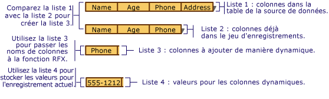

# <a name="recordset-dynamically-binding-data-columns-odbc"></a>Recordset : Liaison dynamique de colonnes de données (ODBC)

Cette rubrique s’applique aux classes ODBC MFC.

Un recordset gère la liaison des colonnes de table que vous spécifiez au moment du design, mais parfois, vous avez besoin de lier des colonnes qui vous étaient inconnues au moment du design. Cette rubrique répond aux questions suivantes :

- [À quel moment pouvez-vous avoir besoin de lier dynamiquement des colonnes à un recordset ?](#_core_when_you_might_bind_columns_dynamically)

- [Comment faire pour lier des colonnes dynamiquement au moment de l’exécution ?](#_core_how_to_bind_columns_dynamically)

> [!NOTE]
>  Cette rubrique s’applique aux objets dérivés de `CRecordset` où la récupération de lignes en bloc n’a pas été implémentée. Les techniques décrites ne sont généralement pas recommandées si vous utilisez la récupération (fetch) de lignes en bloc. Pour plus d’informations sur cette dernière, consultez [Recordset : récupération d’enregistrements en bloc (ODBC)](../../data/odbc/recordset-fetching-records-in-bulk-odbc.md).

##  <a name="_core_when_you_might_bind_columns_dynamically"></a> Quand lier des colonnes dynamiquement

> [!NOTE] 
> L’Assistant Consommateur ODBC MFC n’est pas disponible dans Visual Studio 2019 et ultérieur. Vous pouvez quand même créer un consommateur manuellement.

Au moment du design, l’Assistant Application MFC ou l’[Assistant Consommateur ODBC MFC](../../mfc/reference/adding-an-mfc-odbc-consumer.md) (depuis **Ajouter une classe**) crée des classes de recordset selon les tables et colonnes connues sur votre source de données. Les bases de données peuvent varier entre le moment auquel vous les concevez et celui auquel votre application utilise ces tables et colonnes lors de l’exécution. Un autre utilisateur ou vous-même pouvez ajouter ou supprimer une table, ou encore ajouter ou supprimer des colonnes d’une table sur laquelle le recordset de votre application s’appuie. Cela ne pose vraisemblablement aucun problème pour toutes les applications d’accès aux données, mais pour la vôtre, comment pouvez-vous gérer les modifications apportées au schéma de base de données, si ce n’est en la reconcevant et en la recompilant ? Cette rubrique a pour objectif de répondre à cette question.

Elle décrit le cas le plus courant dans lequel vous pouvez lier des colonnes dynamiquement : vous avez démarré avec un recordset basé sur un schéma de base de données connu et vous voulez gérer des colonnes supplémentaires au moment de l’exécution. La rubrique part du principe que les colonnes supplémentaires sont mappées à des membres de données de champs `CString`, cas le plus courant, même si des suggestions sont fournies pour vous aider à gérer d’autres types de données.

Avec un petit peu de code supplémentaire, vous pouvez effectuer les opérations suivantes :

- [Déterminer quelles colonnes sont disponibles au moment de l’exécution](#_core_how_to_bind_columns_dynamically).

- [Lier dynamiquement des colonnes supplémentaires à votre recordset, au moment de l’exécution](#_core_adding_the_columns).

Votre recordset contient toujours des membres de données pour les colonnes que vous connaissiez au moment du design. Il contient aussi un petit peu de code supplémentaire qui détermine dynamiquement si de nouvelles colonnes ont été ajoutées à votre table cible et, le cas échéant, il lie ces nouvelles colonnes au stockage alloué dynamiquement (plutôt qu’aux membres de données du recordset).

Cette rubrique ne s’intéresse pas à d’autres cas de liaison dynamique, comme les tables ou colonnes supprimées. Pour ces derniers, vous devez utiliser des appels d’API ODBC plus directement. Pour plus d’informations, consultez les *informations de référence du programmeur* du SDK ODBC sur MSDN Library CD.

##  <a name="_core_how_to_bind_columns_dynamically"></a> Comment lier des colonnes dynamiquement

Pour lier des colonnes dynamiquement, vous devez connaître (ou être en mesure de déterminer) les noms des colonnes supplémentaires. Vous devez également allouer du stockage pour les membres de données de champs supplémentaires, spécifier leurs noms et leurs types, ainsi que le nombre de colonnes que vous ajoutez.

Les sections suivantes mentionnent deux recordsets différents. Le premier correspond au recordset principal qui sélectionne des enregistrements dans la table cible. Le second est un recordset de colonnes spécial utilisé pour obtenir des informations sur les colonnes de la table cible.

###  <a name="_core_the_general_process"></a> Processus général

En règle générale, vous suivez ces étapes :

1. Construisez votre objet recordset principal.

   Passez éventuellement un pointeur à un objet `CDatabase` ouvert ou soyez en mesure de fournir des informations de connexion au recordset de colonnes d’une autre manière.

1. Effectuez les étapes permettant d’ajouter dynamiquement des colonnes.

   Consultez le processus décrit dans Ajout des colonnes ci-dessous.

1. Ouvrez votre recordset principal.

   Le recordset sélectionne des enregistrements et utilise la technologie RFX (Record Field Exchange) pour lier à la fois les colonnes statiques (celles qui sont mappées aux membres de données de champs de recordset) et les colonnes dynamiques (mappées au stockage supplémentaire que vous allouez).

###  <a name="_core_adding_the_columns"></a> Ajout des colonnes

La liaison dynamique des colonnes ajoutées au moment de l’exécution exige d’effectuer les étapes suivantes :

1. Au moment de l’exécution, déterminez quelles colonnes figurent dans la table cible. Extrayez de ces informations la liste des colonnes qui ont été ajoutées à la table depuis la conception de votre classe de recordset.

   Une bonne approche consiste à utiliser une classe de recordset de colonnes conçue pour interroger la source de données afin d’obtenir des informations sur les colonnes pour la table cible (par exemple, le nom et le type de données des colonnes).

1. Fournissez un stockage pour les nouveaux membres de données de champs. Puisque votre classe de recordset principale n’a pas de membres de données de champs pour les colonnes inconnues, vous devez fournir un emplacement pour stocker les noms, les valeurs de résultat et éventuellement des informations sur le type de données (si les colonnes correspondent à types de données différents).

   Une approche consiste à créer une ou plusieurs listes dynamiques, une pour les noms de nouvelles colonnes, une autre pour leurs valeurs de résultat et une troisième pour leurs types de données (si nécessaire). Ces listes, en particulier la liste de valeurs, fournissent les informations et le stockage nécessaires à la liaison. La figure suivante illustre la création de ces listes.

   <br/>
   Création des listes de colonnes à lier dynamiquement

1. Ajoutez un appel de fonction RFX dans la fonction `DoFieldExchange` de votre recordset principal pour chaque colonne ajoutée. Ces appels RFX se chargent de récupérer (fetch) un enregistrement, notamment les colonnes supplémentaires, puis de lier les colonnes à des membres de données de recordset ou à votre stockage fourni dynamiquement pour elles.

   Une approche consiste à ajouter une boucle à la fonction `DoFieldExchange` de votre recordset principal pour effectuer une boucle sur la liste des nouvelles colonnes, en appelant la fonction RFX appropriée pour chaque colonne figurant dans la liste. À chaque appel RFX, passez un nom de colonne figurant dans la liste des noms de colonne et un emplacement de stockage dans le membre correspondant de la liste de valeurs de résultat.

###  <a name="_core_lists_of_columns"></a> Liste de colonnes

Les quatre listes que vous avez besoin d’utiliser sont présentées dans le tableau suivant.

|||
|-|-|
|**Current-Table-Columns**| (Liste 1 dans l’illustration) Liste des colonnes figurant actuellement dans la table sur la source de données. Cette liste peut correspondre à la liste des colonnes actuellement liées dans le recordset.|
|**Bound-Recordset-Columns**| (Liste 2 dans l’illustration) Liste des colonnes liées dans votre recordset. Ces colonnes ont déjà des instructions RFX dans votre fonction `DoFieldExchange`.|
|**Colonnes-To-Bind-Dynamically**| (Liste 3 dans l’illustration) Liste des colonnes figurant dans la table mais pas dans votre recordset. Il s’agit des colonnes que vous voulez lier dynamiquement.|
|**Dynamic-Column-Values**| (Liste 4 dans l’illustration) Liste contenant le stockage pour les valeurs récupérées dans les colonnes que vous liez dynamiquement. Les éléments de cette liste correspondent un par un à ceux de la liste Columns-to-Bind-Dynamically.|

###  <a name="_core_building_your_lists"></a> Création de vos listes

Avec une stratégie générale à l’esprit, vous pouvez vous pencher sur les détails. Les procédures décrites dans le reste de cette rubrique vous montrent comment créer les listes mentionnées dans la section [Listes de colonnes](#_core_lists_of_columns). Ces procédures sont les suivantes :

- [Détermination des noms des colonnes qui ne figurent pas dans votre recordset](#_core_determining_which_table_columns_are_not_in_your_recordset).

- [Fourniture d’un stockage dynamique pour les colonnes nouvellement ajoutées à la table](#_core_providing_storage_for_the_new_columns).

- [Ajout dynamique d’appels RFX pour les nouvelles colonnes](#_core_adding_rfx_calls_to_bind_the_columns).

###  <a name="_core_determining_which_table_columns_are_not_in_your_recordset"></a> Détermination des colonnes de table qui ne figurent pas dans votre recordset

Créez une liste (Bound-Recordset-Columns, comme dans la liste 2 de l’illustration) qui contient la liste des colonnes déjà liées dans votre recordset principal. Ensuite, créez une liste (Columns-to-Bind-Dynamically, qui dérive de Current-Table-Columns et Bound-Recordset-Columns) qui contient les noms des colonnes qui figurent dans la table sur la source de données, mais pas dans votre recordset principal.

##### <a name="to-determine-the-names-of-columns-not-in-the-recordset-columns-to-bind-dynamically"></a>Pour déterminer les noms des colonnes qui ne figurent pas dans le recordset (Columns-to-Bind-Dynamically)

1. Créez la liste (Bound-Recordset-Columns) des colonnes déjà liées dans votre recordset principal.

   Une approche consiste à créer Bound-Recordset-Columns au moment du design. Vous pouvez examiner visuellement les appels de fonction RFX dans la fonction `DoFieldExchange` du recordset pour obtenir ces noms. Ensuite, configurez votre liste en tant que tableau initialisé avec les noms.

   Par exemple, l’illustration présente Bound-Recordset-Columns (Liste 2) avec trois éléments. Il manque dans Bound-Recordset-Columns la colonne Phone indiquée dans Current-Table-Columns (Liste 1).

1. Comparez Current-Table-Columns et Bound-Recordset-Columns pour créer la liste (Columns-to-Bind-Dynamically) des colonnes qui ne sont pas déjà liées dans votre recordset principal.

   Une approche consiste à effectuer une boucle sur la liste des colonnes dans la table au moment de l’exécution (Current-Table-Columns) et sur la liste des colonnes déjà liées dans votre recordset (Bound-Recordset-Columns) en parallèle. Dans Columns-to-Bind-Dynamically, placez tous les noms figurant dans Current-Table-Columns qui n’apparaissent pas dans Bound-Recordset-Columns.

   Par exemple, l’illustration présente Columns-to-Bind-Dynamically (Liste 3) avec un seul élément : la colonne Phone figurant dans Current-Table-Columns (Liste 1), mais pas dans Bound-Recordset-Columns (Liste 2).

1. Créez une liste Dynamic-Column-Values (comme la liste 4 de l’illustration) dans laquelle vous allez stocker les valeurs de données correspondant à chaque nom de colonne stocké dans votre liste de colonnes à lier dynamiquement (Columns-to-Bind-Dynamically).

   Les éléments de cette liste jouent le rôle des nouveaux membres de données de champs de recordset. Ils correspondent aux emplacements de stockage auxquels les colonnes dynamiques sont liées. Pour obtenir les descriptions des listes, consultez [Listes de colonnes](#_core_lists_of_columns).

###  <a name="_core_providing_storage_for_the_new_columns"></a> Fourniture d’un stockage pour les nouvelles colonnes

Ensuite, configurez les emplacements de stockage pour les colonnes à lier dynamiquement. L’idée est de fournir un élément de liste dans lequel stocker la valeur de chaque colonne. Ces emplacements de stockage équivalent aux variables de membres de recordset, qui stockent les colonnes liées normalement.

#### <a name="to-provide-dynamic-storage-for-new-columns-dynamic-column-values"></a>Pour fournir un stockage dynamique pour les nouvelles colonnes (Dynamic-Column-Values)

1. Créez Dynamic-Column-Values, en parallèle avec Columns-to-Bind-Dynamically, afin de contenir la valeur des données dans chaque colonne.

   Par exemple, l’illustration montre Dynamic-Column-Values (Liste 4) avec un seul élément : un objet `CString` contenant le numéro de téléphone réel de l’enregistrement actuel : « 555-1212 ».

   Dans le cas le plus courant, Dynamic-Column-Values contient des éléments de type `CString`. Si vous avez affaire à des colonnes dont les types de données varient, vous avez besoin d’une liste pouvant contenir des éléments de divers types.

Le résultat des procédures précédentes donne deux listes principales : Columns-to-Bind-Dynamically qui contient les noms des colonnes et Dynamic-Column-Values qui contient les valeurs comprises dans les colonnes du recordset actuel.

> [!TIP]
> Si les nouvelles colonnes ne sont pas toutes du même type de données, vous avez peut-être besoin d’une liste parallèle supplémentaire contenant des éléments qui définissent d’une manière ou d’une autre le type de chaque élément figurant dans la liste des colonnes. (Vous pouvez utiliser les valeurs AFX_RFX_BOOL, AFX_RFX_BYTE, etc. si vous le voulez. Ces constantes sont définies dans AFXDB.H.) Choisissez un type de liste selon la façon dont vous représentez les types de données des colonnes.

###  <a name="_core_adding_rfx_calls_to_bind_the_columns"></a> Ajout d’appels RFX pour lier les colonnes

Enfin, faites en sorte que la liaison dynamique se produise en plaçant des appels RFX pour les nouvelles colonnes dans votre fonction `DoFieldExchange`.

##### <a name="to-dynamically-add-rfx-calls-for-new-columns"></a>Pour ajouter dynamiquement des appels RFX pour les nouvelles colonnes

1. Dans la fonction membre `DoFieldExchange` de votre recordset principal, ajoutez du code qui effectue une boucle sur la liste des nouvelles colonnes (Columns-to-Bind-Dynamically). Dans chaque boucle, extrayez un nom de colonne dans Columns-to-Bind-Dynamically et une valeur de résultat pour la colonne dans Dynamic-Column-Values. Passez ces éléments à un appel de fonction RFX approprié au type de données de la colonne. Pour obtenir les descriptions des listes, consultez [Listes de colonnes](#_core_lists_of_columns).

Dans le cas le plus courant, dans vos appels de fonction `RFX_Text`, vous extrayez des objets `CString` dans les listes, comme dans les lignes de code suivantes, où Columns-to-Bind-Dynamically est un `CStringList` appelé `m_listName` et Dynamic-Column-Values est un `CStringList` appelé `m_listValue` :

```cpp
RFX_Text( pFX,
            m_listName.GetNext( posName ),
            m_listValue.GetNext( posValue ));
```

Pour plus d’informations sur les fonctions RFX, consultez [Macros and variables globales](../../mfc/reference/mfc-macros-and-globals.md) dans les *informations de référence sur la bibliothèque de classes*.

> [!TIP]
> Si les nouvelles colonnes correspondent à des types de données différents, utilisez une instruction switch dans votre boucle pour appeler la fonction RFX appropriée à chaque type.

Quand le framework appelle `DoFieldExchange` pendant le processus `Open` pour lier des colonnes au recordset, les appels RFX pour les colonnes statiques lient ces colonnes. Ensuite, votre boucle appelle plusieurs fois des fonctions RFX pour les colonnes dynamiques.

## <a name="see-also"></a>Voir aussi

[Recordset (ODBC)](../../data/odbc/recordset-odbc.md)<br/>
[Recordset : Utilisation d’éléments de données volumineux (ODBC)](../../data/odbc/recordset-working-with-large-data-items-odbc.md)