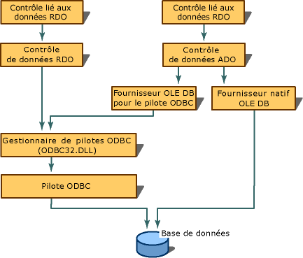

# Architecture des modèles du fournisseur OLE DB

## Sources de données et sessions

L’architecture du fournisseur OLE DB inclut un objet de source de données et une ou plusieurs sessions. L’objet de source de données est l’objet initial que chaque fournisseur doit instancier. Quand une application consommateur a besoin de données, il crée l’objet de source de données pour démarrer le fournisseur. L’objet de source de données crée un objet session (à l’aide de la `IDBCreateSession` interface) via lequel le consommateur se connecte à l’objet de source de données. Les programmeurs ODBC peuvent considérer que l’objet de source de données comme étant équivalent à la `HENV` et l’objet de session comme étant équivalents à le `HDBC`.

Avec les fichiers sources créés par le **Assistant fournisseur OLE DB**, les modèles OLE DB implémentent un objet de source de données. Une session est un objet qui correspond à la norme OLE DB `TSession`.

## Interfaces obligatoires et facultatives

Les modèles du fournisseur OLE DB offrent des implémentations préconfigurées pour toutes les interfaces requises. Interfaces obligatoires et facultatives sont définies par OLE DB pour plusieurs types d’objets :

- [Source de données](../../data/oledb/data-source-object-interfaces.md)

- [Session](../../data/oledb/session-object-interfaces.md)

- [Rowset](../../data/oledb/rowset-object-interfaces.md)

- [Commande](../../data/oledb/command-object-interfaces.md)

- [Transaction](../../data/oledb/transaction-object-interfaces.md)

Les modèles du fournisseur OLE DB n’implémentent pas les objets de ligne et de stockage.

Le tableau suivant répertorie les interfaces obligatoires et facultatives pour les objets répertoriés ci-dessus, en fonction de la [OLE DB 2.6 SDK documentation sur](/previous-versions/windows/desktop/ms722784(v=vs.85)).

|Composant|Interface|Commentaire|
|---------------|---------------|-------------|
|[Source de données](../../data/oledb/data-source-object-interfaces.md) ([CDataSource](../../data/oledb/cdatasource-class.md))|[mandatory] `IDBCreateSession`   [mandatory] `IDBInitialize`   [mandatory] `IDBProperties`   [mandatory] `IPersist`   [optional] `IConnectionPointContainer`   [optional] `IDBAsynchStatus`   [optional] `IDBDataSourceAdmin`   [optional] `IDBInfo`   [optional] `IPersistFile`   [optional] `ISupportErrorInfo`|Connexion du consommateur au fournisseur. L’objet est utilisé pour spécifier des propriétés sur la connexion comme nom de source de données ID et mot de passe utilisateur. L’objet peut également être utilisé pour administrer une source de données (créer, mettre à jour, supprimer, des tables et ainsi de suite).|
|[Session](../../data/oledb/session-object-interfaces.md) ([CSession](../../data/oledb/cdataconnection-operator-csession-amp.md))|[mandatory] `IGetDataSource`   [mandatory] `IOpenRowset`   [mandatory] `ISessionProperties`   [optional] `IAlterIndex`   [optional] `IAlterTable`   [optional] `IBindResource`   [optional] `ICreateRow`   [optional] `IDBCreateCommand`   [optional] `IDBSchemaRowset`   [optional] `IIndexDefinition`   [optional] `ISupportErrorInfo`   [optional] `ITableCreation`   [optional] `ITableDefinition`   [optional] `ITableDefinitionWithConstraints`   [optional] `ITransaction`   [optional] `ITransactionJoin`   [optional] `ITransactionLocal`   [optional] `ITransactionObject`|L’objet de session est une même conversation entre un consommateur et le fournisseur. Elle est similaire à ODBC `HSTMT` dans la mesure où il peut y avoir plusieurs sessions simultanées active.   L’objet session est le lien principal pour accéder à la fonctionnalité OLE DB. Pour accéder à une commande, une transaction ou un objet d’ensemble de lignes, vous accédez via l’objet de session.|
|[Ensemble de lignes](../../data/oledb/rowset-object-interfaces.md) ([CRowset](../../data/oledb/crowset-class.md))|[mandatory] `IAccessor`   [mandatory] `IColumnsInfo`   [mandatory] `IConvertType`   [mandatory] `IRowset`   [mandatory] `IRowsetInfo`   [optional] `IChapteredRowset`   [optional] `IColumnsInfo2`   [optional] `IColumnsRowset`   [optional] `IConnectionPointContainer`   [optional] `IDBAsynchStatus`   [optional] `IGetRow`   [optional] `IRowsetChange`   [optional] `IRowsetChapterMember`   [optional] `IRowsetCurrentIndex`   [optional] `IRowsetFind`   [optional] `IRowsetIdentity`   [optional] `IRowsetIndex`   [optional] `IRowsetLocate`   [optional] `IRowsetRefresh`   [optional] `IRowsetScroll`   [optional] `IRowsetUpdate`   [optional] `IRowsetView`   [optional] `ISupportErrorInfo`   [optional] `IRowsetBookmark`|L’objet d’ensemble de lignes est les données à partir de la source de données. L’objet est utilisé pour les liaisons de données et les opérations de base (mise à jour, extraction, de déplacement et d’autres) sur les données. Vous avez toujours un objet d’ensemble de lignes à conserver et de manipuler des données.|
|[Command](../../data/oledb/command-object-interfaces.md) ([CCommand](ccommand-class.md))|[mandatory] `IAccessor`   [mandatory] `IColumnsInfo`   [mandatory] `ICommand`   [mandatory] `ICommandProperties`   [mandatory] `ICommandText`   [mandatory] `IConvertType`   [optional] `IColumnsRowset`   [optional] `ICommandPersist`   [optional] `ICommandPrepare`   [optional] `ICommandWithParameters`   [optional] `ISupportErrorInfo`   [optional] `ICommandStream`|L’objet de commande gère les opérations de données telles que les requêtes. Il peut gérer des instructions paramétrées ou non paramétrées.   L’objet de commande est également responsable du traitement des liaisons pour les paramètres et les colonnes de sortie. Une liaison est une structure qui contient des informations sur la façon dont une colonne, dans un ensemble de lignes doit être récupérée. Il contient des informations telles que l’ordinal, type de données, longueur et état.|
|[Transaction](../../data/oledb/transaction-object-interfaces.md) (facultatif)|[mandatory] `IConnectionPointContainer`   [mandatory] `ITransaction`   [optional] `ISupportErrorInfo`|L’objet de transaction définit une unité atomique de travail sur une source de données et détermine la façon dont ces unités de travail sont liés entre eux. Cet objet n’est pas directement pris en charge par les modèles du fournisseur OLE DB (autrement dit, vous créez votre propre objet).|

Pour plus d’informations, consultez les rubriques suivantes :

- [Mappages des propriétés](../../data/oledb/property-maps.md)

- [L’enregistrement de l’utilisateur](../../data/oledb/user-record.md)

## Voir aussi

[Modèles du fournisseur OLE DB](../../data/oledb/ole-db-provider-templates-cpp.md) 
[Interfaces OLE DB](/previous-versions/windows/desktop/ms709709(v=vs.85)) 
