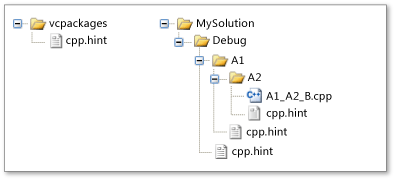

# <a name="hint-files"></a>Fichiers hint
Un *fichier hint* permet à l’IDE Visual Studio d’interpréter des identificateurs Visual C++, comme les noms de fonctions et de macros. Quand vous ouvrez un projet Visual C++, le *système d’analyse* de l’IDE analyse le code de chaque fichier source du projet et collecte des informations sur chaque identificateur. L’IDE utilise ensuite ces informations pour prendre en charge des fonctionnalités comme le navigateur **Affichage de classes** et la **Barre de navigation**.  
  
 Le système d’analyse, introduit dans Visual C++ 2010, comprend la syntaxe C/C++ mais peut interpréter erronément une instruction contenant une macro. L’instruction peut être mal interprétée si la macro produit un code source syntaxiquement incorrect tel qu’il est écrit. L’instruction peut devenir syntaxiquement correcte quand le code source est compilé et que le préprocesseur remplace [l’identificateur de macro](../preprocessor/hash-define-directive-c-cpp.md) par sa définition. Le système d’analyse fonctionne sans qu’il soit nécessaire de générer le projet, car il utilise des fichiers hint pour interpréter les macros. Ainsi, une fonctionnalité d’exploration comme **Affichage de classes** est disponible immédiatement.  
  
 Un fichier hint contient des *indicateurs* personnalisables par l’utilisateur, qui ont la même syntaxe que les définitions de macros C/C++. Visual C++ inclut un fichier hint intégré qui est suffisant pour la plupart des projets, mais vous pouvez créer vos propres fichiers hint pour améliorer la façon dont Visual Studio gère les identificateurs.  
  
> [!IMPORTANT]
>  Si vous modifiez ou que vous ajoutez un fichier hint, vous devez supprimer le fichier .sdf et/ou le fichier VC.db dans la solution, pour que les modifications prennent effet.  
  
## <a name="scenario"></a>Scénario  
 Supposons que le code suivant se trouve dans un fichier source que vous examinez avec le navigateur **Affichage de classes**. La macro `STDMETHOD` déclare une méthode nommée `myMethod`, qui prend un paramètre et retourne un pointeur vers un **HRESULT**.  
  
```  
// Source code file.  
STDMETHOD(myMethod)(int parameter1);  
```  
  
 Les définitions de macros suivantes se trouvent dans un fichier d’en-tête distinct.  
  
```  
// Header file.  
#define STDMETHOD(method) HRESULT (STDMETHODCALLTYPE * method)  
#define STDMETHODCALLTYPE __stdcall  
#define HRESULT void*  
```  
  
 Le système d’analyse ne peut pas interpréter le code source, car une fonction nommée STDMETHOD est déclarée, et cette déclaration est syntaxiquement incorrecte, car elle a deux listes de paramètres. Le système d’analyse n’ouvre pas le fichier d’en-tête pour découvrir les définitions des macros `STDMETHOD`, `STDMETHODCALLTYPE` et `HRESULT`. Comme le système d’analyse ne peut pas interpréter la macro `STDMETHOD`, il ignore toute l’instruction et poursuit l’analyse.  
  
 Le système d’analyse n’utilise pas les fichiers d’en-tête, car votre projet peut dépendre d’un ou plusieurs fichiers d’en-tête importants. Si un fichier d’en-tête change, le système d’analyse doit réexaminer tous les fichiers d’en-tête de votre projet, ce qui ralentit les performances de l’IDE. Au lieu de cela, le système d’analyse utilise des indicateurs qui spécifient comment gérer les macros `STDMETHOD`, `STDMETHODCALLTYPE` et `HRESULT`.  
  
 Comment savoir que vous avez besoin d’un indicateur ? Et si vous avez besoin d’un indicateur, quel type d’indicateur devez-vous créer ? Un signe qu’un indicateur est nécessaire est que l’affichage d’un identificateur dans **Affichage de classes** n’est pas cohérent avec l’affichage dans **l’éditeur**. Par exemple, **Affichage de classes** n’affiche pas un membre de classe dont vous savez qu’il existe, ou le nom du membre est incorrect. Pour plus d’informations sur les types d’indicateurs permettant de résoudre les problèmes courants, consultez la section « Quelles macros nécessitent un indicateur ? » plus loin dans cette rubrique.  
  
## <a name="architecture"></a>Architecture  
 Les fichiers hint concernent des répertoires physiques, et non pas les répertoires logiques décrits dans **l’Explorateur de solutions**. Vous n’avez pas à ajouter un fichier hint à votre projet pour que ce fichier soit pris en compte. Le système d’analyse utilise des fichiers hint seulement quand il analyse des fichiers sources.  
  
 Chaque fichier hint est nommé **cpp.hint**. Par conséquent, plusieurs répertoires peuvent contenir un fichier hint, mais un répertoire particulier ne peut contenir qu’un seul fichier hint.  
  
 Votre projet peut être affecté par zéro ou plusieurs fichiers hint. S’il n’existe pas de fichier hint, le système d’analyse utilise des techniques de récupération d’erreur pour ignorer le code source indéchiffrable. Sinon, le système d’analyse utilise la stratégie suivante pour rechercher et rassembler les indicateurs.  
  
### <a name="search-order"></a>Ordre de recherche  
 Le système d’analyse recherche les fichiers hint dans les répertoires selon l’ordre suivant.  
  
-   Le répertoire qui contient le package d’installation pour Visual C++ (**vcpackages**). Ce répertoire contient un fichier hint intégré qui décrit les symboles des fichiers système fréquemment utilisés, comme **windows.h**. Par conséquent, votre projet hérite automatiquement de la plupart des indicateurs dont il a besoin.  
  
-   Chemin depuis le répertoire racine d’un fichier source au répertoire qui contient le fichier source lui-même. Dans un projet Visual C++ classique, le répertoire racine contient le fichier projet ou solution.  
  
     L’exception à cette règle est le cas où un *fichier stop* se trouve dans le chemin vers le fichier source. Un fichier stop offre un contrôle supplémentaire sur l’ordre de recherche. Il s’agit d’un fichier nommé **cpp.stop**. Au lieu de démarrer du répertoire racine, le système d’analyse recherche à partir du répertoire qui contient le fichier stop jusqu’au répertoire qui contient le fichier source. Dans un projet classique, vous n’avez pas besoin d’un fichier stop.  
  
### <a name="hint-gathering"></a>Collecte des indicateurs  
 Un fichier hint contient zéro à plusieurs *indicateurs*. Un indicateur est défini ou supprimé exactement comme une macro C/C++. La directive de préprocesseur `#define` crée ou redéfinit un indicateur, et la directive `#undef` le supprime.  
  
 Le système d’analyse ouvre chaque fichier hint dans l’ordre de recherche décrit précédemment, rassemble les indicateurs de chaque fichier dans un ensemble *d’indicateurs effectifs*, puis les utilise pour interpréter les identificateurs présents dans votre code.  
  
 Le système d’analyse utilise les règles suivantes pour rassembler les indicateurs.  
  
-   Si le nouvel indicateur spécifie un nom qui n’est pas déjà défini, il ajoute le nom aux indicateurs effectifs.  
  
-   Si le nouvel indicateur spécifie un nom qui est déjà défini, il redéfinit l’indicateur existant.  
  
-   Si le nouvel indicateur est une directive `#undef` qui spécifie un indicateur effectif existant, il supprime l’indicateur existant.  
  
 La première règle signifie que les indicateurs effectifs sont hérités des fichiers hint précédemment ouverts. Les deux dernières règles signifient que des indicateurs qui apparaissent plus tard dans l’ordre de recherche peuvent remplacer des indicateurs qui sont apparus plus tôt. Par exemple, vous pouvez remplacer des indicateurs précédents si vous créez un fichier hint dans le répertoire qui contient un fichier source.  
  
 Pour une description de la collecte des indicateurs, consultez la section `Example` plus loin dans cette rubrique.  
  
### <a name="syntax"></a>Syntaxe  
 Les indicateurs sont créés et supprimés avec la même syntaxe que les directives de préprocesseur qui créent et suppriment des macros. En fait, le système d’analyse utilise le préprocesseur C/C++ pour évaluer les indicateurs. Pour plus d’informations sur les directives de préprocesseur, consultez [#define, directive (C/C++)](../preprocessor/hash-define-directive-c-cpp.md) et [#undef, directive (C/C++)](../preprocessor/hash-undef-directive-c-cpp.md).  
  
 Les seuls éléments syntaxiques inhabituels sont les chaînes de remplacement `@<`, `@=` et `@>`. Il s’agit de chaînes de remplacement spécifiques aux fichiers hint, qui sont utilisées seulement avec des macros de *mappage*. Un mappage est un ensemble de macros qui lient des données, des fonctions ou des événements à d’autres données, fonctions ou gestionnaires d’événements. Par exemple, `MFC` utilise des mappages pour créer des [tables des messages](../mfc/reference/message-maps-mfc.md), et `ATL` utilise des mappages pour créer des [mappages des objets](../atl/reference/object-map-macros.md). Les chaînes de remplacement des fichiers hint indiquent les éléments de début, intermédiaires et de fin d’un mappage. Seul le nom d’une macro de mappage est significatif. Ainsi, chaque chaîne de remplacement masque intentionnellement l’implémentation de la macro.  
  
 Les indicateurs utilisent la syntaxe suivante.  
  
|Syntaxe|Signification|  
|------------|-------------|  
|`#define` *nom de l’indicateur* *chaîne de remplacement*<br /><br /> `#define` *nom de l’indicateur* `(` *paramètre*, ...`)`*chaîne de remplacement*|Directive de préprocesseur qui définit un nouvel indicateur ou redéfinit un indicateur existant. Après la directive, le préprocesseur remplace chaque occurrence de *nom de l’indicateur* dans le code source par *chaîne de remplacement*.<br /><br /> La deuxième forme de la syntaxe définit un indicateur de type fonction. Si un indicateur de type fonction apparaît dans le code source, le préprocesseur remplace d’abord chaque occurrence de *paramètre* dans *chaîne de remplacement* par l’argument correspondant dans le code source, puis remplace *nom de l’indicateur* par *chaîne de remplacement*.|  
|`@<`|*Chaîne de remplacement* spécifique à un fichier hint qui indique le début d’un ensemble d’éléments de mappage.|  
|`@=`|*Chaîne de remplacement* spécifique à un fichier hint qui indique un élément de table intermédiaire. Une table peut avoir plusieurs éléments de table.|  
|`@>`|*Chaîne de remplacement* spécifique à un fichier hint qui indique la fin d’un ensemble d’éléments de mappage.|  
|`#undef` *nom de l’indicateur*|Directive de préprocesseur qui supprime un indicateur existant. Le nom de l’indicateur est fourni par l’identificateur de *nom de l’indicateur*.|  
|`//` *commentaire*|Commentaire d’une seule ligne.|  
|`/*` *commentaire* `*/`|Commentaire multiligne.|  
  
## <a name="what-macros-require-a-hint"></a>Quelles macros nécessitent un indicateur ?  
 Certains types de macros peuvent interférer avec le système d’analyse. Cette section décrit les types de macros qui peuvent provoquer un problème, et le type d’indicateur que vous pouvez créer pour résoudre ce problème.  
  
### <a name="disruptive-macros"></a>Macros provoquant des problèmes  
 Certaines macros provoquent une interprétation erronée du code source par le système d’analyse, mais peuvent être ignorées sans gêner votre expérience navigation. Par exemple, les macros en Langage d’annotation du code source ([SAL](../c-runtime-library/sal-annotations.md), Source Code Annotation Language) se résolvent en attributs C++ qui vous aident à trouver des bogues de programmation. Si vous voulez ignorer les annotations SAL quand vous parcourez le code, vous pouvez créer un fichier hint qui masque l’annotation.  
  
 Dans le code source suivant, le type de paramètre pour la fonction `FormatWindowClassName()` est `PXSTR`, et le nom du paramètre est `szBuffer`. Cependant, le système d’analyse interprète de façon erronée les annotations SAL `_Pre_notnull_` et `_Post_z_` pour le type de paramètre ou le nom du paramètre.  
  
 **Code source :**  
  
```  
static void FormatWindowClassName(_Pre_notnull__Post_z_ PXSTR szBuffer)  
```  
  
 **Stratégie :** définition de null  
  
 La stratégie dans cette situation consiste à traiter les annotations SAL comme si elles n’existaient pas. Pour cela, spécifiez un indicateur dont la chaîne de remplacement est null. Le système d’analyse ignore donc les annotations et le navigateur **Affichage de classes** ne les montre pas. (Visual C++ inclut un fichier hint intégré qui masque les annotations SAL.)  
  
 **Fichier hint :**  
  
```  
#define _Pre_notnull_  
```  
  
### <a name="concealed-cc-language-elements"></a>Éléments du langage C/C++ cachés  
 Une raison fréquente pour laquelle le système d’analyse interprète erronément le code source est le cas où une macro masque un jeton de [signe de ponctuation](../cpp/punctuators-cpp.md) ou de [mot clé](../cpp/keywords-cpp.md) C/C++. Autrement dit, une macro peut contenir la moitié d’une paire de signes de ponctuation, comme `<>`, `[]`, `{}` et `()`.  
  
 Dans le code source suivant, la macro `START_NAMESPACE` masque une accolade ouvrante non appairée (`{`).  
  
 **Code source :**  
  
```  
#define START_NAMESPACE namespace MyProject {  
```  
  
 **Stratégie :** copie directe  
  
 Si la sémantique d’une macro est critique pour l’expérience de navigation, créez un indicateur qui est identique à la macro. Le système d’analyse résout la macro en utilisant la définition dans le fichier hint.  
  
 Notez que si la macro dans le fichier source contient d’autres macros, celles-ci sont interprétées seulement si elles sont déjà dans l’ensemble d’indicateurs effectifs.  
  
 **Fichier hint :**  
  
```  
#define START_NAMESPACE namespace MyProject {  
```  
  
### <a name="maps"></a>Maps  
 Un mappage est constitué de macros qui désignent un élément de début, un élément de fin, et zéro à plusieurs éléments intermédiaires. Le système d’analyse interprète erronément les mappages, car chaque macro de mappage masque des éléments du langage C/C++, et la syntaxe d’une instruction C/C++ complète est distribuée entre plusieurs macros différentes.  
  
 Le code source suivant définit les macros `BEGIN_CATEGORY_MAP`, `IMPLEMENTED_CATEGORY` et `END_CATEGORY_MAP`.  
  
 **Code source :**  
  
```  
#define BEGIN_CATEGORY_MAP(x)\  
static const struct ATL::_ATL_CATMAP_ENTRY* GetCategoryMap() throw() {\  
static const struct ATL::_ATL_CATMAP_ENTRY pMap[] = {  
#define IMPLEMENTED_CATEGORY( catid ) { _ATL_CATMAP_ENTRY_IMPLEMENTED, &catid },  
#define END_CATEGORY_MAP()\  
   { _ATL_CATMAP_ENTRY_END, NULL } };\  
   return( pMap ); }  
```  
  
 **Stratégie :** identifier les éléments du mappage  
  
 Spécifiez des indicateurs pour les éléments de début, intermédiaires (le cas échéant) et de fin pour un mappage. Utilisez les chaînes de remplacement de mappage spéciales, `@<`, `@=` et `@>`. Pour plus d’informations, consultez la section `Syntax` de cette rubrique.  
  
 **Fichier hint :**  
  
```  
// Start of the map.  
#define BEGIN_CATEGORY_MAP(x) @<  
// Intermediate map element.  
#define IMPLEMENTED_CATEGORY( catid ) @=  
// Intermediate map element.  
#define REQUIRED_CATEGORY( catid ) @=  
// End of the map.  
#define END_CATEGORY_MAP() @>  
```  
  
### <a name="composite-macros"></a>Macros composites  
 Les macros composites contiennent un ou plusieurs des types de macros qui induisent le système d’analyse en erreur.  
  
 Le code source suivant contient la macro `START_NAMESPACE`, qui spécifie le début d’une étendue d’espace de noms, et la macro `BEGIN_CATEGORY_MAP`, qui spécifie le début d’un mappage.  
  
 **Code source :**  
  
```  
#define NSandMAP START_NAMESPACE BEGIN_CATEGORY_MAP  
```  
  
 **Stratégie :** copie directe  
  
 Créez des indicateurs pour les macros `START_NAMESPACE` et `BEGIN_CATEGORY_MAP`, puis créez un indicateur pour la macro `NSandMAP`, qui est identique à celle indiquée précédemment pour le code source. Si une macro composite est constituée seulement de macros provoquant des problèmes et d’espaces, vous pouvez aussi définir un indicateur dont la chaîne de remplacement est une définition null.  
  
 Dans cet exemple, supposons que `START_NAMESPACE` a déjà un indicateur tel que décrit dans cette rubrique, dans le sous-titre `Concealed C/C++ Language Elements`. Supposons aussi que `BEGIN_CATEGORY_MAP` a un indicateur tel que décrit précédemment dans `Maps`.  
  
 **Fichier hint :**  
  
```  
#define NSandMAP START_NAMESPACE BEGIN_CATEGORY_MAP  
```  
  
### <a name="inconvenient-macros"></a>Macros peu pratiques  
 Certaines macros peuvent être interprétées par le système d’analyse, mais le code source est difficile à lire, car la macro est longue ou complexe. Pour plus de lisibilité, vous pouvez fournir un indicateur qui simplifie l’affichage de la macro.  
  
 **Code source :**  
  
```  
#define STDMETHOD(methodName) HRESULT (STDMETHODCALLTYPE * methodName)  
```  
  
 **Stratégie :** simplification  
  
 Créez un indicateur qui affiche une définition de macro plus simple.  
  
 **Fichier hint :**  
  
```  
#define STDMETHOD(methodName) void* methodName  
```  
  
## <a name="example"></a>Exemple  
 L’exemple suivant illustre la façon dont des indicateurs sont cumulés à partir de fichiers hint. Cet exemple n’utilise pas de fichiers stop.  
  
 L’illustration suivante décrit certains des répertoires physiques d’un projet Visual C++. Des fichiers hint se trouvent dans les répertoires `vcpackages`, `Debug`, `A1` et `A2`.  
  
### <a name="hint-file-directories"></a>Répertoires des fichiers hint  
   
  
### <a name="directories-and-hint-file-contents"></a>Répertoires et contenu des fichiers hint  
 La liste suivante montre les répertoires de ce projet qui contiennent des fichiers hint et le contenu de ces fichiers. Seuls certains des nombreux indicateurs du fichier hint du répertoire `vcpackages` sont répertoriés.  
  
-   vcpackages  
  
    ```  
    // vcpackages (partial list)  
    #define _In_  
    #define _In_opt_  
    #define _In_z_  
    #define _In_opt_z_  
    #define _In_count_(size)  
    ```  
  
-   Débogage  
  
    ```  
    // Debug  
    #undef _In_  
    #define OBRACE {  
    #define CBRACE }  
    #define RAISE_EXCEPTION(x) throw (x)  
    #define START_NAMESPACE namespace MyProject {  
    #define END_NAMESPACE }  
    ```  
  
-   A1  
  
    ```  
    // A1  
    #define START_NAMESPACE namespace A1Namespace {  
    ```  
  
-   A2  
  
    ```  
    // A2  
    #undef OBRACE  
    #undef CBRACE  
    ```  
  
### <a name="effective-hints"></a>Indicateurs effectifs  
 Le tableau suivant répertorie les indicateurs effectifs pour les fichiers sources de ce projet.  
  
-   Fichier source : A1_A2_B.cpp  
  
-   Indicateurs effectifs :  
  
    ```  
    // vcpackages (partial list)  
    #define _In_opt_  
    #define _In_z_  
    #define _In_opt_z_  
    #define _In_count_(size)  
    // Debug...  
    #define RAISE_EXCEPTION(x) throw (x)  
    // A1  
    #define START_NAMESPACE namespace A1Namespace {   
    // ...Debug  
    #define END_NAMESPACE }  
    ```  
  
 Les remarques suivantes s’appliquent à la liste précédente.  
  
-   Les indicateurs effectifs proviennent des répertoires `vcpackages`, `Debug`, `A1` et `A2`.  
  
-   La directive **#undef** dans le fichier hint `Debug` a supprimé l’indicateur `#define _In_` dans le fichier hint du répertoire `vcpackages`.  
  
-   Le fichier hint du répertoire `A1` redéfinit `START_NAMESPACE`.  
  
-   L’indicateur `#undef` dans le répertoire `A2` a supprimé les indicateurs pour `OBRACE` et `CBRACE` dans le fichier hint du répertoire `Debug`.  
  
## <a name="see-also"></a>Voir aussi  
 [Types de fichiers créés pour les projets Visual C++](../ide/file-types-created-for-visual-cpp-projects.md)    
 [#define, directive (C/C++)](../preprocessor/hash-define-directive-c-cpp.md)   
 [#undef, directive (C/C++)](../preprocessor/hash-undef-directive-c-cpp.md)   
 [Annotations SAL](../c-runtime-library/sal-annotations.md)   
 [Tables des messages](../mfc/reference/message-maps-mfc.md)   
 [Macros de table des messages](../atl/reference/message-map-macros-atl.md)   
 [Macros de mappage d’objets](../atl/reference/object-map-macros.md)