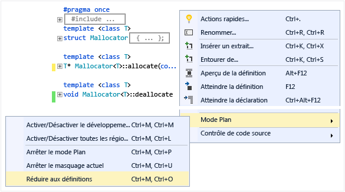
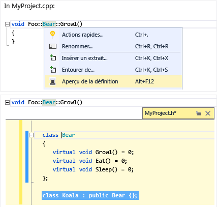
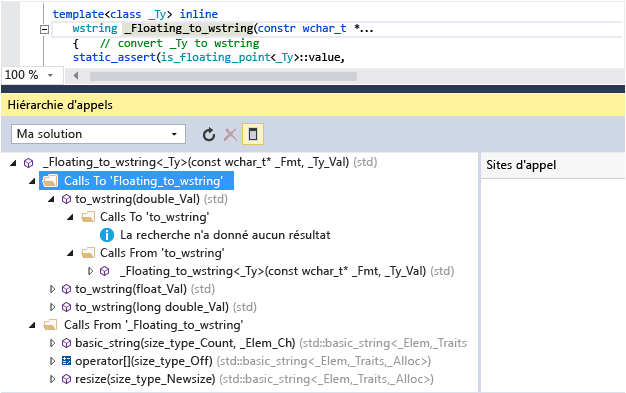

# Lire et comprendre du code C++ dans Visual Studio

L’éditeur de code C++ et l’IDE Visual Studio vous aident de nombreuses façons quand vous développez. Certains sont propres à C++, alors que d'autres sont quasiment identiques pour tous les langages Visual Studio. Pour plus d’informations sur les fonctionnalités partagées, consultez [Écriture de code dans l’éditeur de code et de texte](/visualstudio/ide/writing-code-in-the-code-and-text-editor).  

## Coloration

Visual Studio colore les éléments de la syntaxe pour différencier les types de symboles tels que les mots clés du langage, les noms de type, les noms de variable, les paramètres de fonction et les littéraux de chaîne.

Le code non utilisé (par exemple, le code sous une ligne #if 0) a une couleur estompée.

Vous pouvez personnaliser les couleurs en tapant « Polices » dans **Lancement rapide**, puis en choisissant **Polices et couleurs**. Dans la boîte de dialogue **Polices et couleurs**, faites défiler l’affichage jusqu’aux options C/C++, puis choisissez une police et/ou une couleur personnalisée(s).

## Mode Plan

Cliquez avec le bouton droit n’importe où dans un fichier de code source et choisissez **Mode Plan** pour réduire ou développer les blocs de code et/ou les régions personnalisées. Ceci vous permet de parcourir plus vite seulement le code qui vous intéresse. Pour plus d’informations, voir [Mode Plan](/visualstudio/ide/outlining).

Quand vous placez votre curseur devant une accolade, « { » ou « } », l’éditeur met en évidence l’accolade correspondante.

Les autres options du mode plan sont situées sous **Modifier** > **Mode Plan** dans le menu principal.

## Numéros de ligne

Vous pouvez ajouter des numéros de ligne à votre projet en accédant à **outils** > **options** > **éditeur de texte** > **tous les langages** > **général** ou en recherchant « ligne num » avec **lancement rapide (Ctrl + Q)** . Les numéros de ligne peuvent être définis pour tous les langages ou pour seulement quelques langages, notamment C++.

## Faire défiler et effectuer un zoom

Vous pouvez effectuer un zoom avant ou arrière dans l’éditeur en appuyant sur la touche **Ctrl** et en faisant tourner la roulette de la souris. Vous pouvez également effectuer un zoom à l’aide du paramètre de zoom dans le coin inférieur gauche.

Le **mode Carte** pour la barre de défilement vous permet de faire défiler et parcourir un fichier de code rapidement, sans avoir à quitter votre emplacement actuel. Vous pouvez cliquer n’importe où sur la carte de code pour accéder directement à cet emplacement.

Pour activer le **mode carte**, tapez « carte » dans la zone de recherche **lancement rapide** de la barre d’outils principale et choisissez **utiliser le mode de mappage de défilement**. Pour plus d’informations, consultez [Comment : suivre votre code en personnalisant la barre de défilement](/visualstudio/ide/how-to-track-your-code-by-customizing-the-scrollbar).

Quand le **mode Carte** est désactivé, la barre de défilement met toujours en évidence les modifications que vous avez apportées dans le fichier. Le vert indique les modifications enregistrées, le jaune les modifications non enregistrées.

## Info express et Informations sur les paramètres

Pointez n’importe quelle variable, fonction ou autre symbole pour obtenir des informations le concernant, y compris la déclaration et tout commentaire le précédant.

::: moniker range="vs-2019"

L’info-bulle **Info express** contient un lien **Rechercher en ligne**. Accédez à **Outils** > **Options** > **Éditeur de texte** > **C++**  > **Vue** pour spécifier le fournisseur de recherche.

Si votre code contient une erreur, vous pouvez pointer celle-ci afin qu’**Info express** affiche le message d’erreur correspondant. Vous trouverez également le message d’erreur dans la fenêtre Liste d’erreurs.

::: moniker-end

::: moniker range="<=vs-2017"

Si votre code contient une erreur, vous pouvez pointer celle-ci afin qu’**Info express** affiche le message d’erreur correspondant. Vous trouverez également le message d’erreur dans la fenêtre **Liste d’erreurs**.

::: moniker-end

Quand vous appelez une fonction, **Informations sur les paramètres** indique les types de paramètres et l’ordre dans lequel ils sont attendus.

## Aperçu de définition

Pointez une déclaration de variable ou de fonction, cliquez avec le bouton droit, puis choisissez **Aperçu de la définition** pour afficher sa définition inline sans quitter l’emplacement actuel. Pour plus d’informations, consultez [Aperçu de la définition (Alt+F12)](/visualstudio/ide/how-to-view-and-edit-code-by-using-peek-definition-alt-plus-f12).

##  Aide (F1)

Placez le curseur sur ou juste après un type, un mot clé ou une fonction, et appuyez sur **F1** pour accéder directement à la rubrique de référence appropriée sur docs.microsoft.com. **F1** fonctionne également sur les éléments de la liste d’erreurs et dans de nombreuses boîtes de dialogue.

## Affichage de classes

L’**Affichage de classes** affiche un ensemble d’arborescences pouvant faire l’objet d’une recherche, qui regroupent par projet tous les symboles de code et leurs hiérarchies parent/enfant et portée. Pour configurer ce que l’**Affichage de classes** affiche, accédez à **Paramètres de l’Affichage de classes** (cliquez sur l’icône en forme d’engrenage en haut de la fenêtre).

## Générer le graphique des fichiers Include

Cliquez avec le bouton droit sur un fichier de code dans votre projet et choisissez **Générer le graphique des fichiers Include** pour afficher un graphe montrant les fichiers qui sont inclus par d’autres fichiers.

## Afficher la hiérarchie d'appels

Cliquez avec le bouton droit sur un appel de fonction pour afficher la liste récursive de toutes les fonctions qui sont appelées et de toutes les fonctions qui l’appellent. Chaque fonction de la liste peut être développée de la même façon. Pour plus d’informations, consultez [Hiérarchie d’appels](/visualstudio/ide/reference/call-hierarchy).

## Voir aussi

[Modifier et refactoriser du code (C++)](writing-and-refactoring-code-cpp.md) 
[Naviguer dans votre base de code C++ dans Visual Studio](navigate-code-cpp.md) 
[Collaborer avec Live Share pour C++](live-share-cpp.md)
