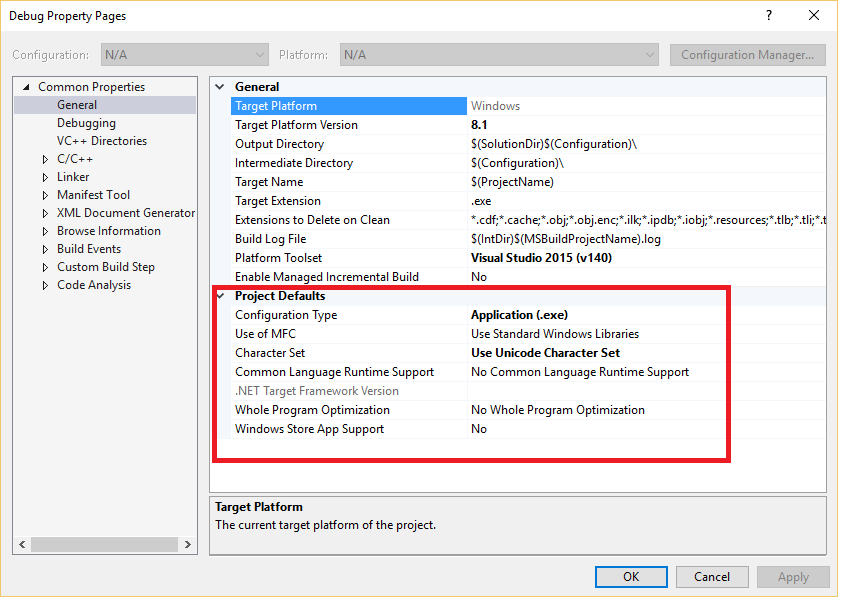
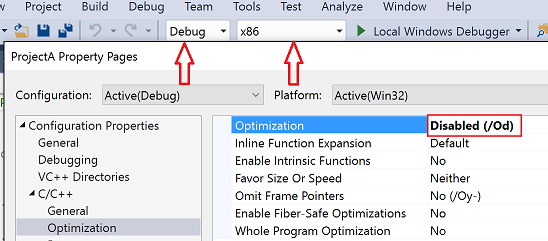
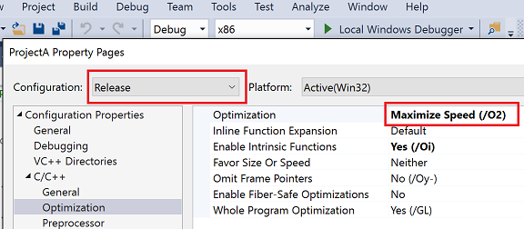
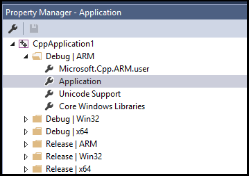
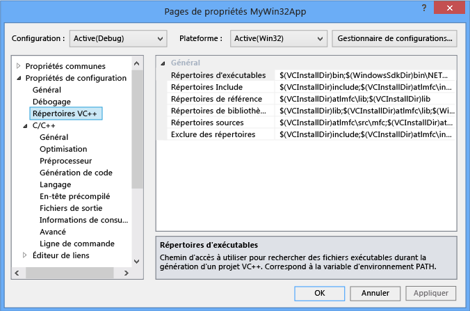
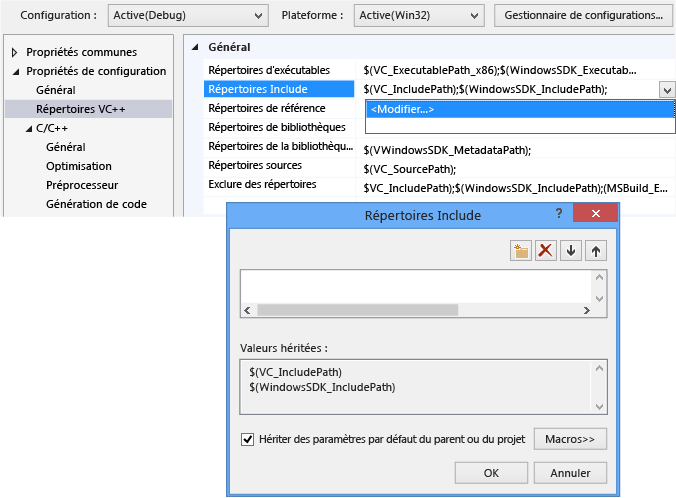
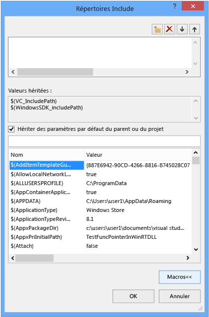
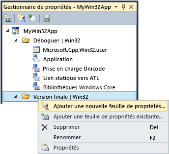

# <a name="working-with-project-properties"></a>Utilisation des propriétés de projet

Dans l’IDE, toutes les informations nécessaires pour générer un projet sont exposées sous forme de *propriétés*. Ces informations comprennent le nom de l’application, l’extension (par exemple, DLL, LIB, EXE), les options de compilateur, les options de l’éditeur de liens, les paramètres de débogueur, les étapes de génération personnalisée et bien d’autres choses. En général, vous utilisez les *pages de propriétés* (**Projet &#124; Propriétés**) pour voir et modifier ces propriétés.

Quand vous créez un projet, le système attribue des valeurs à différentes propriétés. Les valeurs par défaut varient légèrement en fonction du type de projet et des options que vous choisissez dans l’Assistant Application. Par exemple, un projet ATL a des propriétés relatives aux fichiers MIDL, mais elles sont absentes dans une application console de base. Les propriétés par défaut sont affichées dans le volet Général des pages de propriétés :



Certaines propriétés, comme le nom de l’application, s’appliquent à toutes les variations de build, quelle que soit la plateforme cible, ou qu’il s’agisse d’une build debug ou release. Toutefois, la plupart des propriétés dépendent de la configuration. C’est parce que le compilateur doit connaître la plateforme sur laquelle le programme va s’exécuter ainsi que les options de compilateur à utiliser pour générer le code approprié. Par conséquent, quand vous définissez une propriété, faites bien attention à la configuration et à la plateforme auxquelles la nouvelle valeur doit s’appliquer. Doit-elle s’appliquer uniquement aux builds Debug Win32 ou aussi à Debug ARM et Debug x64 ? Par exemple, la propriété **Optimisation** est définie par défaut sur **Augmenter la vitesse (/O2)** dans une configuration Release, mais est désactivée dans la configuration Debug.

Les pages de propriétés sont conçues pour vous permettre de toujours voir, et si nécessaire modifier, la configuration et la plateforme auxquelles une valeur de propriété doit s’appliquer. L’illustration suivante montre les pages de propriétés avec les informations de configuration et de plateforme dans les zones de liste en haut. Quand la propriété **Optimisation** est définie ici, elle s’applique uniquement aux builds Debug Win32, qui est la configuration active, comme indiqué par les flèches rouges.



L’illustration suivante montre la même page de propriétés de projet, mais la configuration a été remplacée par Release. Notez le changement de valeur de la propriété Optimisation. Notez également que la configuration active est toujours Debug. Vous pouvez définir ici les propriétés de n’importe quelle configuration, et pas seulement celles de la configuration active.



Le système de projet lui-même est basé sur MSBuild, qui définit les formats de fichier et les règles pour générer des projets de tout type. MSBuild gère une grande partie de la complexité de génération pour plusieurs plateformes et configurations, mais il faut comprendre un peu son fonctionnement. C’est particulièrement important si vous voulez définir des configurations personnalisées ou créer des ensembles de propriétés réutilisables à partager et importer dans plusieurs projets.

Les propriétés de projet sont stockées directement dans le fichier projet (*.vcxproj) ou dans d’autres fichiers .xml ou .props que le fichier projet importe et qui fournissent des valeurs par défaut. Comme indiqué précédemment, une même propriété pour une même configuration peut avoir une valeur différente dans différents fichiers. Quand vous générez un projet, le moteur MSBuild évalue le fichier projet et tous les fichiers importés dans un ordre bien défini (décrit ci-dessous). Comme chaque fichier est évalué, toutes les valeurs de propriété définies dans ce fichier remplacent les valeurs existantes. Les valeurs qui ne sont pas spécifiées sont héritées des fichiers qui ont été évalués précédemment. Par conséquent, quand vous définissez une propriété dans les pages de propriétés, faites bien attention à l’endroit où vous la définissez. Si vous définissez une propriété sur « X » dans un fichier .props, mais qu’elle est définie sur « Y » dans le fichier projet, le projet est généré avec la propriété définie sur « Y ». Si la même propriété est définie sur « Z » sur un élément de projet, par exemple, un fichier .cpp, le moteur MSBuild utilise la valeur « Z ». Pour plus d'informations, consultez [Héritage de propriétés](#bkmkPropertyInheritance) dans la suite de cet article.

## <a name="build-configurations"></a>Configurations de build

Une configuration est simplement un groupe arbitraire de propriétés qui porte un nom. Visual Studio fournit des configurations Debug et Release, et chacune définit des propriétés différentes pour une build debug ou release. Vous pouvez utiliser le **Gestionnaire de configuration** pour définir des configurations personnalisées et regrouper de manière pratique des propriétés pour une version particulière de build. Le Gestionnaire de propriétés est utilisé pour une utilisation plus poussée des propriétés, mais nous en parlons ici parce qu’il permet de visualiser les configurations de propriétés. Vous y accédez à partir de **Affichage &#124; Gestionnaire de propriétés** ou **Affichage &#124; Autres fenêtres &#124; Gestionnaire de propriétés** en fonction de vos paramètres. Il a des nœuds pour chaque paire de plateforme et configuration dans le projet. Chacun de ces nœuds contient d’autres nœuds pour les feuilles de propriétés (fichiers .props) qui définissent des propriétés spécifiques pour cette configuration.



Si vous accédez au volet Général dans les Pages de propriétés (voir l’illustration ci-dessus) et définissez la propriété Jeu de caractères sur « Non définie » au lieu de « Utiliser Unicode », puis que vous cliquez sur **OK**, le Gestionnaire de propriétés ne montre aucune feuille de propriétés **Prise en charge Unicode** pour la configuration actuelle, mais reste disponible pour d’autres configurations.

Pour plus d’informations sur le Gestionnaire de propriétés et les feuilles de propriétés, consultez [Création de configurations de propriétés réutilisables](#bkmkPropertySheets) plus loin dans cet article.

> [!TIP]
> Le fichier .user est une fonctionnalité héritée et nous vous recommandons de la supprimer pour que les propriétés restent correctement groupées en fonction de la configuration/plateforme.

## <a name="target-platforms"></a>Plateformes cibles

*Plateforme cible* fait référence au type d’appareil et/ou de système d’exploitation sur lequel doit s’exécuter l’exécutable. Vous pouvez générer un projet pour plusieurs plateformes. Les plateformes cibles disponibles pour les projets C++ varient selon le type de projet et sont entre autres : Win32, x64, ARM, Android et iOS.     La plateforme cible **x86** que vous pouvez voir dans le **Gestionnaire de configuration** est identique à **Win32** dans les projets C++ natifs. Win32 désigne Windows 32 bits et **x64** désigne Windows 64 bits. Pour plus d’informations sur ces deux plateformes, consultez [Exécution d’applications 32 bits](/windows/desktop/WinProg64/running-32-bit-applications).

La valeur de plateforme cible **N’importe quelle UC** que vous pouvez voir dans le **Gestionnaire de configuration** n’a aucun effet sur les projets C++ natifs, elle concerne les projets C++/ CLI et d’autres types de projet .NET. Pour plus d’informations, consultez l’article [/CLRIMAGETYPE (Spécifier le type d’une image CLR)](../build/reference/clrimagetype-specify-type-of-clr-image.md).

## <a name="property-pages"></a>pages de propriétés

Comme indiqué précédemment, le système de projet Visual C++ est basé sur [MSBuild](/visualstudio/msbuild/msbuild-properties) et les valeurs sont stockées dans le fichier projet XML, les fichiers .props et .targets par défaut. Pour Visual Studio 2015, ces fichiers se trouvent dans **\Program Files (x86)\MSBuild\Microsoft.Cpp\v4.0\V140**. Pour Visual Studio 2017, ces fichiers se trouvent dans **\\Program Files (x86)\\Microsoft Visual Studio\\2017\\_edition_\\Common7\\IDE\\VC\\VCTargets**, où _edition_ est l’édition de Visual Studio installée. Les propriétés sont également stockées dans les fichiers .props personnalisés que vous pouvez ajouter à votre propre projet. Nous recommandons vivement de ne PAS modifier ces fichiers manuellement et d’utiliser à la place les pages de propriétés dans l’IDE pour modifier toutes les propriétés, en particulier celles qui résultent d’un héritage, à moins d’avoir une très bonne compréhension de MSBuild.

L’illustration suivante montre les pages de propriétés d’un projet Visual C++. Dans le volet gauche, la **règle** *Répertoires VC++* est sélectionnée et le volet droit répertorie les propriétés associées à cette règle. Les valeurs `$(...)` sont malheureusement appelées *macros*. Ce ne sont *pas* des macros C/C++, mais simplement des constantes de compilation. Les macros sont décrites dans la section [Macros des pages de propriétés](#bkmkPropertiesVersusMacros) plus loin dans cet article.



> [!WARNING]
> Les configurations des **Propriétés communes** dans les versions antérieures de Visual Studio ont été supprimées. Pour ajouter une référence à un projet, vous utilisez maintenant la boîte de dialogue **Ajouter une référence**, de la même façon que pour les langages managés. Consultez [Gestion des références dans un projet](/visualstudio/ide/managing-references-in-a-project).

#### <a name="to-set-a-property-for-a-project"></a>Pour définir une propriété pour un projet

1. Dans la plupart des scénarios, vous pouvez définir des propriétés au niveau du projet sans créer de feuille de propriétés personnalisée. Dans le menu principal, choisissez **Projet &#124; Propriétés** ou cliquez avec le bouton droit sur le nœud du projet dans **l’Explorateur de solutions**, puis choisissez **Propriétés**.

2. Utilisez les zones de liste **Configuration** et **Plateforme** en haut de la boîte de dialogue pour spécifier les groupes de propriétés qui doivent appliquer vos changements. Dans de nombreux cas, vous pouvez choisir **Toutes les plateformes** et **Toutes les configurations**. Pour définir des propriétés pour certaines configurations seulement, sélectionnez-les toutes dans le **Gestionnaire de propriétés**, puis ouvrez le menu contextuel et choisissez **Propriétés**.

La boîte de dialogue **Pages de propriétés** montre seulement les pages de propriétés qui s’appliquent au projet actuel. Par exemple, si le projet n'a pas de fichier .idl, la page de propriétés MIDL n'est pas affichée.

Quand vous sélectionnez une propriété dans une Page de propriétés, vous pouvez appuyer sur **F1** pour accéder à la rubrique de référence et obtenir plus d’informations sur le commutateur du compilateur ou de l’éditeur de liens correspondant.

Plus d’informations sur chaque page de propriétés sont disponibles dans ces rubriques :

- [Général, page de propriétés (Projet)](../ide/general-property-page-project.md)

- [Général, page de propriétés (Fichier)](../ide/general-property-page-file.md)

- [Ligne de commande, pages de propriétés](../ide/command-line-property-pages.md)

- [Paramètres de projet pour une configuration Debug C++](/visualstudio/debugger/project-settings-for-a-cpp-debug-configuration)

- [NMake, page de propriétés](../ide/nmake-property-page.md)

- [Éditeur de liens, page de propriétés](../ide/linker-property-pages.md)

- [Ressources, page de propriétés](../ide/resources-property-pages.md)

- [MIDL, page de propriétés](../ide/midl-property-pages.md)

- [Références web, page de propriétés](../ide/web-references-property-page.md)

- [XML Data Generator Tool, page de propriétés](../ide/xml-data-generator-tool-property-page.md)

## <a name="to-quickly-browse-and-search-all-properties"></a>Pour parcourir et rechercher rapidement toutes les propriétés

La page de propriétés **Toutes les options** (sous le nœud **Propriétés de configuration &#124; C/C++** dans la boîte de dialogue **Pages de propriétés**) offre un mode de navigation et de recherche rapide dans les propriétés disponibles au sein du contexte actuel. Elle comporte une zone de recherche spéciale et possède une syntaxe simple pour aider à filtrer les résultats :

Aucun préfixe :<br/>
Effectuer une recherche dans les noms de propriétés uniquement (la sous-chaîne ne respecte pas la casse).

'/' ou '-' :<br/>
Effectuer une recherche uniquement dans les commutateurs de compilation (le préfixe ne respecte pas la casse)

v :<br/>
Effectuer une recherche uniquement dans les valeurs (la sous-chaîne ne respecte pas la casse).

##  <a name="bkmkPropertiesVersusMacros"></a> Macros de la page de propriétés

Une *macro* est une constante de compilation qui peut référencer une valeur définie par Visual Studio ou le système MSBuild, ou une valeur définie par l’utilisateur. L'utilisation de macros au lieu de valeurs codées en dur telles que les chemins d'accès aux répertoires permet de partager facilement des paramètres de propriétés entre les ordinateurs et entre les versions de Visual Studio et de mieux s'assurer que les paramètres de projet participent correctement à l'héritage de propriété. Vous pouvez utiliser l’éditeur de propriétés pour voir les valeurs de toutes les macros disponibles.

### <a name="predefined-macros"></a>Macros prédéfinies

*macros globales*<br/>
S'applique à tous les éléments dans une configuration de projet. Possède la syntaxe `$(name)`. Un exemple de macro globale est `$(VCInstallDir)`, qui stocke le répertoire racine de votre installation de Visual Studio. Une macro globale correspond à `PropertyGroup` dans MSBuild.

*macros d’élément*<br/>
Possède la syntaxe `%(name)`. Pour un fichier, une macro d'élément s'applique uniquement à ce fichier ; par exemple, vous pouvez utiliser `%(AdditionalIncludeDirectories)` pour spécifier les répertoires Include qui s'appliquent uniquement à un fichier particulier. Ce genre de macro d'élément correspond à des métadonnées `ItemGroup` dans MSBuild. Lorsqu'elle est utilisée dans le contexte d'une configuration de projet, une macro d'élément s'applique à tous les fichiers d'un certain type. Par exemple, la propriété de configuration C/C++ **Définitions de préprocesseur** peut prendre une macro d’élément `%(PreprocessorDefinitions)` qui s’applique à tous les fichiers .cpp dans le projet. Ce genre de macro d'élément correspond à des métadonnées `ItemDefinitionGroup` dans MSBuild. Pour plus d’informations, consultez l’article [Item Definitions (Définitions des éléments)](/visualstudio/msbuild/item-definitions).

### <a name="user-defined-macros"></a>macros définies par l'utilisateur

Vous pouvez créer des *macros définies par l’utilisateur* à utiliser comme variables dans les générations de projet. Par exemple, vous pouvez créer une macro définie par l'utilisateur qui fournit une valeur pour une étape de génération personnalisée ou un outil de génération personnalisée. Une macro définie par l'utilisateur est une paire nom/valeur. Dans un fichier projet, utilisez la notation **$(**<em>nom</em>**)** pour accéder à la valeur.

Une macro définie par l’utilisateur est stockée dans une feuille de propriétés. Si votre projet ne contient pas encore de feuille de propriétés, vous pouvez en créez une en suivant les étapes de la section [Création de configurations de propriétés réutilisables](#bkmkPropertySheets).

##### <a name="to-create-a-user-defined-macro"></a>Pour créer une macro définie par l’utilisateur

1. Dans la fenêtre **Gestionnaire de propriétés** (dans la barre de menus, choisissez **Affichage**, **Gestionnaire de propriétés**), ouvrez le menu contextuel d’une feuille de propriétés (son nom se termine par .user), puis choisissez Propriétés. La boîte de dialogue **Pages de propriétés** pour cette feuille de propriétés s’ouvre.

1. Dans le volet gauche de la boîte de dialogue, sélectionnez **Macros utilisateur**. Dans le volet droit, choisissez le bouton **Ajouter une macro** pour ouvrir la boîte de dialogue **Ajouter une macro utilisateur**.

1. Dans la boîte de dialogue, spécifiez un nom et une valeur pour la macro. Vous pouvez aussi cocher la case **Définir cette macro comme variable d’environnement dans l’environnement de génération**.

## <a name="property-editor"></a>Éditeur de propriétés

Vous pouvez utiliser l'Éditeur de propriétés pour modifier certaines propriétés de type chaîne et sélectionner des macros comme valeurs. Pour accéder à l'Éditeur de propriétés, sélectionnez une propriété dans une page de propriétés, puis cliquez sur la flèche vers le bas située à droite. Si la liste déroulante contient **\<Modifier>**, vous pouvez choisir cette option pour afficher l’Éditeur de propriétés pour cette propriété.



Dans l’Éditeur de propriétés, vous pouvez choisir le bouton **Macros** pour voir les macros disponibles et leurs valeurs actuelles. L’illustration suivante montre l’Éditeur de propriétés pour la propriété **Autres répertoires Include** après la sélection du bouton **Macros**. Quand vous cochez la case **Hériter des paramètres par défaut du parent ou du projet** et que vous ajoutez une nouvelle valeur, celle-ci est ajoutée aux valeurs actuellement héritées. Si vous désactivez la case à cocher, votre nouvelle valeur remplace les valeurs héritées. Dans la plupart des cas, laissez la case à cocher activée.



##  <a name="bkmkPropertySheets"></a> Création de configurations de propriétés réutilisables

Nous ne recommandons plus de définir les propriétés « globales » sur la base de chaque utilisateur et de chaque ordinateur. Utilisez plutôt le **Gestionnaire de propriétés** pour créer une *feuille de propriétés* afin de stocker les paramètres de chaque type de projet que vous voulez réutiliser ou partager avec d’autres utilisateurs. Avec les feuilles de propriétés, il est également moins probable que les paramètres de propriétés pour d’autres types de projets soient modifiés par inadvertance. Les feuilles de propriétés sont décrites plus en détail dans [Création de configurations de propriétés réutilisables](#bkmkPropertySheets).

> [!IMPORTANT]
> **Fichiers .user et pourquoi ils posent un problème**
>
> Les versions précédentes de Visual Studio utilisaient des feuilles de propriétés globales qui avaient une extension de nom de fichier .user et se trouvaient dans le dossier \<profil_utilisateur>\AppData\Local\Microsoft\MSBuild\v4.0\. Nous ne recommandons plus l'utilisation de ces fichiers, car ils définissent des propriétés pour les configurations de projet sur la base de chaque utilisateur et de chaque ordinateur. Ces paramètres « globaux » peuvent perturber les builds, surtout lorsque vous ciblez plusieurs plateformes sur votre ordinateur de build. Par exemple, si vous avez un projet MFC et un projet Windows Phone, les propriétés .user seraient non valides pour l'un d'eux. Les feuilles de propriétés réutilisables sont plus flexibles et plus fiables.
>
> Bien que les fichiers .user soient toujours installés par Visual Studio et participent à l'héritage des propriétés, ils sont vides par défaut. Une bonne pratique est de supprimer la référence correspondante dans le **Gestionnaire de propriétés** pour faire en sorte que les projets fonctionnent indépendamment des paramètres selon l’utilisateur et l’ordinateur. De cette façon, vous garantissez un comportement approprié dans un environnement de contrôle de code source (SCC).

Pour afficher le **Gestionnaire de propriétés**, dans la barre de menus, choisissez **Affichage**, **Autres fenêtres**, **Gestionnaire de propriétés**.

Si vous avez un ensemble de propriétés commun fréquemment utilisé à appliquer à plusieurs projets, vous pouvez utiliser le **Gestionnaire de propriétés** pour les capturer dans un fichier de *feuilles de propriétés* réutilisable qui, par convention, a une extension de nom de fichier .props. Vous pouvez appliquer la feuille (ou les feuilles) à de nouveaux projets afin de ne pas avoir à définir intégralement ses propriétés. Pour accéder au **Gestionnaire de propriétés**, dans la barre de menus, choisissez **Afficher**, **Gestionnaire de propriétés**.



Sous chaque nœud de configuration, vous voyez des nœuds pour chaque feuille de propriétés qui s’applique à cette configuration. Le système ajoute des feuilles de propriétés qui définissent les valeurs selon les options que vous choisissez dans l’Assistant Application quand vous créez le projet. Cliquez avec le bouton droit sur n’importe quel nœud et choisissez Propriétés pour voir les propriétés qui s’appliquent à ce nœud. Toutes les feuilles de propriétés sont importées automatiquement dans la feuille de propriétés « master » du projet (ms.cpp.props) et sont évaluées par ordre d’apparition dans le Gestionnaire de propriétés. Vous pouvez les déplacer pour changer l’ordre d’évaluation. Les feuilles de propriétés qui sont évaluées par la suite remplacent les valeurs dans les feuilles précédemment évaluées.

Si vous choisissez **Ajouter une nouvelle feuille de propriétés** et que vous sélectionnez, par exemple, la feuille de propriétés MyProps.props, une boîte de dialogue Page de propriétés apparaît. Remarquez qu'elle s'applique à la feuille de propriétés MyProps ; toutes les modifications que vous apportez sont écrites dans la feuille, et non dans le fichier projet (.vcxproj).

Les propriétés dans une feuille de propriétés sont remplacées si la même propriété est définie directement dans le fichier .vcxproj.

Vous pouvez importer une feuille de propriétés aussi souvent que nécessaire. Plusieurs projets d'une solution peuvent hériter des paramètres de la feuille de propriétés et un projet peut avoir plusieurs feuilles. Une feuille de propriétés peut hériter elle-même des paramètres d'une autre feuille de propriétés.

Vous pouvez également créer une feuille de propriétés pour plusieurs configurations. Pour cela, créez une feuille de propriétés pour chaque configuration, ouvrez le menu contextuel associé à l’une d’elles, choisissez **Ajouter une feuille de propriétés existante**, puis ajoutez les autres feuilles. Toutefois, si vous utilisez une feuille de propriétés commune, sachez que lorsque vous définissez une propriété, elle est définie pour toutes les configurations auxquelles la feuille s'applique et l'environnement IDE n'indique pas quels projets ou autres feuilles de propriétés héritent d'une feuille de propriétés donnée.

Dans les grandes solutions qui auront de nombreux projets, il peut être utile de créer une feuille de propriétés au niveau de la solution. Quand vous ajoutez un projet à la solution, utilisez le **Gestionnaire de propriétés** pour ajouter cette feuille de propriétés au projet. Si nécessaire au niveau du projet, vous pouvez ajouter une nouvelle feuille de propriétés pour définir des valeurs spécifiques au projet.

> [!IMPORTANT]
> Un fichier .props par défaut ne participe pas au contrôle de code source car il n'est pas créé en tant qu'élément de projet. Vous pouvez ajouter manuellement le fichier comme élément de solution si vous souhaitez l'inclure dans le contrôle de code source.

#### <a name="to-create-a-property-sheet"></a>Pour créer une feuille de propriétés

1. Dans la barre de menus, choisissez **Affichage**, **Gestionnaire de propriétés**. Le **Gestionnaire de propriétés** s’ouvre.

2. Pour définir la portée de la feuille de propriétés, sélectionnez l'élément auquel elle s'applique. Il peut s'agir d'une configuration particulière ou d'une autre feuille de propriétés. Ouvrez le menu contextuel de cet élément, puis choisissez **Ajouter une nouvelle feuille de propriétés de projet**. Spécifiez un nom et un emplacement.

3. Dans le **Gestionnaire de propriétés**, ouvrez la nouvelle feuille de propriétés et définissez les propriétés à inclure.

##  <a name="bkmkPropertyInheritance"></a> Héritage de propriétés

Les propriétés de projet sont superposées. Chaque couche hérite des valeurs de la couche précédente, mais une valeur héritée peut être substituée en définissant la propriété explicitement. Voici l’arborescence d’héritage de base :

1. Paramètres par défaut de l’ensemble d’outils MSBuild CPP (..\Program Files\MSBuild\Microsoft.Cpp\v4.0\Microsoft.Cpp.Default.props, qui est importé par le fichier .vcxproj.)

2. Feuilles de propriétés

3. Fichier .vcxproj. (peut substituer les paramètres par défaut et les paramètres de feuille de propriétés.)

4. Métadonnées d'élément

> [!TIP]
> Dans une page de propriétés, une propriété avec le style `bold` est définie dans le contexte actuel. Une propriété en police normale est héritée.

Un fichier projet (.vcxproj) importe d'autres feuilles de propriétés au moment de la génération. Une fois toutes les feuilles de propriétés importées, le fichier projet est évalué et la dernière définition d'une valeur de propriété est celle qui est utilisée. Il est parfois utile d'afficher le fichier développé pour déterminer comment une valeur de propriété donnée est héritée. Pour afficher la version développée, entrez la commande suivante à une invite de commandes Visual Studio. (Remplacez les espaces réservés des noms de fichiers par ceux que vous voulez utiliser.)

**msbuild /pp:** *temp* **.txt** *mon_application* **.vcxproj**

Les fichiers projet développés peuvent être volumineux et difficiles à comprendre si MSBuild ne vous est pas familier. Voici la structure de base d'un fichier projet :

1. Propriétés de projet fondamentales, qui ne sont pas exposées dans l'environnement IDE.

2. Importation de Microsoft.cpp.default.props, qui définit des propriétés de base et indépendantes des ensembles d'outils.

3. Propriétés de configuration globales (exposées comme les propriétés par défaut **PlatformToolset** et **Project** dans la page **Configuration générale**. Ces propriétés déterminent l'ensemble d'outils et les feuilles de propriétés intrinsèques importés dans Microsoft.cpp.props à l'étape suivante.

4. Importation de Microsoft.cpp.props, qui définit la plupart des paramètres par défaut du projet.

5. Importation de toutes les feuilles de propriétés, y compris les fichiers .user. Ces feuilles de propriétés peuvent tout remplacer sauf les propriétés par défaut **PlatformToolset** et **Project**.

6. Les propriétés restantes de la configuration du projet. Ces valeurs peuvent remplacer celles définies dans les feuilles de propriétés.

7. Éléments (fichiers) avec leurs métadonnées. Il s’agit toujours du dernier mot dans les règles d’évaluation MSBuild, même s’ils se produisent avant d’autres propriétés et importations.

Pour plus d’informations, consultez l’article [Propriétés MSBuild](/visualstudio/msbuild/msbuild-properties).

## <a name="adding-an-include-directory-to-the-set-of-default-directories"></a>Ajout d'un répertoire Include au jeu de répertoires par défaut

Lorsque vous ajoutez un répertoire Include à un projet, il est important de ne pas remplacer tous les répertoires par défaut. La méthode appropriée pour ajouter un répertoire est d’ajouter le nouveau chemin, par exemple, "C:\MyNewIncludeDir\", puis la macro **$(IncludePath)** à la valeur de propriété.

## <a name="setting-environment-variables-for-a-build"></a>Définition des variables d'environnement pour une génération

Le compilateur Visual C++ (cl.exe) reconnaît certaines variables d’environnement, plus spécifiquement LIB, LIBPATH, PATH et INCLUDE. Quand vous effectuez une génération avec l’IDE, les propriétés définies dans la page de propriétés [Page de propriétés, Répertoires VC++](../ide/vcpp-directories-property-page.md) sont utilisées pour définir ces variables d’environnement. Si les valeurs LIB, LIBPATH et INCLUDE ont déjà été définies, par exemple par une invite de commandes développeur, elles sont remplacées par les valeurs des propriétés MSBuild correspondantes. La génération ajoute ensuite la valeur de la propriété de répertoires d'exécutables Répertoires VC++ à PATH. Vous pouvez définir une variable d’environnement définie par l’utilisateur en créant une macro définie par l’utilisateur et en cochant la case **Définir cette macro comme variable d’environnement dans l’environnement de génération**.

## <a name="setting-environment-variables-for-a-debugging-session"></a>Définition des variables d'environnement pour une session de débogage

Dans le volet gauche de la boîte de dialogue **Pages de propriétés** du projet, développez le nœud **Propriétés de configuration** et sélectionnez **Débogage**.

Dans le volet droit, modifiez les paramètres de projet **Environnement** ou **Fusion de l’environnement**, puis choisissez le bouton **OK**.

## <a name="modifying-properties-and-targets-without-changing-the-project-file"></a>Modification des propriétés et des cibles sans changer le fichier projet

Vous pouvez remplacer les propriétés et les cibles de projet à partir de l’invite de commandes MSBuild sans changer le fichier projet. Cela est utile quand vous voulez appliquer certaines propriétés temporairement ou occasionnellement. Vous devez être familiarisé avec MSBuild. Pour plus d’informations, consultez [MSBuild](https://docs.microsoft.com/visualstudio/msbuild/msbuild).

> [!IMPORTANT]
> Vous pouvez utiliser l’éditeur XML dans Visual Studio, ou n’importe quel éditeur de texte, pour créer le fichier .props ou .targets. N’utilisez pas le **Gestionnaire de propriétés** dans ce scénario, car il ajoute les propriétés au fichier projet.

*Pour remplacer les propriétés de projet :*

1. Créez un fichier .props qui spécifie les propriétés à remplacer.

1. À partir de l’invite de commandes : définissez ForceImportBeforeCppTargets="C:\sources\my_props.props"

*Pour remplacer les cibles de projet :*

1. Créer un fichier .targets avec leur implémentation ou une cible particulière

2. À partir de l’invite de commandes : définissez ForceImportAfterCppTargets ="C:\sources\my_target.targets"

Vous pouvez aussi définir l’option sur la ligne de commande msbuild à l’aide de l’option /p: :

```cmd
> msbuild myproject.sln /p:ForceImportBeforeCppTargets="C:\sources\my_props.props"
> msbuild myproject.sln /p:ForceImportAfterCppTargets="C:\sources\my_target.targets"
```

Quand vous remplacez les propriétés et les cibles de cette façon, c’est comme si vous ajoutiez les importations suivantes à tous les fichiers .vcxproj dans la solution :

```cmd
<Import Project=="C:\sources\my_props.props" />
<Import Project="$(VCTargetsPath)\Microsoft.Cpp.targets" />
<Import Project==" C:\sources\my_target.targets"" />
```

## <a name="see-also"></a>Voir aussi

[Création et gestion de projets Visual C++](../ide/creating-and-managing-visual-cpp-projects.md)<br/>
[Structure des fichiers .vcxproj et .props](vcxproj-file-structure.md)<br/>
[Fichiers XML des pages de propriétés](property-page-xml-files.md)<br/>
