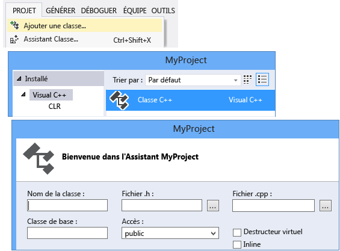
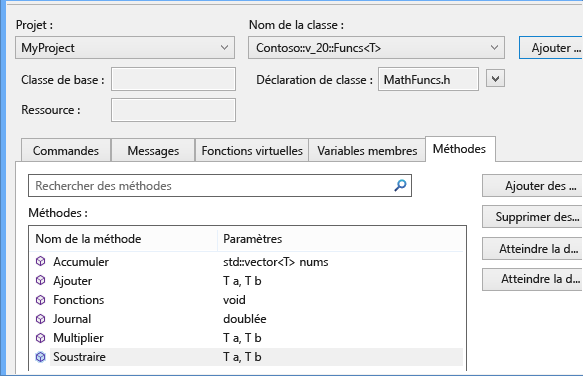
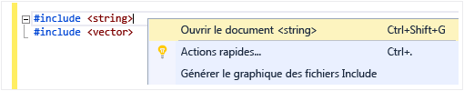
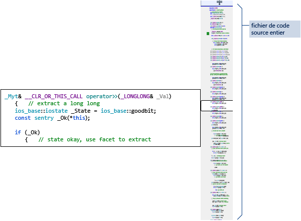

# Écriture et refactorisation du code (C++)

L’éditeur de code C++ et l’IDE Visual Studio vous aident de nombreuses façons quand vous développez. Certains sont propres à C++, alors que d'autres sont quasiment identiques pour tous les langages Visual Studio. Pour plus d’informations sur les fonctionnalités partagées, consultez [Écriture de code dans l’éditeur de code et de texte](/visualstudio/ide/writing-code-in-the-code-and-text-editor). Les options pour l’activation et la configuration des fonctionnalités propres à C++ se trouvent sous **Outils &#124; Options &#124; Éditeur de texte &#124; C/C++** . Après avoir choisi l’option que vous voulez définir, vous pouvez obtenir de l’aide supplémentaire en appuyant sur la touche **F1** quand la boîte de dialogue a le focus. Pour les options générales de mise en forme du code, tapez `Editor C++` dans **Lancement rapide**.

Des fonctionnalités expérimentales, qui peuvent ou non être incluses dans une version future de Visual Studio, se trouvent dans la boîte de dialogue [Éditeur de texte C++ expérimental](/visualstudio/ide/reference/options-text-editor-c-cpp-experimental). Dans Visual Studio 2017, vous pouvez activer **IntelliSense prédictif** dans cette boîte de dialogue.

## Ajout de nouveaux fichiers

Pour ajouter de nouveaux fichiers à un projet, cliquez avec le bouton droit sur le nœud du projet dans l’Explorateur de solutions, puis choisissez **Ajouter &#124; Nouveau**.

## Options de mise en forme

Pour définir les options de mise en forme comme les retraits, la complétion des accolades et la colorisation, tapez « Mise en forme de C++ » dans la fenêtre **Lancement rapide**. Visual Studio 2017 version 15.7 et ultérieure prend en charge ClangFormat. Vous pouvez le configurer dans la [Page de propriétés de mise en forme de C/C++](/visualstudio/ide/reference/options-text-editor-c-cpp-formatting) sous **Outils &#124; Options &#124; Éditeur de texte &#124; C/C++ &#124; Mise en forme**.

## IntelliSense

IntelliSense est le nom d’un ensemble de fonctionnalités qui fournissent des informations inline sur les membres, les types et les surcharges de fonction. L’illustration suivante montre la liste déroulante des membres qui s’affiche quand vous commencez à taper. Vous pouvez appuyer sur la touche Tab pour entrer le texte de l'élément sélectionné dans votre fichier de code.

Pour plus d’informations, consultez [Visual C++ IntelliSense](/visualstudio/ide/visual-cpp-intellisense).

## Insérer des extraits de code

Un extrait de code est un bloc de code source prédéfini. Cliquez avec le bouton droit sur un point précis ou sur le texte sélectionné pour insérer un extrait de code ou entourer le texte sélectionné de l'extrait de code. L'illustration ci-dessous montre les trois étapes à suivre pour entourer une instruction sélectionnée d'une boucle for. Les éléments en jaune dans l'image finale sont des champs modifiables auxquels vous accédez avec la touche Tab. Pour plus d’informations, consultez [Extraits de code](/visualstudio/ide/code-snippets).

## Ajouter une classe

Ajoutez une nouvelle classe à partir du menu **Projet** avec l’Assistant Classe.

Vous pouvez aussi utiliser l’Assistant Classe pour modifier ou examiner une classe existante.

Pour plus d’informations, consultez [Ajout de fonctionnalités avec des Assistants Code (C++)](../ide/adding-functionality-with-code-wizards-cpp.md).

## Refactorisation

Les refactorisations sont disponibles sous le menu contextuel Action rapide ou en cliquant sur une [ampoule](/visualstudio/ide/perform-quick-actions-with-light-bulbs) dans l’éditeur.  Vous pouvez en trouver certaines dans le menu **Modifier > Refactoriser**.  Ces fonctions incluent :

* [Renommer](refactoring/rename.md)
* [Extraire la fonction](refactoring/extract-function.md)
* [Implémenter les virtuels purs](refactoring/implement-pure-virtuals.md)
* [Créer la déclaration/la définition](refactoring/create-declaration-definition.md)
* [Définition de fonction move](refactoring/move-definition-location.md)
* [Convertir en littéral de chaîne brute](refactoring/convert-to-raw-string-literal.md)
* [Modifier la signature](refactoring/change-signature.md)

## Naviguer et comprendre

Visual C++ partage beaucoup de fonctionnalités de navigation dans le code avec d’autres langages. Pour plus d’informations, consultez [Navigation dans le code](/visualstudio/ide/navigating-code) et [Affichage de la structure du code](/visualstudio/ide/viewing-the-structure-of-code).

## Info express

Placez le curseur sur une variable pour afficher des informations sur son type.

## Ouvrir le document (accéder à l'en-tête)

Cliquez avec le bouton droit sur le nom d'en-tête dans une directive `#include` et ouvrez le fichier d'en-tête.

## Aperçu de définition

Placez le curseur sur une déclaration de variable ou de fonction, cliquez avec le bouton droit, puis choisissez **Aperçu de la définition** pour afficher sa définition inline. Pour plus d’informations, consultez [Aperçu de la définition (Alt+F12)](/visualstudio/ide/how-to-view-and-edit-code-by-using-peek-definition-alt-plus-f12).

## Atteindre la définition

Placez le curseur sur une déclaration de variable ou de fonction, cliquez avec le bouton droit, puis choisissez **Atteindre la définition** pour ouvrir le document où l’objet est défini.

## Afficher la hiérarchie d'appels

Cliquez avec le bouton droit sur un appel de fonction pour afficher la liste récursive de toutes les fonctions qui sont appelées et de toutes les fonctions qui l’appellent. Chaque fonction de la liste peut être développée de la même façon. Pour plus d’informations, consultez [Hiérarchie d’appels](/visualstudio/ide/reference/call-hierarchy).

## Afficher ou masquer l'en-tête / le fichier de code

Cliquez avec le bouton droit et choisissez **Afficher ou masquer l’en-tête / le fichier de code** pour basculer entre un fichier d’en-tête et son fichier de code associé.

## mode Plan

Cliquez avec le bouton droit n’importe où dans un fichier de code source et choisissez **Mode Plan** pour réduire ou développer les définitions et/ou les régions personnalisées. Ceci vous permet de parcourir plus vite seulement les parties qui vous intéressent. Pour plus d’informations, voir [Mode Plan](/visualstudio/ide/outlining).

## Mode mappage pour la barre de défilement

Le mode mappage pour la barre de défilement vous permet de faire défiler et parcourir un fichier de code rapidement, sans avoir à quitter votre emplacement actuel. Ou cliquez n'importe où sur la carte du code pour accéder directement à cet emplacement. Pour plus d'informations, voir [Procédure : Suivre votre code en personnalisant la barre de défilement](/visualstudio/ide/how-to-track-your-code-by-customizing-the-scrollbar).

## Générer le graphique des fichiers Include

Cliquez avec le bouton droit sur un fichier de code dans votre projet et choisissez **Générer le graphique des fichiers Include** pour afficher un graphe montrant les fichiers qui sont inclus par d’autres fichiers.

## F1 Aide

Placez le curseur sur ou juste après un type, un mot clé ou une fonction, et appuyez sur F1 pour accéder directement à la rubrique de référence appropriée sur docs.microsoft.com. F1 fonctionne également sur les éléments de la liste d'erreurs et dans de nombreuses boîtes de dialogue.

## Lancement rapide

Pour accéder facilement à une fenêtre ou à un outil dans Visual Studio, tapez simplement son nom dans la fenêtre de lancement rapide dans le coin supérieur droit de l'interface utilisateur. La liste de saisie semi-automatique est filtrée à mesure que vous tapez.

