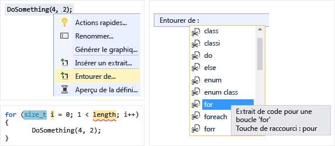
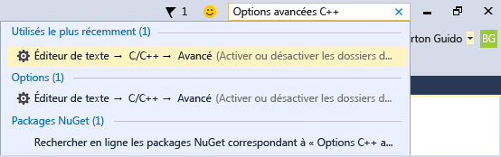

# Modifier et refactoriser du code C++ dans Visual Studio

Visual Studio met à votre disposition plusieurs outils pour vous aider à écrire, modifier et refactoriser votre code.

##  IntelliSense

IntelliSense est un outil de complétion de code puissant qui suggère des symboles et des extraits de code au fil de votre frappe. C++ IntelliSense dans Visual Studio s’exécute en temps réel, analysant votre base de code à mesure que vous la mettez à jour et fournissant des recommandations. Plus vous tapez de caractères, plus la liste des résultats recommandés raccourcit.

Certains symboles sont omis automatiquement afin de limiter les résultats dans la mesure du possible. Par exemple, lors de l’accès aux membres d’un objet de classe à partir de l’extérieur de la classe, vous ne pourrez pas voir les membres privés par défaut, ni les membres protégés (si vous n’êtes pas dans le contexte d’une classe enfant). Vous pouvez ajuster le filtrage en utilisant les boutons en bas.

Une fois que vous avez choisi le symbole dans la liste déroulante, vous pouvez le compléter automatiquement à l’aide de la **touche Tab**, **entrée**ou de l’un des autres caractères de validation (par défaut : `{ } [ ] ( ) . , : ; + - * / % & | ^ ! = ? @ # \`). Pour ajouter ou supprimer des caractères dans cette liste, recherchez « IntelliSense » dans **Lancement rapide** (Ctrl+Q) et choisissez l’option **Éditeur de texte > C/C++ > Avancé**. L’option **Caractères de validation des listes de membres** vous permet de personnaliser la liste avec les modifications de votre choix.

L’option **Mode filtre des listes de membres** contrôle les types de suggestions de saisie semi-automatique IntelliSense que vous voyez. Par défaut, elle est définie sur **Approximatif**. Dans une recherche approximative, si vous avez un symbole appelé *MaClasseFantastique*, vous pouvez taper « MCF » et trouver la classe dans les suggestions de saisie semi-automatique. L’algorithme de recherche approximative définit un seuil minimal que les symboles doivent respecter pour apparaître dans la liste. Le filtrage **Intelligent** affiche tous les symboles contenant des sous-chaînes qui correspondent à ce que vous avez tapé. Le filtrage **Préfixe** recherche les chaînes qui commencent par ce que vous avez tapé.

Pour plus d’informations sur C++ IntelliSense, consultez [Visual C++ IntelliSense](/visualstudio/ide/visual-cpp-intellisense) et [Configurer un projet C++ pour IntelliSense](/visualstudio/ide/visual-cpp-intellisense-configuration).

## IntelliCode

IntelliCode est la version d’IntelliSense assistée par intelligence artificielle. Il place le candidat le plus probable en haut de votre liste de saisie semi-automatique. Les recommandations IntelliCode sont basées sur des milliers de projets open source sur GitHub ayant chacun reçu plus de 100 étoiles. Quand il est combiné avec le contexte de votre code, la liste de saisie semi-automatique est adaptée pour promouvoir les pratiques courantes.

Quand vous écrivez du code C++, IntelliCode vous aide à utiliser des bibliothèques courantes comme la bibliothèque standard C++. Le contexte de votre code est utilisé pour fournir en priorité les recommandations les plus utiles. Dans l’exemple suivant, la fonction membre `size` étant fréquemment utilisée avec la fonction `sort`, elle est présentée au début de la liste des résultats.

::: moniker range="vs-2019"

Dans Visual Studio 2019, IntelliCode est disponible en tant que composant facultatif dans la charge de travail **Développement Desktop en C++** . Pour qu’IntelliCode soit actif pour C++, accédez à **Outils** > **Options** > **IntelliCode** > **Général** et définissez **Modèle de base C++** sur **Activé**.

::: moniker-end

::: moniker range="vs-2017"

Dans Visual Studio 2017, IntelliCode est disponible en tant qu’extension dans la Visual Studio Marketplace.

::: moniker-end

## Fonctionnalité IntelliSense prédictive (expérimentale)

La **fonctionnalité IntelliSense prédictive** est une fonctionnalité expérimentale qui utilise une reconnaissance contextuelle pour limiter le nombre des résultats affichés dans la liste déroulante IntelliSense. L’algorithme applique une mise en correspondance de type afin d’afficher uniquement les résultats qui correspondent au type attendu. Dans le cas le plus simple, si vous tapez `int x =` et appelez la liste déroulante IntelliSense, vous voyez uniquement des entiers ou des fonctions retournant des entiers. Cette fonctionnalité est désactivée par défaut, car elle est toujours en cours de développement. Elle fonctionne le mieux avec les symboles globaux ; les fonctions membres ne sont pas encore prises en charge. Vous pouvez l’activer en tapant « Prédictive » dans **Lancement rapide** ou en accédant à **Outils** > **Options** > **Éditeur de texte** > **C/C++**  > **Expérimental** > **Activer la fonctionnalité IntelliSense prédictive**.

Pour remplacer la **fonctionnalité IntelliSense prédictive** et afficher la liste la plus longue, appuyez sur **Ctrl + J**. Si la **fonctionnalité IntelliSense prédictive** est activée, l’appel de **Ctrl + J** supprime le filtre prédictif. Le fait de réappuyer sur **Ctrl+J** supprime le filtre d’accessibilité des résultats de la liste de membres le cas échéant. Le bouton ([+]) sous la liste déroulante IntelliSense fait la même chose que **Ctrl + J**. Pointez sur le bouton pour afficher des informations d’info-bulle sur ce qui est affiché.

La capture d’écran précédente montre plusieurs boutons sous la liste déroulante. Ils activent les filtres IntelliSense pour différents types de résultats :

- Variables et constantes
- Fonctions
- Types
- Macros
- Enums
- Espaces de noms

Un bouton ne s’affiche que s’il est pertinent pour votre session IntelliSense actuelle. En règle générale, vous ne voyez pas tous les boutons en même temps.

## Modèle IntelliSense

Quand le signe insertion est à l’intérieur d’une définition de modèle, une **Barre de modèles** s’affiche, qui vous permet de fournir des exemples d’arguments de modèle pour IntelliSense. 

Cliquez sur l’icône **\<t >** pour développer/réduire la **barre du modèle**. Cliquez sur l’icône en forme de crayon ou double-cliquez sur la **Barre de modèles** pour ouvrir la fenêtre **Modifier**. 

Les modifications apportées dans la fenêtre sont appliquées directement au code source afin que vous puissiez voir les effets en temps réel. 

La Barre de modèles peut remplir automatiquement la liste des candidats en fonction des instanciations dans votre code. Cliquez sur **Ajouter toutes les instanciations existantes** pour afficher la liste de tous les arguments concrets ayant servi à instancier le modèle dans l’ensemble de votre base de code.

Une fenêtre en bas de l’éditeur indique où chaque instanciation a été trouvée et quels étaient ses arguments.

Les informations de la **Barre de modèles** sont traitées comme étant propres à l’utilisateur. Elles sont stockées dans le dossier .vs et ne sont pas soumises au contrôle de code source.

##  Tildes d’erreur et correctifs rapides

Si l’éditeur détecte des problèmes dans votre code, il ajoute des tildes colorés sous ceux-ci. Les tildes rouges indiquent du code impossible à compiler. Les tildes verts indiquent d’autres types de problèmes qui peuvent s’avérer sérieux. Vous pouvez ouvrir la fenêtre **Liste d’erreurs** pour obtenir plus d’informations sur les problèmes.

Pour certains types d’erreurs ainsi que les modèles de codage courants, l’éditeur propose un **Correctif rapide** sous la forme d’une ampoule qui apparaît quand vous placez le curseur sur le tilde. Cliquez sur la flèche vers le bas pour afficher les suggestions. 

Dans l’exemple suivant, un `vector` a été déclaré, mais aucune définition n’a été trouvée. L’éditeur suggère donc d’inclure le fichier d’en-tête nécessaire :

L’éditeur propose également des correctifs rapides pour certaines opportunités de refactorisation. Par exemple, si vous déclarez une classe dans un fichier d’en-tête, Visual Studio suggère de créer une définition pour celle-ci dans un fichier .cpp distinct. 

## Suivi des modifications

Chaque fois que vous apportez une modification à un fichier, une barre jaune s’affiche sur la gauche pour indiquer que des modifications non enregistrées ont été effectuées. Quand vous enregistrez le fichier, la barre devient verte. Les barres verte et jaune sont conservées tant que le document est ouvert dans l’éditeur. Elles représentent les modifications qui ont été apportées depuis la dernière ouverture du document.

## Déplacer du code

Pour déplacer des lignes de code vers le haut et vers le bas, sélectionnez-les, maintenez la touche Alt enfoncée, puis appuyez sur les touches de direction **Haut/Bas**.

##  Insérer des extraits de code

Un extrait de code est un bloc de code source prédéfini. Cliquez avec le bouton droit sur un point précis ou sur le texte sélectionné pour insérer un extrait de code ou entourer le texte sélectionné de l'extrait de code. L'illustration ci-dessous montre les trois étapes à suivre pour entourer une instruction sélectionnée d'une boucle for. Les éléments en jaune dans l'image finale sont des champs modifiables auxquels vous accédez avec la touche Tab. Pour plus d'informations, consultez [Code Snippets](/visualstudio/ide/code-snippets).

##  Ajouter une classe

Ajoutez une nouvelle classe à partir du menu **Projet** ou du menu contextuel dans l’**Explorateur de solutions** :

Vous pouvez aussi utiliser l’Assistant Classe pour modifier ou examiner une classe existante.

Pour plus d’informations, consultez [Ajout de fonctionnalités avec des Assistants Code (C++)](../ide/adding-functionality-with-code-wizards-cpp.md).

##  Refactorisation

Les refactorisations sont disponibles sous le menu contextuel Action rapide ou en cliquant sur une [ampoule](/visualstudio/ide/perform-quick-actions-with-light-bulbs) dans l’éditeur.  Vous pouvez en trouver certaines dans le menu **Modifier > Refactoriser**.  Voici quelques fonctionnalités :

* [Renommer](refactoring/rename.md)
* [Extraire la fonction](refactoring/extract-function.md)
* [Implémenter les virtuels purs](refactoring/implement-pure-virtuals.md)
* [Créer la déclaration/la définition](refactoring/create-declaration-definition.md)
* [Définition de fonction move](refactoring/move-definition-location.md)
* [Convertir en littéral de chaîne brute](refactoring/convert-to-raw-string-literal.md)
* [Modifier la signature](refactoring/change-signature.md)

## Application d’un style de code avec ClangFormat et EditorConfig

Les versions 2017 et ultérieures de Visual Studio prennent en charge [ClangFormat](https://clang.llvm.org/docs/ClangFormat.html), utilitaire de mise en forme de code courant pour C++ basé sur Clang/LLVM. Tapez « ClangFormat » dans [Lancement rapide](/visualstudio/ide/reference/quick-launch-environment-options-dialog-box) pour le configurer afin qu’il utilise un de ces formats courants :

- LLVM
- Google
- Chromium
- Mozilla
- WebKit
- Visual Studio

Vous pouvez également fournir votre propre fichier .clang-format ou _clang-format pour appliquer des règles personnalisées à tous les fichiers de code de même niveau ou de niveau inférieur.

Les fichiers pouvant facilement être partagés par le bais du contrôle de code source, vous pouvez imposer des conventions de codage à l’ensemble de votre équipe de développement.

Les versions 2017 et ultérieures de Visual Studio prennent également en charge [EditorConfig](https://editorconfig.org/), qui fonctionne de manière similaire. ClangFormat, toutefois, a plus d’options de style qu’EditorConfig, notamment des règles propres à C++. Avec **EditorConfig**, vous créez des fichiers **.editorconfig** et les placez dans différents dossiers de votre base de code afin de spécifier des styles de code pour ces dossiers et sous-dossiers. Un fichier **.editorconfig** est prioritaire sur tout fichier **.editorconfig** dans les dossiers parents et remplace les paramètres de mise en forme configurés via **Outils** > **Options**. Vous pouvez définir des règles pour les tabulations, les espaces et la taille du retrait, entre autres. Pour plus d’informations, consultez [Créer des paramètres d’éditeur personnalisés et portables avec EditorConfig](/visualstudio/ide/create-portable-custom-editor-options).

## Autres options de mise en forme

La zone de recherche **Lancement rapide** est le moyen le plus rapide de trouver un paramètre ou un outil. Elle se trouve dans le menu principal. Dès que vous commencez à taper, la liste de saisie semi-automatique filtre les résultats.

Pour définir les options de mise en forme comme les retraits, la complétion des accolades et la colorisation, tapez « Mise en forme de C++ » dans la fenêtre **Lancement rapide**.

D’autres options de mise en forme sont disponibles sous **Edition** > **Avancé** dans le menu principal.

Les options pour l’activation et la configuration des fonctionnalités d’édition propres à C++ se trouvent sous **Outils** > **Options** > **Éditeur de texte** > **C/C++** . Après avoir choisi l’option que vous voulez définir, vous pouvez obtenir de l’aide supplémentaire en appuyant sur la touche **F1** quand la boîte de dialogue a le focus. Pour les options générales de mise en forme du code, tapez `Editor C++` dans **Lancement rapide**.

Des fonctionnalités expérimentales, qui peuvent ou non être incluses dans une version future de Visual Studio, se trouvent dans la boîte de dialogue [Éditeur de texte C++ expérimental](/visualstudio/ide/reference/options-text-editor-c-cpp-experimental). Dans Visual Studio versions 2017 et ultérieures, vous pouvez activer **IntelliSense prédictif** dans cette boîte de dialogue.

## Voir aussi

[Lire et comprendre du code C++](read-and-understand-code-cpp.md) 
[Naviguer dans votre base de code C++ dans Visual Studio](navigate-code-cpp.md) 
[Collaborer avec Live Share pour C++](live-share-cpp.md)
