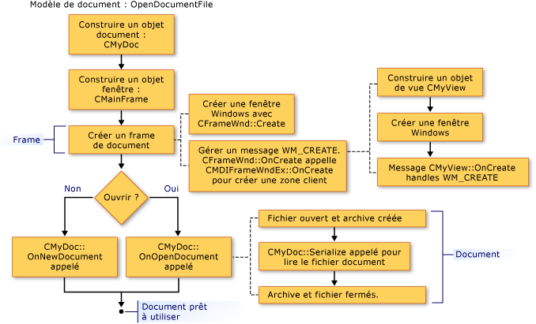

# Création de documents, fenêtres et vues

Les illustrations suivantes donnent une vue d’ensemble du processus de création de documents, vues et fenêtres frame. Autres articles qui vous concentrer sur les objets qui participent fournissent d’autres informations.

À la fin de ce processus, les objets coopérant existent et stockent les pointeurs vers les uns des autres. Les figures suivantes illustrent la séquence dans laquelle les objets sont créés. Vous pouvez suivre la séquence à partir d’une illustration à.

  
Séquence de création d’un Document

  
Séquence de création d’une fenêtre Frame

  
Séquence de création d’une vue

Pour plus d’informations sur la façon dont le framework initialise le nouveau document, vue et les objets de fenêtre frame, consultez la section classes [CDocument](../mfc/reference/cdocument-class.md), [CView](../mfc/reference/cview-class.md), [CFrameWnd](../mfc/reference/cframewnd-class.md), [CMDIFrameWnd](../mfc/reference/cmdiframewnd-class.md), et [CMDIChildWnd](../mfc/reference/cmdichildwnd-class.md) dans la référence de la bibliothèque MFC. Consultez également [Note technique 22](../mfc/tn022-standard-commands-implementation.md), qui explique les processus de création et d’initialisation supplémentaires sous sa discussion des commandes standard de l’infrastructure pour le **New** et **ouvrir** éléments sur le **fichier** menu.

##   L’initialisation de vos propres ajouts à ces Classes

Les figures précédentes indiquent également les points à partir duquel vous pouvez substituer des fonctions membres pour initialiser des objets de votre application. Une substitution de `OnInitialUpdate` dans votre vue de la classe est le meilleur endroit pour initialiser la vue. Le `OnInitialUpdate` appel se produit immédiatement après la fenêtre frame est créée et la vue dans la fenêtre frame est attachée à son document. Par exemple, si votre vue est une vue de défilement (dérivée de `CScrollView` plutôt que `CView`), vous devez définir la taille d’affichage en fonction de la taille du document dans votre `OnInitialUpdate` remplacer. (Ce processus est décrit dans la description de la classe [CScrollView](../mfc/reference/cscrollview-class.md).) Vous pouvez remplacer le `CDocument` fonctions membres `OnNewDocument` et `OnOpenDocument` pour fournir l’initialisation spécifique à l’application du document. En règle générale, vous devez substituer les deux dans la mesure où un document peut être créé de deux manières.

Dans la plupart des cas, votre substitution doit appeler la version de la classe de base. Pour plus d’informations, consultez les fonctions membres nommées des classes [CDocument](../mfc/reference/cdocument-class.md), [CView](../mfc/reference/cview-class.md), [CFrameWnd](../mfc/reference/cframewnd-class.md), et [CWinApp](../mfc/reference/cwinapp-class.md) dans la bibliothèque MFC Référence de la bibliothèque.

## Voir aussi

[Modèles de document et le processus de création de Document/Vue](../mfc/document-templates-and-the-document-view-creation-process.md) 
[Création de modèle de document](../mfc/document-template-creation.md) 
[Création d’un document/vue](../mfc/document-view-creation.md) 
[Relations entre les objets MFC](../mfc/relationships-among-mfc-objects.md)

