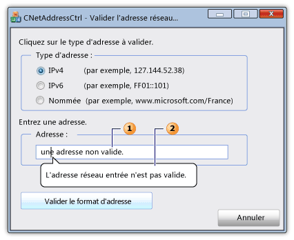

# <a name="cnetaddressctrl-class"></a>Classe CNetAddressCtrl

La classe `CNetAddressCtrl` représente le contrôle d'adresse réseau, que vous pouvez utiliser pour entrer et valider le format des adresses IPv4, IPv6 et DNS nommées.

## <a name="syntax"></a>Syntaxe

```
class CNetAddressCtrl : public CEdit
```

## <a name="members"></a>Membres

### <a name="public-constructors"></a>Constructeurs publics

|Nom|Description|
|----------|-----------------|
|[CNetAddressCtrl::CNetAddressCtrl](#cnetaddressctrl)|Construit un objet `CNetAddressCtrl`.|

### <a name="public-methods"></a>M&#233;thodes publiques

|Nom|Description|
|----------|-----------------|
|[CNetAddressCtrl::Créer](#create)|Crée un contrôle d’adresse réseau avec des `CNetAddressCtrl` styles spécifiés et l’attache à l’objet actuel.|
|[CNetAddressCtrl::CreateEx](#createex)|Crée un contrôle d’adresse réseau avec des `CNetAddressCtrl` styles étendus spécifiés et l’attache à l’objet actuel.|
|[CNetAddressCtrl::DsplayErrorTip](#displayerrortip)|Affiche une pointe de ballon d’erreur lorsque l’utilisateur entre une adresse réseau non supportée dans le contrôle actuel de l’adresse réseau.|
|[CNetAddressCtrl::GetAddress](#getaddress)|Récupère une représentation validée et analysée de l’adresse réseau associée au contrôle actuel de l’adresse réseau.|
|[CNetAddressCtrl::GetAllowType](#getallowtype)|Récupère le type d’adresse réseau que le contrôle d’adresse réseau actuel peut prendre en charge.|
|[CNetAddressCtrl::SetAllowType](#setallowtype)|Définit le type d’adresse réseau que le contrôle actuel de l’adresse réseau peut prendre en charge.|

## <a name="remarks"></a>Notes

Le contrôle de l’adresse réseau vérifie que le format de l’adresse que l’utilisateur entre est correct. Le contrôle ne se connecte pas réellement à l’adresse réseau. La méthode [CNetAddressCtrl::SetAllowType](#setallowtype) spécifie un ou plusieurs types d’adresses que la méthode [CNetAddressCtrl::GetAddress](#getaddress) méthode peut analyser et vérifier. Une adresse peut prendre la forme d’un IPv4, iPv6 ou d’une adresse nommée pour une destination de serveur, de réseau, d’hôte ou de message de diffusion. Si le format de l’adresse est incorrect, vous pouvez utiliser la méthode [CNetAddressCtrl::DisplayErrorTip](#displayerrortip) pour afficher une boîte de message infotip qui pointe graphiquement vers la boîte texte du contrôle de l’adresse réseau et affiche un message d’erreur prédéfini.

La `CNetAddressCtrl` classe est dérivée de la classe [CEdit.](../../mfc/reference/cedit-class.md) Par conséquent, le contrôle de l’adresse réseau donne accès à tous les messages de contrôle de modification Windows.

La figure suivante représente un dialogue qui contient un contrôle d’adresse réseau. La boîte de texte (1) pour le contrôle de l’adresse réseau contient une adresse réseau invalide. Le message infotip (2) est affiché si l’adresse réseau est invalide.



## <a name="example"></a>Exemple

L’exemple de code suivant est une partie d’un dialogue qui valide une adresse réseau. Les gestionnaires d’événements pour trois boutons radio spécifient que l’adresse réseau peut être l’un des trois types d’adresse. L’utilisateur entre une adresse dans la boîte texte du contrôle réseau, puis appuie sur un bouton pour valider l’adresse. Si l’adresse est valide, un message de réussite est affiché; autrement, le message d’erreur d’infotip prédéfini s’affiche.

[!code-cpp[NVC_MFC_CNetAddressCtrl_s1#1](../../mfc/reference/codesnippet/cpp/cnetaddressctrl-class_1.cpp)]

## <a name="example"></a>Exemple

L’exemple de code suivant du fichier d’en-tête de dialogue définit les variables [NC_ADDRESS](/windows/win32/api/shellapi/ns-shellapi-nc_address) et [NET_ADDRESS_INFO](/windows/win32/shell/hkey-type) qui sont requises par la méthode [CNetAddressCtrl:GetAddress.](#getaddress)

[!code-cpp[NVC_MFC_CNetAddressCtrl_s1#2](../../mfc/reference/codesnippet/cpp/cnetaddressctrl-class_2.h)]

## <a name="inheritance-hierarchy"></a>Hiérarchie d'héritage

[CObject](../../mfc/reference/cobject-class.md)

[CCmdTarget](../../mfc/reference/ccmdtarget-class.md)

[CWnd](../../mfc/reference/cwnd-class.md)

[CEdit](../../mfc/reference/cedit-class.md)

`CNetAddressCtrl`

## <a name="requirements"></a>Spécifications

**En-tête :** afxcmn.h

Cette classe est prise en charge dans Windows Vista et plus tard.

Des exigences supplémentaires pour cette classe sont décrites dans [Build Requirements for Windows Vista Common Controls](../../mfc/build-requirements-for-windows-vista-common-controls.md).

## <a name="cnetaddressctrlcnetaddressctrl"></a><a name="cnetaddressctrl"></a>CNetAddressCtrl::CNetAddressCtrl

Construit un objet `CNetAddressCtrl`.

```
CNetAddressCtrl();
```

### <a name="remarks"></a>Notes

Utilisez le [CNetAddressCtrl::Créer](#create) ou [CNetAddressCtrl::CreateEx](#createex) méthode pour créer `CNetAddressCtrl` un contrôle réseau et l’attacher à l’objet.

## <a name="cnetaddressctrlcreate"></a><a name="create"></a>CNetAddressCtrl::Créer

Crée un contrôle d’adresse réseau avec des `CNetAddressCtrl` styles spécifiés et l’attache à l’objet actuel.

```
virtual BOOL Create(
    DWORD dwStyle,
    const RECT& rect,
    CWnd* pParentWnd,
    UINT nID);
```

### <a name="parameters"></a>Paramètres

|Paramètre|Description|
|---------------|-----------------|
|*dwStyle (en)*|[dans] Une combinaison bitwise de styles à appliquer au contrôle. Pour plus d’informations, voir [Edit Styles](../../mfc/reference/styles-used-by-mfc.md#edit-styles).|
|*Rect*|[dans] Une référence à une structure [RECT](/windows/win32/api/windef/ns-windef-rect) qui contient la position et la taille du contrôle.|
|*pParentWnd*|[dans] Un pointeur non nul à un objet [CWnd](../../mfc/reference/cwnd-class.md) qui est la fenêtre parente du contrôle.|
|*nID*|[dans] L’id du contrôle.|

### <a name="return-value"></a>Valeur de retour

VRAI si cette méthode est réussie; autrement, FALSE.

## <a name="cnetaddressctrlcreateex"></a><a name="createex"></a>CNetAddressCtrl::CreateEx

Crée un contrôle d’adresse réseau avec des `CNetAddressCtrl` styles étendus spécifiés et l’attache à l’objet actuel.

```
virtual BOOL CreateEx(
    DWORD dwExStyle,
    DWORD dwStyle,
    const RECT& rect,
    CWnd* pParentWnd,
    UINT nID);
```

### <a name="parameters"></a>Paramètres

|Paramètre|Description|
|---------------|-----------------|
|*dwExStyle (en anglais)*|[dans] Une combinaison bitwise (OU) de styles étendus à appliquer au contrôle. Pour plus d’informations, consultez le paramètre *dwExStyle* de la fonction [CreateWindowEx.](/windows/win32/api/winuser/nf-winuser-createwindowexw)|
|*dwStyle (en)*|[dans] Une combinaison bitwise (OU) de styles à appliquer au contrôle. Pour plus d’informations, voir [Edit Styles](../../mfc/reference/styles-used-by-mfc.md#edit-styles).|
|*Rect*|[dans] Une référence à une structure [RECT](/windows/win32/api/windef/ns-windef-rect) qui contient la position et la taille du contrôle.|
|*pParentWnd*|[dans] Un pointeur non nul à un objet [CWnd](../../mfc/reference/cwnd-class.md) qui est la fenêtre parente du contrôle.|
|*nID*|[dans] L’id du contrôle.|

### <a name="return-value"></a>Valeur de retour

VRAI si cette méthode est réussie; autrement, FALSE.

## <a name="cnetaddressctrldisplayerrortip"></a><a name="displayerrortip"></a>CNetAddressCtrl::DsplayErrorTip

Affiche un message d’erreur dans la pointe du ballon qui est associé au contrôle actuel de l’adresse réseau.

```
HRESULT DisplayErrorTip();
```

### <a name="return-value"></a>Valeur de retour

La `S_OK` valeur si cette méthode est réussie; autrement, un code d’erreur.

### <a name="remarks"></a>Notes

Utilisez la méthode [CNetAddressCtrl::SetAllowType](#setallowtype) pour spécifier les types d’adresses que le contrôle actuel de l’adresse réseau peut prendre en charge. Utilisez la méthode [CNetAddressCtrl::GetAddress](#getaddress) pour valider et analyser l’adresse réseau que l’utilisateur entre. Utilisez la méthode [CNetAddressCtrl::DisplayErrorTip](#displayerrortip) pour afficher un infotip de message d’erreur si la méthode [CNetAddressCtrl:GetAddress](#getaddress) est infructueuse.

Ce message invoque la [macro NetAddr_DisplayErrorTip,](/windows/win32/api/shellapi/nf-shellapi-netaddr_displayerrortip) qui est décrite dans le SDK Windows. Cette macro `NCM_DISPLAYERRORTIP` envoie le message.

## <a name="cnetaddressctrlgetaddress"></a><a name="getaddress"></a>CNetAddressCtrl::GetAddress

Récupère une représentation validée et analysée de l’adresse réseau associée au contrôle actuel de l’adresse réseau.

```
HRESULT GetAddress(PNC_ADDRESS pAddress) const;
```

### <a name="parameters"></a>Paramètres

*pAddress (en)*<br/>
[dans, dehors] Pointeur vers une structure [NC_ADDRESS.](/windows/win32/api/shellapi/ns-shellapi-nc_address)  Définissez le membre *pAddrInfo* de cette structure à l’adresse d’une structure [NET_ADDRESS_INFO](/windows/win32/shell/hkey-type) avant d’appeler la méthode GetAddress.

### <a name="return-value"></a>Valeur de retour

La valeur S_OK si cette méthode est réussie; autrement, un code d’erreur COM. Pour plus d’informations sur les codes d’erreur possibles, consultez la section Valeur de retour de la [macro NetAddr_GetAddress.](/windows/win32/api/shellapi/nf-shellapi-netaddr_getaddress)

### <a name="remarks"></a>Notes

Si cette méthode est efficace, la structure [NET_ADDRESS_INFO](/windows/win32/shell/hkey-type) contient des informations supplémentaires sur l’adresse réseau.

Utilisez la méthode [CNetAddressCtrl::SetAllowType](#setallowtype) pour spécifier les types d’adresses que le contrôle actuel de l’adresse réseau peut prendre en charge. Utilisez la méthode [CNetAddressCtrl::GetAddress](#getaddress) pour valider et analyser l’adresse réseau que l’utilisateur entre. Utilisez la méthode [CNetAddressCtrl::DisplayErrorTip](#displayerrortip) pour afficher un infotip de message d’erreur si la méthode [CNetAddressCtrl:GetAddress](#getaddress) est infructueuse.

Cette méthode invoque la [macro NetAddr_GetAddress,](/windows/win32/api/shellapi/nf-shellapi-netaddr_getaddress) qui est décrite dans le SDK Windows. Cette macro envoie le message NCM_GETADDRESS.

## <a name="cnetaddressctrlgetallowtype"></a><a name="getallowtype"></a>CNetAddressCtrl::GetAllowType

Récupère le type d’adresse réseau que le contrôle d’adresse réseau actuel peut prendre en charge.

```
DWORD GetAllowType() const;
```

### <a name="return-value"></a>Valeur de retour

Une combinaison bitwise (OU) de drapeaux qui spécifie les types d’adresses que le contrôle d’adresse réseau peut prendre en charge. Pour plus d’informations, voir [NET_STRING](/windows/win32/shell/net-string).

### <a name="remarks"></a>Notes

Ce message invoque la [macro NetAddr_GetAllowType,](/windows/win32/api/shellapi/nf-shellapi-netaddr_getallowtype) qui est décrite dans le SDK Windows. Cette macro envoie le message NCM_GETALLOWTYPE.

## <a name="cnetaddressctrlsetallowtype"></a><a name="setallowtype"></a>CNetAddressCtrl::SetAllowType

Définit le type d’adresse réseau que le contrôle actuel de l’adresse réseau peut prendre en charge.

```
HRESULT SetAllowType(DWORD dwAddrMask);
```

### <a name="parameters"></a>Paramètres

|Paramètre|Description|
|---------------|-----------------|
|*dwAddrMask*|[dans] Une combinaison bitwise (OU) de drapeaux qui spécifie les types d’adresses que le contrôle d’adresse réseau peut prendre en charge. Pour plus d’informations, voir [NET_STRING](/windows/win32/shell/net-string).|

### <a name="return-value"></a>Valeur de retour

S_OK si cette méthode est efficace; autrement, un code d’erreur COM.

### <a name="remarks"></a>Notes

Utilisez la méthode [CNetAddressCtrl::SetAllowType](#setallowtype) pour spécifier les types d’adresses que le contrôle actuel de l’adresse réseau peut prendre en charge. Utilisez la méthode [CNetAddressCtrl::GetAddress](#getaddress) pour valider et analyser l’adresse réseau que l’utilisateur entre. Utilisez la méthode [CNetAddressCtrl::DisplayErrorTip](#displayerrortip) pour afficher un infotip de message d’erreur si la méthode [CNetAddressCtrl:GetAddress](#getaddress) est infructueuse.

Ce message invoque la [macro NetAddr_SetAllowType,](/windows/win32/api/shellapi/nf-shellapi-netaddr_setallowtype) qui est décrite dans le SDK Windows. Cette macro envoie le message NCM_SETALLOWTYPE.

## <a name="see-also"></a>Voir aussi

[Classe CNetAddressCtrl](../../mfc/reference/cnetaddressctrl-class.md)<br/>
[Graphique hiérarchique](../../mfc/hierarchy-chart.md)<br/>
[CEdit Class](../../mfc/reference/cedit-class.md)
