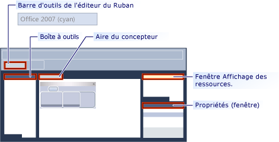

# <a name="ribbon-designer-mfc"></a>Concepteur de ruban (MFC)

Le Concepteur de ruban permet de créer et de personnaliser des rubans dans les applications MFC. Un ruban est un élément d'interface utilisateur (IU) qui organise les commandes en groupes logiques. Ces groupes apparaissent sous des onglets distincts dans une bande transversale située dans la partie supérieure de la fenêtre. Le ruban remplace la barre de menus et les barres d'outils. Un ruban peut considérablement améliorer la convivialité d'une l'application. Pour plus d’informations, consultez [rubans](/windows/desktop/uxguide/cmd-ribbons). L'illustration suivante représente un ruban.


Dans les versions antérieures de Visual Studio, les rubans devaient être créés en écrivant du code qui utilise les classes de ruban MFC telles que [classe CMFCRibbonBar](../mfc/reference/cmfcribbonbar-class.md). Dans Visual Studio 2010 et versions ultérieures, le Concepteur de ruban fournit une méthode alternative pour générer des rubans. Dans un premier temps, il convient de créer et de personnaliser un ruban en tant que ressource. Chargez ensuite la ressource de ruban à partir du code de l'application MFC. Vous pouvez même utiliser les ressources de ruban et les classes de ruban MFC conjointement. Par exemple, vous pouvez créer une ressource de ruban et puis ajouter par programmation des éléments à celui-ci lors de l’exécution à l’aide de code.

## <a name="understanding-the-ribbon-designer"></a>Présentation du Concepteur de ruban

Le Concepteur de ruban crée et stocke le ruban en tant que ressource. Quand vous créez une ressource de ruban, le Concepteur de ruban effectue trois opérations :

- Il ajoute une entrée dans le script de définition de ressources du projet (* .rc). Dans l’exemple suivant, IDR_RIBBON est le nom unique qui identifie la ressource de ruban et RT_RIBBON_XML est le type de ressource Ribbon.mfcribbon-ms est le nom du fichier de ressources.

```
    IDR_RIBBON RT_RIBBON_XML      "res\\ribbon.mfcribbon-ms"
```

- Ajoute les définitions des ID de commande à resource.h.

```
#define IDR_RIBBON            307
```

- Crée un fichier de ressources de ruban (*.mfcribbon-ms) qui contient le code XML définissant les boutons, les contrôles et les attributs du ruban. Les modifications apportées au ruban dans le Concepteur de ruban sont stockées dans le fichier de ressources au format XML. L’exemple de code suivant montre une partie du contenu d’un \*fichier .mfcribbon-ms :

```
<RIBBON_BAR>
<ELEMENT_NAME>RibbonBar</ELEMENT_NAME>
<IMAGE>
<ID>
<NAME>IDB_BUTTONS</NAME>
<VALUE>113</VALUE>
</ID>
```

Pour utiliser la ressource de ruban dans votre application MFC, charger la ressource en appelant [CMFCRibbonBar::LoadFromResource](../mfc/reference/cmfcribbonbar-class.md#loadfromresource).

## <a name="creating-a-ribbon-by-using-the-ribbon-designer"></a>Création d'un ruban à l'aide du Concepteur de ruban

Il existe deux façons d'ajouter une ressource de ruban à votre projet MFC :

- Créez une application MFC et configurez l'Assistant de projet MFC pour créer le ruban. Pour plus d’informations, consultez [Procédure pas à pas : Création d’une Application de ruban à l’aide de MFC](../mfc/walkthrough-creating-a-ribbon-application-by-using-mfc.md).

- Dans un projet MFC existant, créez une ressource de ruban et chargez-la. Pour plus d’informations, consultez [Procédure pas à pas : La mise à jour de l’Application de Scribble MFC (partie 1)](../mfc/walkthrough-updating-the-mfc-scribble-application-part-1.md).

Si votre projet contient déjà un ruban codé manuellement, vous pouvez utiliser les fonctions de MFC pour convertir le ruban existant en ressource de ruban. Pour plus d'informations, voir [Procédure : Convertir un ruban MFC existant à une ressource de ruban](../mfc/how-to-convert-an-existing-mfc-ribbon-to-a-ribbon-resource.md).

> [!NOTE]
>  Il n'est pas possible de créer des rubans dans des applications à base de boîtes de dialogue. Pour plus d’informations, consultez [Type d’Application, Assistant Application MFC](../mfc/reference/application-type-mfc-application-wizard.md).

## <a name="customizing-ribbons"></a>Personnalisation des rubans

Pour ouvrir un ruban dans le Concepteur de ruban, double-cliquez sur la ressource de ruban dans l'Affichage des ressources. Dans le concepteur, vous pouvez ajouter, supprimer et personnaliser les éléments du ruban, le bouton d'application ou la barre d'outils Accès rapide. Vous pouvez aussi lier des événements, par exemple, des événements de clic de bouton et des événements de menu, à une méthode dans votre application.

L'illustration suivante représente les différents composants du Concepteur de ruban.



- **Boîte à outils :** Contient des contrôles qui peuvent être déplacés dans l’aire du concepteur.

- **Aire du concepteur :** Contient la représentation visuelle de la ressource de ruban.

- **Fenêtre Propriétés :** Répertorie les attributs de l’élément est sélectionné sur l’aire du concepteur.

- **Fenêtre Affichage des ressources :** Affiche les ressources qui incluent des ressources de ruban, dans votre projet.

- **Barre d’outils Éditeur Ribbon :** Contient des commandes qui vous permettent d’afficher un aperçu du ruban et modifier son thème visuel.

Les rubriques suivantes expliquent comment utiliser les fonctionnalités du Concepteur de ruban :

- [Guide pratique pour Personnaliser le bouton d’Application](../mfc/how-to-customize-the-application-button.md)

- [Guide pratique pour Personnaliser la barre d’outils Accès rapide](../mfc/how-to-customize-the-quick-access-toolbar.md)

- [Guide pratique pour Ajouter des contrôles de ruban et des gestionnaires d’événements](../mfc/how-to-add-ribbon-controls-and-event-handlers.md)

- [Guide pratique pour Charger une ressource de ruban à partir d’une Application MFC](../mfc/how-to-load-a-ribbon-resource-from-an-mfc-application.md)

## <a name="definitions-of-ribbon-elements"></a>Définition des éléments de ruban


- **Bouton d’application :** Le bouton qui apparaît dans l’angle supérieur gauche d’un ruban. Le bouton d'application remplace le menu Fichier et est visible même quand le ruban est réduit. Quand vous cliquez sur ce bouton, vous obtenez un menu qui contient une liste de commandes.

- **Barre d’outils Accès rapide :** Une petite barre d’outils personnalisable qui affiche fréquemment utilisé des commandes.

- **Catégorie**: Le regroupement logique qui représente le contenu d’un onglet de ruban.

- **Bouton par défaut de catégorie :** Le bouton qui apparaît sur le ruban lorsque le ruban est réduit. Quand vous cliquez sur ce bouton, la catégorie réapparaît sous forme de menu.

- **Panneau de configuration :** Zone de la barre du ruban qui affiche un groupe de contrôles connexes. Chaque catégorie du ruban contient un ou plusieurs volets de ruban.

- **Éléments de ruban :** Contrôle dans les panneaux, par exemple, boutons et des zones de liste déroulante. Pour connaître les différents contrôles qui peuvent être hébergés sur un ruban, consultez [exemple RibbonGadgets : Application de Gadgets de ruban](../visual-cpp-samples.md).

## <a name="see-also"></a>Voir aussi

[Éléments d’Interface utilisateur](../mfc/user-interface-elements-mfc.md)<br/>
[Utilisation des fichiers de ressources](../windows/working-with-resource-files.md)
