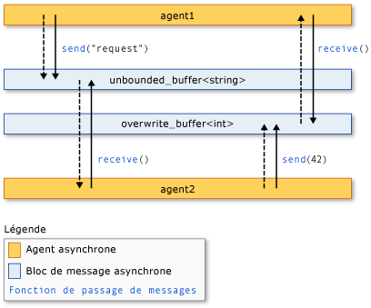

# <a name="asynchronous-agents-library"></a>bibliothèque d’agents asynchrones

La bibliothèque d’agents asynchrones (ou simplement la *bibliothèque d’agents*) fournit un modèle de programmation qui vous permet d’accroître la robustesse du développement d’applications prenant en charge l’accès concurrentiel. La bibliothèque d’agents est une bibliothèque de modèles C++ qui promeut un modèle de programmation basé sur les acteurs et le passage de messages in-process pour les tâches de flux de données à granularité grossière et de traitement pipeline. La bibliothèque d’agents s’appuie sur les composants de planification et de gestion des ressources de la runtime d’accès concurrentiel.

## <a name="programming-model"></a>Modèle de programmation

La bibliothèque d’agents fournit des alternatives à l’état partagé en vous permettant de connecter des composants isolés par le biais d’un modèle de communication asynchrone basé sur le flux de données au lieu du flux de contrôle. Le *flux* de données fait référence à un modèle de programmation dans lequel les calculs sont effectués lorsque toutes les données requises sont disponibles ; *le workflow de contrôle* fait référence à un modèle de programmation dans lequel les calculs sont effectués dans un ordre prédéterminé.

Le modèle de programmation de flux de données est lié au concept de *transmission de messages*, durant laquelle les composants indépendants d’un programme communiquent entre eux à l’aide de messages.

La bibliothèque d’agents est composée de trois composants : les *agents asynchrones*, les *blocs de messages asynchrones* et les *fonctions de passage de message*. Les agents maintiennent l’État et utilisent des blocs de messages et des fonctions de passage de messages pour communiquer entre eux et avec des composants externes. Les fonctions de transmission de messages permettent aux agents d’envoyer et de recevoir des messages vers et depuis les composants externes. Les blocs de messages asynchrones contiennent des messages et permettent aux agents de communiquer de manière synchronisée.

L’illustration suivante montre comment deux agents utilisent des blocs de messages et des fonctions de passage de messages pour communiquer. Dans cette illustration, `agent1` envoie un message à à `agent2` l’aide de la fonction [Concurrency :: Send](reference/concurrency-namespace-functions.md#send) et d’un objet [Concurrency :: unbounded_buffer](reference/unbounded-buffer-class.md) . `agent2` utilise la fonction [Concurrency :: Receive](reference/concurrency-namespace-functions.md#receive) pour lire le message. `agent2` utilise la même méthode pour envoyer un message à `agent1` . Les flèches en pointillés représentent le flow des données entre les agents. Les flèches pleines connectent les agents aux blocs de messages qu’ils écrivent ou lisent.



Un exemple de code qui implémente cette illustration est présenté plus loin dans cette rubrique.

Le modèle de programmation de l’agent présente plusieurs avantages par rapport à d’autres mécanismes de synchronisation et de simultanéité, par exemple, des événements. L’un des avantages est qu’en utilisant le passage de messages pour transmettre les changements d’État entre les objets, vous pouvez isoler l’accès aux ressources partagées et ainsi améliorer l’évolutivité. L’un des avantages du passage de messages est qu’il lie la synchronisation aux données au lieu de les lier à un objet de synchronisation externe. Cela simplifie la transmission des données entre les composants et peut éliminer les erreurs de programmation dans vos applications.

## <a name="when-to-use-the-agents-library"></a>Quand utiliser la bibliothèque d’agents

Utilisez la bibliothèque agents lorsque vous avez plusieurs opérations qui doivent communiquer entre elles de manière asynchrone. Les blocs de messages et les fonctions de transmission de messages vous permettent d’écrire des applications parallèles sans nécessiter de mécanismes de synchronisation tels que des verrous. Cela vous permet de vous concentrer sur la logique d’application.

Le modèle de programmation de l’agent est souvent utilisé pour créer des *pipelines de données* ou des *réseaux*. Un pipeline de données est une série de composants, chacun d’entre eux effectuant une tâche spécifique qui contribue à un plus grand objectif. Chaque composant d’un pipeline de flux de données exécute un travail lorsqu’il reçoit un message d’un autre composant. Le résultat de ce travail est passé à d’autres composants dans le pipeline ou le réseau. Les composants peuvent utiliser des fonctionnalités d’accès concurrentiel plus précises à partir d’autres bibliothèques, par exemple la [bibliothèque de modèles parallèles (PPL)](../../parallel/concrt/parallel-patterns-library-ppl.md).

## <a name="example"></a>Exemple

L’exemple suivant implémente l’illustration indiquée plus haut dans cette rubrique.

[!code-cpp[concrt-basic-agents#1](../../parallel/concrt/codesnippet/cpp/asynchronous-agents-library_1.cpp)]

Cet exemple produit la sortie suivante :

```Output
agent1: sending request...
agent2: received 'request'.
agent2: sending response...
agent1: received '42'.
```

Les rubriques suivantes décrivent les fonctionnalités utilisées dans cet exemple.

## <a name="related-topics"></a>Rubriques connexes

[Agents asynchrones](../../parallel/concrt/asynchronous-agents.md)<br/>
Décrit le rôle des agents asynchrones dans la résolution des tâches de calcul plus volumineuses.

[Blocs de messages asynchrones](../../parallel/concrt/asynchronous-message-blocks.md)<br/>
Décrit les différents types de blocs de messages fournis par la bibliothèque d’agents.

[Fonctions de passage de messages](../../parallel/concrt/message-passing-functions.md)<br/>
Décrit les différentes routines de passage de message qui sont fournies par la bibliothèque d’agents.

[Comment : implémenter divers modèles de Producer-Consumer](../../parallel/concrt/how-to-implement-various-producer-consumer-patterns.md)<br/>
Décrit comment implémenter le modèle producteur-consommateur dans votre application.

[Comment : fournir des fonctions de travail aux classes Call et transformer](../../parallel/concrt/how-to-provide-work-functions-to-the-call-and-transformer-classes.md)<br/>
Illustre plusieurs manières de fournir des fonctions de travail aux classes [Concurrency :: Call](../../parallel/concrt/reference/call-class.md) et [Concurrency :: transformer](../../parallel/concrt/reference/transformer-class.md) .

[Comment : utiliser le transformateur dans un pipeline de données](../../parallel/concrt/how-to-use-transformer-in-a-data-pipeline.md)<br/>
Montre comment utiliser la classe [Concurrency :: transformer](../../parallel/concrt/reference/transformer-class.md) dans un pipeline de données.

[Comment : effectuer une sélection parmi les tâches terminées](../../parallel/concrt/how-to-select-among-completed-tasks.md)<br/>
Montre comment utiliser les classes [Concurrency :: Choice](../../parallel/concrt/reference/choice-class.md) et [concurrentielle :: Join](../../parallel/concrt/reference/join-class.md) pour sélectionner la première tâche afin de terminer un algorithme de recherche.

[Comment : envoyer un message à intervalles réguliers](../../parallel/concrt/how-to-send-a-message-at-a-regular-interval.md)<br/>
Montre comment utiliser la classe [Concurrency :: Timer](../../parallel/concrt/reference/timer-class.md) pour envoyer un message à intervalles réguliers.

[Comment : utiliser un filtre de bloc de message](../../parallel/concrt/how-to-use-a-message-block-filter.md)<br/>
Montre comment utiliser un filtre pour permettre à un bloc de message asynchrone d’accepter ou de rejeter des messages.

[Bibliothèque de modèles parallèles](../../parallel/concrt/parallel-patterns-library-ppl.md)<br/>
Décrit comment utiliser divers modèles parallèles, tels que les algorithmes parallèles, dans vos applications.

[Concurrency Runtime](../../parallel/concrt/concurrency-runtime.md)<br/>
Décrit le runtime d'accès concurrentiel, qui simplifie la programmation parallèle, et contient des liens vers les rubriques connexes.
