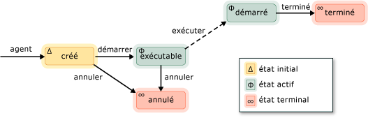

# Agents asynchrones

Un *agent asynchrone* (ou simplement *agent*) est un composant d’application qui fonctionne de façon asynchrone avec d’autres agents pour résoudre des tâches de calcul plus volumineuses. Considérez un agent comme une tâche qui a un cycle de vie défini. Par exemple, un agent peut lire des données à partir d’un périphérique d’entrée/sortie (par exemple, le clavier, un fichier sur disque ou une connexion réseau) et un autre agent peut effectuer des actions sur ces données lorsqu’elles sont disponibles. Le premier agent utilise le passage de message pour informer le deuxième agent que des données supplémentaires sont disponibles. Le planificateur de tâches runtime d’accès concurrentiel fournit un mécanisme efficace pour permettre aux agents de bloquer et de produire de manière coopérative sans nécessiter une préemption moins efficace.

La bibliothèque d’agents définit la classe [Concurrency :: agent](../../parallel/concrt/reference/agent-class.md) pour représenter un agent asynchrone. `agent` est une classe abstraite qui déclare l’accès concurrentiel à la méthode virtuelle [:: agent :: Run](reference/agent-class.md#run). La `run` méthode exécute la tâche qui est effectuée par l’agent. Étant donné que `run` est abstrait, vous devez implémenter cette méthode dans chaque classe à partir de laquelle vous dérivez `agent` .

## Cycle de vie de l’agent

Les agents ont un cycle de vie défini. L’énumération [Concurrency :: agent_status](reference/concurrency-namespace-enums.md#agent_status) définit les différents États d’un agent. L’illustration suivante est un diagramme d’État qui montre comment les agents progressent d’un État à un autre. Dans cette illustration, les lignes pleines représentent les méthodes que vous appelez à partir de votre application. les lignes en pointillés représentent les méthodes appelées à partir du Runtime.

Le tableau suivant décrit chaque État de l' `agent_status` énumération.

|État de l'agent|Description|
|-----------------|-----------------|
|`agent_created`|L’exécution de l’agent n’a pas été planifiée.|
|`agent_runnable`|Le runtime planifie l’exécution de l’agent.|
|`agent_started`|L’agent a démarré et est en cours d’exécution.|
|`agent_done`|L’agent est terminé.|
|`agent_canceled`|L’agent a été annulé avant d’être entré dans l' `started` État.|

`agent_created` est l’état initial d’un agent, `agent_runnable` et `agent_started` sont les États actifs et `agent_done` et `agent_canceled` sont les États des terminaux.

Utilisez la méthode [Concurrency :: agent :: Status](reference/agent-class.md#status) pour récupérer l’état actuel d’un `agent` objet. Bien que la `status` méthode soit de sécurité simultanée, l’état de l’agent peut changer à l’heure de retour de la `status` méthode. Par exemple, un agent peut être dans l' `agent_started` État lorsque vous appelez la `status` méthode, mais déplacé vers l' `agent_done` État juste après le `status` retour de la méthode.

## Méthodes et fonctionnalités

Le tableau suivant présente quelques-unes des méthodes importantes qui appartiennent à la `agent` classe. Pour plus d’informations sur toutes les `agent` méthodes de classe, consultez [agent, classe](../../parallel/concrt/reference/agent-class.md).

|Méthode|Description|
|------------|-----------------|
|[start](reference/agent-class.md#start)|Planifie l' `agent` exécution de l’objet et lui affecte l' `agent_runnable` État.|
|[Utilisez](reference/agent-class.md#run)|Exécute la tâche qui doit être effectuée par l' `agent` objet.|
|[terminé](reference/agent-class.md#done)|Déplace un agent vers l' `agent_done` État.|
|[cancel](../../parallel/concrt/cancellation-in-the-ppl.md#cancel)|Si l’agent n’a pas été démarré, cette méthode annule l’exécution de l’agent et lui affecte l' `agent_canceled` État.|
|[statut](reference/agent-class.md#status)|Récupère l’état actuel de l' `agent` objet.|
|[wait](reference/agent-class.md#wait)|Attend que l' `agent` objet passe à l' `agent_done` État ou `agent_canceled` .|
|[wait_for_all](reference/agent-class.md#wait_for_all)|Attend que tous les `agent` objets fournis entrent dans l' `agent_done` `agent_canceled` État ou.|
|[wait_for_one](reference/agent-class.md#wait_for_one)|Attend qu’au moins un des `agent` objets fournis passe à l' `agent_done` `agent_canceled` État ou.|

Après avoir créé un objet d’agent, appelez la méthode [Concurrency :: agent :: Start](reference/agent-class.md#start) pour planifier son exécution. Le runtime appelle la `run` méthode après avoir planifié l’agent et lui affecte l' `agent_runnable` État.

Le runtime ne gère pas les exceptions levées par les agents asynchrones. Pour plus d’informations sur la gestion des exceptions et les agents, consultez [gestion des exceptions](../../parallel/concrt/exception-handling-in-the-concurrency-runtime.md).

## Exemple

Pour obtenir un exemple qui montre comment créer une application basée sur un agent de base, consultez [procédure pas à pas : création d’une application Agent-Based](../../parallel/concrt/walkthrough-creating-an-agent-based-application.md).

## Voir aussi

[bibliothèque d’agents asynchrones](../../parallel/concrt/asynchronous-agents-library.md)
