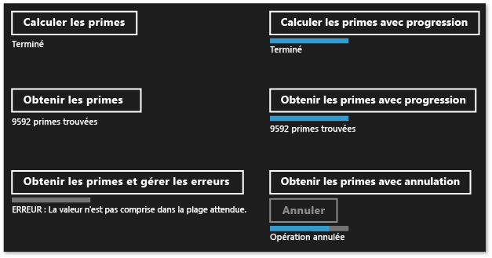
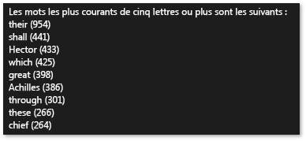

# Création d’opérations asynchrones en C++ pour les applications UWP

Ce document décrit quelques-uns des points clés à prendre en compte lorsque vous utilisez la classe de tâche pour produire des opérations asynchrones basées sur un pool de threads Windows dans une application de Windows Runtime universelle (UWP).

L’utilisation de la programmation asynchrone est un composant clé du modèle d’application Windows Runtime, car il permet aux applications de rester réactives aux entrées d’utilisateur. Vous pouvez commencer une tâche de longue durée sans bloquer le thread d'interface utilisateur, et vous pouvez recevoir ultérieurement les résultats de la tâche. Vous pouvez également annuler des tâches et de recevoir des notifications de progression comme les tâches sont exécutées en arrière-plan. Le document [programmation asynchrone en C++](/windows/uwp/threading-async/asynchronous-programming-in-cpp-universal-windows-platform-apps) fournit une vue d’ensemble du modèle asynchrone qui est disponible dans Visual C++ pour créer des applications UWP. Ce document explique comment utiliser et créer des chaînes d’opérations de Windows Runtime asynchrones. Cette section décrit comment utiliser les types dans ppltasks. h pour produire des opérations asynchrones qui peuvent être consommées par un autre composant Windows Runtime et comment contrôler l’exécution du travail asynchrone. Envisagez également de lire les [modèles et les conseils de programmation asynchrone dans Hilo (applications du Windows Store en c++ et XAML)](/previous-versions/windows/apps/jj160321(v=win.10)) pour découvrir comment nous avons utilisé la classe Task pour implémenter des opérations asynchrones dans Hilo, une application Windows Runtime à l’aide de C++ et XAML.

> [!NOTE]
> Vous pouvez utiliser la bibliothèque de [modèles parallèles](../../parallel/concrt/parallel-patterns-library-ppl.md) (PPL) et la [bibliothèque d’agents asynchrones](../../parallel/concrt/asynchronous-agents-library.md) dans une application UWP. Toutefois, vous ne pouvez pas utiliser le planificateur de tâches, ni le Gestionnaire des ressources. Ce document décrit les fonctionnalités supplémentaires fournies par la bibliothèque de modèles parallèles, qui sont disponibles uniquement pour une application UWP, et non pour une application de bureau.

## Points clés

- Utilisez [concurrency::create_async](reference/concurrency-namespace-functions.md#create_async) pour créer des opérations asynchrones qui peuvent être utilisées par d'autres composants (qui peuvent être écrits dans d'autres langages que C++).

- Utilisez [concurrency::progress_reporter](../../parallel/concrt/reference/progress-reporter-class.md) pour rapporter des notifications de progression aux composants qui appellent vos opérations asynchrones.

- Utilisez les jetons d'annulation pour permettre l'annulation des opérations asynchrones internes.

- Le comportement de la fonction `create_async` dépend du type de retour de la fonction de travail passée. Une fonction de travail qui retourne une tâche ( `task<T>` ou `task<void>`) s'exécute de manière synchrone dans le contexte qui a appelé `create_async`. Une fonction de travail qui retourne `T` ou `void` s'exécute dans un contexte arbitraire.

- Il est possible d'utiliser la méthode [concurrency::task::then](reference/task-class.md#then) pour créer une chaîne de tâches qui s'exécutent l'une après l'autre. Dans une application UWP, le contexte par défaut pour les continuations d’une tâche dépend de la manière dont cette tâche a été construite. Si la tâche a été créée en passant une action asynchrone au constructeur de tâche, ou en passant une expression lambda qui retourne une action asynchrone, le contexte par défaut pour toutes les continuations de cette tâche est le contexte actuel. Si la tâche n’est pas construite à partir d’une action asynchrone, un contexte arbitraire est utilisé par défaut pour les continuations de la tâche. Il est possible de substituer le contexte par défaut avec la classe [concurrency::task_continuation_context](../../parallel/concrt/reference/task-continuation-context-class.md) .

## Dans ce document

- [Création d’opérations asynchrones](#create-async)

- [Exemple : Création d'un composant Windows Runtime C++](#example-component)

- [Contrôle du thread d'exécution](#exethread)

- [Exemple : contrôle de l’exécution dans une application Windows Runtime avec C++ et XAML](#example-app)

##  Création d'opérations asynchrones

Vous pouvez utiliser la tâche et le modèle de continuation dans la bibliothèque de modèles parallèles (PPL) pour définir des tâches en arrière-plan ainsi que des tâches supplémentaires qui s'exécutent lorsque les tâches précédentes se terminent. Cette fonctionnalité est fournie par la classe [concurrency::task](../../parallel/concrt/reference/task-class.md) . Pour plus d’informations sur ce modèle et la classe `task` , consultez [Task Parallelism](../../parallel/concrt/task-parallelism-concurrency-runtime.md).

Le Windows Runtime est une interface de programmation que vous pouvez utiliser pour créer des applications UWP qui s’exécutent uniquement dans un environnement de système d’exploitation spécial. De telles applications utilisent des fonctions, des types de données et des appareils autorisés, et sont distribuées à partir de la Microsoft Store. Le Windows Runtime est représenté par l' *interface binaire d’application* (ABI). L’ABI est un contrat binaire sous-jacent qui rend Windows Runtime API disponibles pour les langages de programmation tels que les Visual C++.

À l’aide de l’Windows Runtime, vous pouvez utiliser les meilleures fonctionnalités de différents langages de programmation et les combiner dans une seule application. Par exemple, vous pouvez créer votre interface utilisateur dans JavaScript et exécuter la logique d'application nécessitant de nombreuses ressources de calcul dans un composant C++. La capacité à exécuter ces opérations nécessitant de nombreuses ressources de calcul en arrière-plan est un facteur clé pour que votre interface utilisateur reste réactive. Étant donné que la `task` classe est spécifique à C++, vous devez utiliser une interface Windows Runtime pour communiquer des opérations asynchrones à d’autres composants (qui peuvent être écrits dans des langages autres que C++). L’Windows Runtime fournit quatre interfaces que vous pouvez utiliser pour représenter des opérations asynchrones :

[Windows::Foundation::IAsyncAction](/uwp/api/windows.foundation.iasyncaction) 
Représente une opération asynchrone.

[Windows :: Foundation :: IAsyncActionWithProgress\<TProgress>](/uwp/api/windows.foundation.iasyncactionwithprogress-1) 
Représente une action asynchrone qui rapporte la progression.

[Windows :: Foundation :: IAsyncOperation\<TResult>](/uwp/api/windows.foundation.iasyncoperation-1) 
Représente une opération asynchrone qui retourne une valeur.

[Windows :: Foundation :: IAsyncOperationWithProgress\<TResult, TProgress>](/uwp/api/windows.foundation.iasyncoperationwithprogress-2) 
Représente une opération asynchrone qui retourne un résultat et signale une progression.

La notion d' *action* signifie que la tâche asynchrone ne produit pas de valeur (pensez à une fonction qui retourne `void`). La notion d' *opération* signifie que la tâche asynchrone produit une valeur. La notion de *progression* signifie que la tâche peut rapporter des messages de progression à l'appelant. JavaScript, .NET Framework et Visual C++ disposent chacun de leur propre façon de créer des instances de ces interfaces à utiliser dans le cadre d'ABI. Pour Visual C++, la bibliothèque de modèles parallèles fournit la fonction [concurrency::create_async](reference/concurrency-namespace-functions.md#create_async) . Cette fonction crée une action ou une opération asynchrone Windows Runtime qui représente l’achèvement d’une tâche. La `create_async` fonction prend une fonction de travail (généralement une expression lambda), crée en interne un `task` objet et inclut cette tâche dans l’une des quatre interfaces de Windows Runtime asynchrones.

> [!NOTE]
> À utiliser `create_async` uniquement lorsque vous devez créer des fonctionnalités accessibles à partir d’une autre langue ou d’un autre composant de Windows Runtime. Utilisez la classe `task` directement lorsque vous savez que l'opération est à la fois produite et consommée par du code C++ dans le même composant.

Le type de retour de `create_async` est déterminé par le type de ses arguments. Par exemple, si votre fonction de travail ne retourne pas de valeur et ne rapporte pas la progression, `create_async` renvoie `IAsyncAction`. Si votre fonction de travail ne renvoie pas de valeur et rapporte également la progression, `create_async` renvoie `IAsyncActionWithProgress`. Pour signaler la progression, utilisez un objet [concurrency::progress_reporter](../../parallel/concrt/reference/progress-reporter-class.md) comme paramètre de votre fonction de travail. La possibilité de signaler la progression vous permet de rapporter la quantité de travail qui a été effectuée et la quantité restante (par exemple sous forme d'un pourcentage). Elle vous permet également de rapporter les résultats à mesure qu'ils deviennent disponibles.

Les interfaces `IAsyncAction`, `IAsyncActionWithProgress<TProgress>`, `IAsyncOperation<TResult>`et `IAsyncActionOperationWithProgress<TProgress, TProgress>` fournissent chacune une méthode `Cancel` qui vous permet d'annuler l'opération asynchrone. La classe `task` fonctionne avec des jetons d'annulation. Lorsque vous utilisez un jeton d'annulation pour annuler un travail, le runtime ne démarre pas le nouveau processus qui souscrit à ce jeton. Un travail qui est déjà actif peut contrôler son jeton d'annulation et s'arrêter lorsqu'il peut. Ce mécanisme est décrit plus en détail dans le document [Cancellation in the PPL](cancellation-in-the-ppl.md). Vous pouvez connecter l’annulation de tâche avec les `Cancel` méthodes Windows Runtime de deux manières. Tout d'abord, vous pouvez définir la fonction de travail que vous passez à `create_async` pour prendre un objet [concurrency::cancellation_token](../../parallel/concrt/reference/cancellation-token-class.md) . Lorsque la `Cancel` méthode est appelée, ce jeton d’annulation est annulé et les règles d’annulation normales s’appliquent à l’objet sous-jacent `task` qui prend en charge l' `create_async` appel. Si vous ne fournissez pas d'objet `cancellation_token` , l'objet `task` sous-jacent en définit un implicitement. Définissez un objet `cancellation_token` lorsque vous devez gérer de manière coopérative l'annulation dans votre fonction de travail. La section [exemple : contrôle de l’exécution dans une application Windows Runtime avec C++ et XAML](#example-app) montre comment effectuer une annulation dans une application plateforme Windows universelle (UWP) avec C# et XAML qui utilise un composant Windows Runtime C++ personnalisé.

> [!WARNING]
> Dans une chaîne de continuations de tâches, nettoyez toujours l’État, puis appelez [Concurrency :: cancel_current_task](reference/concurrency-namespace-functions.md#cancel_current_task) lorsque le jeton d’annulation est annulé. Si vous utilisez la méthode du retour rapide au lieu d'appeler `cancel_current_task`, l'opération passe à l'état Terminé au lieu de l'état Annulé.

Le tableau suivant résume les combinaisons qu'il est possible d'utiliser pour définir des opérations asynchrones dans votre application.

|Pour créer cette interface Windows Runtime|Retournez ce type à partir de `create_async`|Passez ces types de paramètre à votre fonction de travail pour utiliser un jeton implicite d'annulation|Passez ces types de paramètre à votre fonction de travail pour utiliser un jeton explicite d'annulation|
|----------------------------------------------------------------------------------|------------------------------------------|--------------------------------------------------------------------------------------------|--------------------------------------------------------------------------------------------|
|`IAsyncAction`|`void` ou `task<void>`|(aucun)|(`cancellation_token`)|
|`IAsyncActionWithProgress<TProgress>`|`void` ou `task<void>`|(`progress_reporter`)|(`progress_reporter`, `cancellation_token`)|
|`IAsyncOperation<TResult>`|`T` ou `task<T>`|(aucun)|(`cancellation_token`)|
|`IAsyncActionOperationWithProgress<TProgress, TProgress>`|`T` ou `task<T>`|(`progress_reporter`)|(`progress_reporter`, `cancellation_token`)|

Vous pouvez retourner une valeur ou un `task` objet à partir de la fonction de travail que vous passez à la fonction `create_async` . Ces variations produisent différents comportements. Lorsque vous retournez une valeur, la fonction de travail est encapsulée dans un `task` afin qu'elle puisse être exécutée sur un thread d'arrière-plan. En outre, la `task` sous-jacente utilise un jeton implicite d'annulation. Inversement, si vous retournez un objet `task` , la fonction de travail s'exécute de façon synchrone. Par conséquent, si vous retournez un objet `task` , vérifiez que toutes les opérations de longue durée de votre fonction de travail s'exécutent également comme tâches afin de permettre à votre application de rester réactive. En outre, la `task` sous-jacente n'utilise pas de jeton implicite d'annulation. Par conséquent, vous devez définir votre fonction de travail pour prendre un objet `cancellation_token` si vous avez besoin de la prise en charge de l'annulation lorsque vous retournez un objet `task` depuis `create_async`.

L’exemple suivant montre les différentes façons de créer un `IAsyncAction` objet qui peut être consommé par un autre composant de Windows Runtime.

[!code-cpp[concrt-windowsstore-primes#100](../../parallel/concrt/codesnippet/cpp/creating-asynchronous-operations-in-cpp-for-windows-store-apps_1.cpp)]

## Exemple : création d’un composant Windows Runtime C++ et utilisation de celui-ci à partir de C\#

Prenons l’exemple d’une application qui utilise XAML et C# pour définir l’interface utilisateur et un composant Windows Runtime C++ pour exécuter des opérations nécessitant de nombreuses ressources de calcul. Dans cet exemple, le composant C++ calcule les nombres premiers inclus dans un intervalle donné. Pour illustrer les différences entre les quatre Windows Runtime interfaces de tâches asynchrones, démarrez, dans Visual Studio, en créant une **solution vide** et en la nommant `Primes` . Ajoutez ensuite à la solution un projet **Composant Windows Runtime** et nommez-le `PrimesLibrary`. Ajoutez le code suivant au fichier d'en-tête généré en C++ (cet exemple renomme Class1.h en Primes.h). Chaque méthode `public` définit une des quatre interfaces asynchrones. Les méthodes qui retournent une valeur retournent un objet [Windows :: Foundation : \<int> : Collections :: IVector](/uwp/api/windows.foundation.collections.ivector-1) . Les méthodes qui signalent la progression génèrent des valeurs `double` qui définissent le pourcentage de travail global effectué.

[!code-cpp[concrt-windowsstore-primes#1](../../parallel/concrt/codesnippet/cpp/creating-asynchronous-operations-in-cpp-for-windows-store-apps_2.h)]

> [!NOTE]
> Par Convention, les noms de méthodes asynchrones dans le Windows Runtime se terminent généralement par « Async ».

Ajoutez le code suivant au fichier source généré en C++ (cet exemple renomme Class1.cpp en Primes.cpp). La fonction `is_prime` détermine si son entrée est un nombre premier. Les autres méthodes implémentent la classe `Primes` . Chaque appel à `create_async` utilise une signature compatible avec la méthode par laquelle elle est appelée. Par exemple, étant donné que `Primes::ComputePrimesAsync` renvoie `IAsyncAction`, la fonction de travail fournie à `create_async` ne retourne pas de valeur, ni ne prend d'objet `progress_reporter` comme paramètre.

[!code-cpp[concrt-windowsstore-primes#2](../../parallel/concrt/codesnippet/cpp/creating-asynchronous-operations-in-cpp-for-windows-store-apps_3.cpp)]

Chaque méthode exécute d’abord la validation pour s’assurer que les paramètres d’entrée ne sont pas négatifs. Si une valeur d’entrée est négative, la méthode génère [Platform::InvalidArgumentException](../../cppcx/platform-invalidargumentexception-class.md). La gestion des erreurs est expliquée plus loin dans cette section.

Pour utiliser ces méthodes à partir d’une application UWP, utilisez le modèle **application vide (XAML)** Visual C# pour ajouter un deuxième projet à la solution Visual Studio. Cet exemple nomme le projet `Primes`. Ensuite, à partir du projet `Primes` , ajoutez une référence au projet `PrimesLibrary` .

Ajoutez le code suivant à MainPage.xaml. Ce code définit l'interface utilisateur afin que vous puissiez appeler le composant C++ et afficher les résultats.

[!code-xml[concrt-windowsstore-primes#3](../../parallel/concrt/codesnippet/xaml/creating-asynchronous-operations-in-cpp-for-windows-store-apps_4.xaml)]

Ajoutez le code suivant à la classe `MainPage` dans MainPage.xaml. Ce code définit un objet `Primes` et le bouton des gestionnaires d'événements.

[!code-cs[concrt-windowsstore-primes#4](../../parallel/concrt/codesnippet/csharp/creating-asynchronous-operations-in-cpp-for-windows-store-apps_5.cs)]

Ces méthodes utilisent `async` et les mots clés `await` pour mettre à jour l'interface utilisateur une fois les opérations asynchrones terminées. Pour plus d’informations sur le codage asynchrone dans des applications UWP, consultez [Threading et programmation asynchrone](/windows/uwp/threading-async).

Les méthodes `getPrimesCancellation` et `cancelGetPrimes` opèrent ensemble pour permettre à l'utilisateur d'annuler l'opération. Quand l’utilisateur choisit le bouton **Annuler** , la `cancelGetPrimes` méthode appelle [IAsyncOperationWithProgress \<TResult, TProgress> :: Cancel](/uwp/api/windows.foundation.iasyncinfo.cancel) pour annuler l’opération. Le runtime d’accès concurrentiel, qui gère l’opération asynchrone sous-jacente, lève un type d’exception interne qui est intercepté par le Windows Runtime pour communiquer que l’annulation est terminée. Pour plus d’informations sur le modèle d’annulation, consultez [annulation](../../parallel/concrt/cancellation-in-the-ppl.md).

> [!IMPORTANT]
> Pour permettre à la bibliothèque de modèles parallèles de signaler correctement au Windows Runtime qu’il a annulé l’opération, n’interceptez pas ce type d’exception interne. Cela signifie que vous ne devez pas non plus intercepter toutes les exceptions (`catch (...)`). Si vous devez intercepter toutes les exceptions, levez à nouveau l’exception pour vous assurer que l’Windows Runtime peut terminer l’opération d’annulation.

L’illustration suivante montre l’application `Primes` après la sélection de chaque option.

Pour obtenir un exemple qui utilise `create_async` pour créer des tâches asynchrones qui peuvent être consommées par d’autres langages, consultez [utilisation de C++ dans l’exemple optimiseur de voyage Bing Maps](/previous-versions/windows/apps/hh699891(v=vs.140)).

## Contrôle du thread d’exécution

Le Windows Runtime utilise le modèle de thread COM. Dans ce modèle, les objets sont hébergés dans des cloisonnements différents, selon la façon dont ils gèrent leur synchronisation. Les objets thread-safe sont hébergés dans des multithreads cloisonnés (MTA). Les objets accessibles par un thread unique sont hébergés dans un thread cloisonné (STA).

Dans une application ayant une interface utilisateur, le thread ASTA est chargé de pomper des messages de fenêtre et est le seul thread dans le processus pouvant mettre à jour les contrôles d'interface utilisateur hébergés par le STA. Cela a deux conséquences. D'abord, pour permettre à l'application de rester réactive, toutes les opérations faisant un usage intensif de l'unité centrale et les opérations d'E/S ne doivent pas être exécutées sur le thread ASTA. Ensuite, les résultats provenant des threads d'arrière-plan doit être marshalés vers l'ASTA pour mettre à jour l'interface utilisateur. Dans une application UWP C++, `MainPage` les autres pages XAML s’exécutent toutes sur le ATSA. Par conséquent, les continuations de tâches déclarées sur l'ASTA sont exécutées par défaut afin de vous permettre de mettre à jour les contrôles directement dans le corps de continuation. Toutefois, si vous imbriquez une tâche dans une autre tâche, toutes les continuations de cette tâche imbriquée s'exécutent dans le MTA. Par conséquent, vous devez déterminer si vous voulez spécifier explicitement dans quel contexte ces continuations s'exécutent.

Une tâche créée à partir d'une opération asynchrone, comme par exemple `IAsyncOperation<TResult>`, utilise une sémantique spéciale qui vous permet d'ignorer les détails de threading. Même si une opération peut fonctionner sur un thread d'arrière-plan (ou ne peut reposer sur aucun thread), ses continuations sont garanties par défaut pour fonctionner sur le cloisonnement qui a démarré les opérations de continuation (en d'autres termes, depuis le cloisonnement ayant appelé `task::then`). Vous pouvez utiliser la classe [concurrency::task_continuation_context](../../parallel/concrt/reference/task-continuation-context-class.md) pour contrôler le contexte d'exécution d'une continuation. Utilisez les méthodes statiques d'assistance pour créer des objets `task_continuation_context` .

- Utilisez [concurrency::task_continuation_context::use_arbitrary](reference/task-continuation-context-class.md#use_arbitrary) pour spécifier que la continuation s'exécute sur un thread d'arrière-plan.

- Utilisez [concurrency::task_continuation_context::use_current](reference/task-continuation-context-class.md#use_current) pour spécifier que la continuation s'exécute sur le thread qui a appelé `task::then`.

Vous pouvez passer un objet `task_continuation_context` à la méthode [task::then](reference/task-class.md#then) pour contrôler explicitement le contexte d'exécution de la continuation ou vous pouvez passer la tâche à un autre cloisonnement et appeler la méthode `task::then` pour contrôler implicitement le contexte d'exécution.

> [!IMPORTANT]
> Étant donné que le thread d’interface utilisateur principal des applications UWP s’exécute sous STA, les continuations que vous créez sur ce STA s’exécutent par défaut sur le STA. Par conséquent, les continuations que vous créez dans le MTA s'exécutent sur le MTA.

La section suivante présente une application qui lit un fichier sur le disque dur, recherche les mots les plus courants dans ce fichier, et donne les résultats dans l'interface utilisateur. L'opération finale, mettant à jour l'interface utilisateur, se produit sur le thread d'interface utilisateur.

> [!IMPORTANT]
> Ce comportement est spécifique aux applications UWP. Pour les applications de bureau, vous ne contrôlez pas où s'exécutent les continuations. À la place, le planificateur choisit un thread de travail sur lequel exécuter chaque continuation.

> [!IMPORTANT]
> N'appelez pas [concurrency::task::wait](reference/task-class.md#wait) dans le corps d'une continuation qui s'exécute sur le STA. Sinon, le runtime lève [concurrency::invalid_operation](../../parallel/concrt/reference/invalid-operation-class.md) , car cette méthode bloque le thread actuel et peut provoquer le blocage de l'application. Toutefois, vous pouvez appeler la méthode [concurrency::task::get](reference/task-class.md#get) pour recevoir le résultat de la tâche précédente dans une continuation basée sur des tâches.

## Exemple : contrôle de l’exécution dans une application Windows Runtime avec C++ et XAML

Considérez une application C++ XAML qui lit un fichier sur le disque, recherche les mots les plus courants dans ce fichier, et donne les résultats dans l'interface utilisateur. Pour créer cette application, démarrez, dans Visual Studio, en créant un projet **application vide (Windows universel)** et en le nommant `CommonWords` . Dans votre manifeste d'application, spécifiez la **Bibliothèque de documents** pour permettre à l'application d'accéder au dossier Documents. Ajoutez également le type de fichier texte (.txt) dans la section des déclarations du manifeste d'application. Pour plus d’informations sur les fonctionnalités et les déclarations des applications, consultez [empaquetage, déploiement et interrogation des applications Windows](/windows/win32/appxpkg/appx-portal).

Mettez l'élément `Grid` à jour dans MainPage.xaml pour inclure un élément `ProgressRing` et un élément `TextBlock` . Le `ProgressRing` indique que l'opération est en cours et le `TextBlock` donne les résultats du calcul.

[!code-xml[concrt-windowsstore-commonwords#1](../../parallel/concrt/codesnippet/xaml/creating-asynchronous-operations-in-cpp-for-windows-store-apps_6.xaml)]

Ajoutez les `#include` instructions suivantes à *pch. h*.

[!code-cpp[concrt-windowsstore-commonwords#2](../../parallel/concrt/codesnippet/cpp/creating-asynchronous-operations-in-cpp-for-windows-store-apps_7.h)]

Ajoutez les déclarations de méthode suivante à la classe `MainPage` (MainPage.h).

[!code-cpp[concrt-windowsstore-commonwords#3](../../parallel/concrt/codesnippet/cpp/creating-asynchronous-operations-in-cpp-for-windows-store-apps_8.h)]

Ajoutez les instructions `using` suivantes à MainPage.cpp.

[!code-cpp[concrt-windowsstore-commonwords#4](../../parallel/concrt/codesnippet/cpp/creating-asynchronous-operations-in-cpp-for-windows-store-apps_9.cpp)]

Dans MainPage.cpp, implémentez les méthodes `MainPage::MakeWordList`, `MainPage::FindCommonWords`, et `MainPage::ShowResults` . `MainPage::MakeWordList` et `MainPage::FindCommonWords` exécutent des opérations nécessitant de nombreuses ressources de calcul. La méthode `MainPage::ShowResults` affiche le résultat du calcul dans l'interface utilisateur.

[!code-cpp[concrt-windowsstore-commonwords#5](../../parallel/concrt/codesnippet/cpp/creating-asynchronous-operations-in-cpp-for-windows-store-apps_10.cpp)]

Modifiez le constructeur de `MainPage` pour créer une chaîne des tâches de continuation qui affiche dans l'interface utilisateur les mots récurrents du livre d'Homère, *l'Iliade* . Les deux premières tâches de continuation, qui fractionnent le texte en mots individuels et recherchent les mots récurrents, peuvent prendre du temps et sont donc explicitement définies pour s'exécuter en arrière-plan. La tâche de continuation finale, qui met à jour l’interface utilisateur, ne spécifie aucun contexte de continuation, et suit par conséquent des règles de thread de cloisonnement.

[!code-cpp[concrt-windowsstore-commonwords#6](../../parallel/concrt/codesnippet/cpp/creating-asynchronous-operations-in-cpp-for-windows-store-apps_11.cpp)]

> [!NOTE]
> Cet exemple montre comment spécifier des contextes d'exécution et comment utiliser une chaîne de continuations. Il est important de noter que, par défaut, une tâche créée lors une opération asynchrone exécute ses continuations sur le cloisonnement qui a appelé `task::then`. Par conséquent, cet exemple utilise `task_continuation_context::use_arbitrary` pour spécifier que les opérations qui n'impliquent pas l'interface utilisateur sont exécutées sur un thread d'arrière-plan.

L’illustration suivante montre les résultats de l’application `CommonWords` .

Dans cet exemple, il est possible de prendre en charge l’annulation, car les `task` objets qui prennent en charge `create_async` utilisent un jeton d’annulation implicite. Définissez la fonction de travail pour prendre un objet `cancellation_token` si vos tâches doivent répondre à l'annulation de manière coopérative. Pour plus d’informations sur l’annulation dans la bibliothèque PPL, consultez [Cancellation in the PPL](cancellation-in-the-ppl.md)

## Voir aussi

[Concurrency Runtime](../../parallel/concrt/concurrency-runtime.md)
