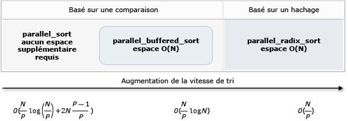

# <a name="parallel-algorithms"></a>Algorithmes parallèles

La bibliothèque de modèles parallèles (PPL) fournit des algorithmes qui effectuent simultanément des tâches sur des collections de données. Ces algorithmes ressemblent à ceux fournis par la bibliothèque standard C++.

Les algorithmes parallèles sont composés de fonctionnalités existantes dans l’runtime d’accès concurrentiel. Par exemple, l’algorithme [Concurrency ::p arallel_for](reference/concurrency-namespace-functions.md#parallel_for) utilise un objet [Concurrency :: structured_task_group](../../parallel/concrt/reference/structured-task-group-class.md) pour effectuer les itérations de la boucle parallèle. Les `parallel_for` partitions de l’algorithme fonctionnent de manière optimale en fonction du nombre de ressources informatiques disponibles.

## <a name="sections"></a><a name="top"></a> Sections

- [Algorithme parallel_for](#parallel_for)

- [Algorithme parallel_for_each](#parallel_for_each)

- [Algorithme parallel_invoke](#parallel_invoke)

- [Algorithmes parallel_transform et parallel_reduce](#parallel_transform_reduce)

  - [Algorithme parallel_transform](#parallel_transform)

  - [Algorithme parallel_reduce](#parallel_reduce)

  - [Exemple : exécution du mappage et de la réduction en parallèle](#map_reduce_example)

- [Partitionnement du travail](#partitions)

- [Tri parallèle](#parallel_sorting)

  - [Choisir un algorithme de tri](#choose_sort)

## <a name="the-parallel_for-algorithm"></a><a name="parallel_for"></a> Algorithme parallel_for

L’algorithme [Concurrency ::p arallel_for](reference/concurrency-namespace-functions.md#parallel_for) exécute à plusieurs reprises la même tâche en parallèle. Chacune de ces tâches est paramétrée par une valeur d’itération. Cet algorithme est utile lorsque vous disposez d’un corps de boucle qui ne partage pas de ressources entre les itérations de cette boucle.

L' `parallel_for` algorithme partitionne les tâches de façon optimale pour une exécution en parallèle. Il utilise un algorithme de vol de travail et un vol de plage pour équilibrer ces partitions lorsque les charges de travail sont déséquilibrées. Quand une itération de boucle bloque de façon coopérative, le runtime redistribue la plage d’itérations assignée au thread actuel à d’autres threads ou processeurs. De même, lorsqu’un thread termine une plage d’itérations, le runtime redistribue le travail d’autres threads à ce thread. L' `parallel_for` algorithme prend également en charge le *parallélisme imbriqué*. Quand une boucle parallèle contient une autre boucle parallèle, le runtime coordonne le traitement des ressources entre les corps de la boucle de manière efficace pour une exécution en parallèle.

L' `parallel_for` algorithme a plusieurs versions surchargées. La première version prend une valeur de début, une valeur de fin et une fonction de travail (une expression lambda, un objet de fonction ou un pointeur de fonction). La deuxième version prend une valeur de début, une valeur de fin, une valeur d’étape et une fonction de travail. La première version de cette fonction utilise 1 comme valeur d’étape. Les versions restantes prennent les objets partitionneur, ce qui vous permet de spécifier comment les `parallel_for` plages doivent être partitionnées entre les threads. Les partitionneurs sont expliqués plus en détail dans la section [partitionnement du travail](#partitions) dans ce document.

Vous pouvez convertir **`for`** de nombreuses boucles à utiliser `parallel_for` . Toutefois, l' `parallel_for` algorithme diffère de l' **`for`** instruction des manières suivantes :

- L' `parallel_for` algorithme `parallel_for` n’exécute pas les tâches dans un ordre prédéterminé.

- L' `parallel_for` algorithme ne prend pas en charge les conditions d’arrêt arbitraires. L' `parallel_for` algorithme s’arrête lorsque la valeur actuelle de la variable d’itération est inférieure à `last` .

- Le `_Index_type` paramètre de type doit être un type intégral. Ce type intégral peut être signé ou non signé.

- L’itération de la boucle doit être Forward. L' `parallel_for` algorithme lève une exception de type [std :: invalid_argument](../../standard-library/invalid-argument-class.md) si le `_Step` paramètre est inférieur à 1.

- Le mécanisme de gestion des exceptions pour l' `parallel_for` algorithme diffère de celui d’une **`for`** boucle. Si plusieurs exceptions se produisent simultanément dans un corps de boucle parallèle, le runtime propage une seule des exceptions au thread qui a appelé `parallel_for` . En outre, lorsqu’une itération de boucle lève une exception, le runtime n’arrête pas immédiatement la boucle globale. Au lieu de cela, la boucle est placée à l’état annulé et le runtime ignore les tâches qui n’ont pas encore démarré. Pour plus d’informations sur la gestion des exceptions et les algorithmes parallèles, consultez [gestion des exceptions](../../parallel/concrt/exception-handling-in-the-concurrency-runtime.md).

Bien que l' `parallel_for` algorithme ne prenne pas en charge les conditions d’arrêt arbitraires, vous pouvez utiliser l’annulation pour arrêter toutes les tâches. Pour plus d’informations sur l’annulation, consultez [annulation dans la bibliothèque de modèles parallèles](cancellation-in-the-ppl.md).

> [!NOTE]
> Le coût de planification qui résulte de l’équilibrage de charge et de la prise en charge de fonctionnalités telles que l’annulation peut ne pas dépasser les avantages de l’exécution du corps de la boucle en parallèle, en particulier lorsque le corps de la boucle est relativement petit. Vous pouvez réduire cette surcharge en utilisant un partitionneur dans votre boucle parallèle. Pour plus d’informations, consultez [partitionnement du travail](#partitions) plus loin dans ce document.

### <a name="example"></a>Exemple

L’exemple suivant illustre la structure de base de l' `parallel_for` algorithme. Cet exemple imprime sur la console chaque valeur de la plage [1, 5] en parallèle.

[!code-cpp[concrt-parallel-for-structure#1](../../parallel/concrt/codesnippet/cpp/parallel-algorithms_1.cpp)]

Cet exemple produit l’exemple de sortie suivant :

```Output
1 2 4 3 5
```

Étant donné que l' `parallel_for` algorithme agit sur chaque élément en parallèle, l’ordre dans lequel les valeurs sont imprimées sur la console varie.

Pour obtenir un exemple complet qui utilise l' `parallel_for` algorithme, consultez [Comment : écrire une boucle de parallel_for](../../parallel/concrt/how-to-write-a-parallel-for-loop.md).

[[Haut](#top)]

## <a name="the-parallel_for_each-algorithm"></a><a name="parallel_for_each"></a> Algorithme parallel_for_each

L’algorithme [Concurrency ::p arallel_for_each](reference/concurrency-namespace-functions.md#parallel_for_each) exécute des tâches sur un conteneur itératif, telles que celles fournies par la bibliothèque standard C++, en parallèle. Elle utilise la même logique de partitionnement que celle utilisée par l' `parallel_for` algorithme.

L' `parallel_for_each` algorithme ressemble à l’algorithme [std :: for_each](../../standard-library/algorithm-functions.md#for_each) de la bibliothèque standard C++, sauf que l' `parallel_for_each` algorithme exécute les tâches simultanément. À l’instar des autres algorithmes parallèles, `parallel_for_each` n’exécute pas les tâches dans un ordre spécifique.

Bien que l' `parallel_for_each` algorithme fonctionne sur les itérateurs de transfert et les itérateurs d’accès aléatoire, il est plus performant avec les itérateurs d’accès aléatoire.

### <a name="example"></a>Exemple

L’exemple suivant illustre la structure de base de l' `parallel_for_each` algorithme. Cet exemple imprime sur la console chaque valeur d’un objet [std :: Array](../../standard-library/array-class-stl.md) en parallèle.

[!code-cpp[concrt-parallel-for-each-structure#1](../../parallel/concrt/codesnippet/cpp/parallel-algorithms_2.cpp)]

Cet exemple produit l’exemple de sortie suivant :

```Output
4 5 1 2 3
```

Étant donné que l' `parallel_for_each` algorithme agit sur chaque élément en parallèle, l’ordre dans lequel les valeurs sont imprimées sur la console varie.

Pour obtenir un exemple complet qui utilise l' `parallel_for_each` algorithme, consultez [Comment : écrire une boucle de parallel_for_each](../../parallel/concrt/how-to-write-a-parallel-for-each-loop.md).

[[Haut](#top)]

## <a name="the-parallel_invoke-algorithm"></a><a name="parallel_invoke"></a> Algorithme parallel_invoke

L’algorithme [Concurrency ::p arallel_invoke](reference/concurrency-namespace-functions.md#parallel_invoke) exécute un ensemble de tâches en parallèle. Elle n’est pas retournée tant que chaque tâche n’est pas terminée. Cet algorithme est utile lorsque vous avez plusieurs tâches indépendantes que vous souhaitez exécuter en même temps.

L' `parallel_invoke` algorithme prend comme paramètres une série de fonctions de travail (fonctions lambda, objets de fonction ou pointeurs de fonction). L' `parallel_invoke` algorithme est surchargé pour prendre entre deux et dix paramètres. Chaque fonction que vous transmettez `parallel_invoke` doit accepter des paramètres nuls.

À l’instar des autres algorithmes parallèles, `parallel_invoke` n’exécute pas les tâches dans un ordre spécifique. La rubrique [parallélisme des tâches](../../parallel/concrt/task-parallelism-concurrency-runtime.md) explique comment l' `parallel_invoke` algorithme est associé aux tâches et aux groupes de tâches.

### <a name="example"></a>Exemple

L’exemple suivant illustre la structure de base de l' `parallel_invoke` algorithme. Cet exemple appelle simultanément la `twice` fonction sur trois variables locales et imprime le résultat dans la console.

[!code-cpp[concrt-parallel-invoke-structure#1](../../parallel/concrt/codesnippet/cpp/parallel-algorithms_3.cpp)]

Cet exemple produit la sortie suivante :

```Output
108 11.2 HelloHello
```

Pour obtenir des exemples complets qui utilisent l' `parallel_invoke` algorithme, consultez [Comment : utiliser Parallel_invoke pour écrire une routine de tri parallèle](../../parallel/concrt/how-to-use-parallel-invoke-to-write-a-parallel-sort-routine.md) et [Comment : utiliser Parallel_invoke pour exécuter des opérations parallèles](../../parallel/concrt/how-to-use-parallel-invoke-to-execute-parallel-operations.md).

[[Haut](#top)]

## <a name="the-parallel_transform-and-parallel_reduce-algorithms"></a><a name="parallel_transform_reduce"></a> Algorithmes parallel_transform et parallel_reduce

Les algorithmes d' [accès concurrentiel ::p arallel_transform](reference/concurrency-namespace-functions.md#parallel_transform) et d' [accès concurrentiel ::p arallel_reduce](reference/concurrency-namespace-functions.md#parallel_reduce) sont des versions parallèles des algorithmes de la bibliothèque C++ standard [std :: Transform](../../standard-library/algorithm-functions.md#transform) et [std :: Accumulate](../../standard-library/numeric-functions.md#accumulate), respectivement. Les versions de runtime d’accès concurrentiel se comportent comme les versions de la bibliothèque standard C++, mais l’ordre des opérations n’est pas déterminé, car elles s’exécutent en parallèle. Utilisez ces algorithmes lorsque vous travaillez avec un ensemble qui est suffisamment grand pour que les performances et l’extensibilité bénéficient d’un traitement en parallèle.

> [!IMPORTANT]
> Les `parallel_transform` `parallel_reduce` algorithmes et ne prennent en charge que les itérateurs d’accès aléatoire, bidirectionnel et suivant, car ces itérateurs produisent des adresses mémoire stables. En outre, ces itérateurs doivent produire **`const`** des valeurs non-l.

### <a name="the-parallel_transform-algorithm"></a><a name="parallel_transform"></a> Algorithme parallel_transform

Vous pouvez utiliser l' `parallel transform` algorithme pour effectuer de nombreuses opérations de parallélisation des données. Par exemple, vous pouvez :

- Ajuster la luminosité d’une image et effectuer d’autres opérations de traitement d’image.

- Additionnez ou prenez le produit scalaire entre deux vecteurs et effectuez d’autres calculs numériques sur les vecteurs.

- Effectue le traçage de rayon 3D, où chaque itération fait référence à un pixel qui doit être rendu.

L’exemple suivant illustre la structure de base utilisée pour appeler l' `parallel_transform` algorithme. Cet exemple inverse chaque élément d’un objet std ::[Vector](../../standard-library/vector-class.md) de deux manières. La première méthode utilise une expression lambda. La deuxième méthode utilise [std :: négation](../../standard-library/negate-struct.md), qui dérive de [std :: unary_function](../../standard-library/unary-function-struct.md).

[!code-cpp[concrt-basic-parallel-transform#1](../../parallel/concrt/codesnippet/cpp/parallel-algorithms_4.cpp)]

> [!WARNING]
> Cet exemple illustre l’utilisation de base de `parallel_transform` . Étant donné que la fonction de travail n’effectue pas une quantité significative de travail, une augmentation significative des performances n’est pas attendue dans cet exemple.

L' `parallel_transform` algorithme a deux surcharges. La première surcharge prend une plage d’entrée et une fonction unaire. La fonction unaire peut être une expression lambda qui accepte un argument, un objet de fonction ou un type qui dérive de `unary_function` . La deuxième surcharge accepte deux plages d’entrée et une fonction binaire. La fonction binaire peut être une expression lambda qui prend deux arguments, un objet de fonction ou un type qui dérive de [std :: binary_function](../../standard-library/binary-function-struct.md). L’exemple suivant illustre ces différences.

[!code-cpp[concrt-parallel-transform-vectors#2](../../parallel/concrt/codesnippet/cpp/parallel-algorithms_5.cpp)]

> [!IMPORTANT]
> L’itérateur que vous fournissez pour la sortie de `parallel_transform` doit chevaucher complètement l’itérateur d’entrée ou ne pas se chevaucher. Le comportement de cet algorithme n’est pas spécifié si les itérateurs d’entrée et de sortie se chevauchent partiellement.

### <a name="the-parallel_reduce-algorithm"></a><a name="parallel_reduce"></a> Algorithme parallel_reduce

L' `parallel_reduce` algorithme est utile lorsque vous disposez d’une séquence d’opérations qui satisfont la propriété associative. (Cet algorithme ne requiert pas la propriété commutative.) Voici quelques-unes des opérations que vous pouvez effectuer avec `parallel_reduce` :

- Multipliez les séquences de matrices pour produire une matrice.

- Multipliez un vecteur par une séquence de matrices pour produire un vecteur.

- Calcule la longueur d’une séquence de chaînes.

- Combinez une liste d’éléments, tels que des chaînes, en un seul élément.

L’exemple de base suivant montre comment utiliser l' `parallel_reduce` algorithme pour combiner une séquence de chaînes en une seule chaîne. Comme pour les exemples de `parallel_transform` , les gains de performances ne sont pas attendus dans cet exemple de base.

[!code-cpp[concrt-basic-parallel-reduce#1](../../parallel/concrt/codesnippet/cpp/parallel-algorithms_6.cpp)]

Dans de nombreux cas, vous pouvez considérer `parallel_reduce` comme un raccourci pour l’utilisation de l' `parallel_for_each` algorithme avec la classe [Concurrency :: combinable](../../parallel/concrt/reference/combinable-class.md) .

### <a name="example-performing-map-and-reduce-in-parallel"></a><a name="map_reduce_example"></a> Exemple : exécution de Map et Reduce en parallèle

Une opération de *mappage* applique une fonction à chaque valeur d’une séquence. Une opération de *réduction* combine les éléments d’une séquence en une seule valeur. Vous pouvez utiliser les fonctions de la bibliothèque standard C++ [std :: Transform](../../standard-library/algorithm-functions.md#transform) et [std :: Accumulate](../../standard-library/numeric-functions.md#accumulate) pour effectuer des opérations de mappage et de réduction. Toutefois, pour de nombreux problèmes, vous pouvez utiliser l' `parallel_transform` algorithme pour effectuer l’opération de mappage en parallèle et l' `parallel_reduce` algorithme effectue l’opération de réduction en parallèle.

L’exemple suivant compare le temps nécessaire pour calculer la somme des nombres premiers en série et en parallèle. La phase de mappage transforme les valeurs non premières en 0 et la phase de réduction additionne les valeurs.

[!code-cpp[concrt-parallel-map-reduce-sum-of-primes#1](../../parallel/concrt/codesnippet/cpp/parallel-algorithms_7.cpp)]

Pour obtenir un autre exemple qui effectue une opération de mappage et de réduction en parallèle, consultez [Comment : effectuer des opérations de mappage et de réduction en parallèle](../../parallel/concrt/how-to-perform-map-and-reduce-operations-in-parallel.md).

[[Haut](#top)]

## <a name="partitioning-work"></a><a name="partitions"></a> Partitionnement du travail

Pour paralléliser une opération sur une source de données, une étape essentielle consiste à *partitionner* la source en plusieurs sections accessibles simultanément par plusieurs threads. Un partitionneur spécifie la manière dont un algorithme parallèle doit partitionner les plages entre les threads. Comme expliqué précédemment dans ce document, la bibliothèque de modèles parallèles utilise un mécanisme de partitionnement par défaut qui crée une charge de travail initiale, puis utilise un algorithme de vol de travail et un vol de plage pour équilibrer ces partitions lorsque les charges de travail sont déséquilibrées. Par exemple, lorsqu’une itération de boucle termine une plage d’itérations, le runtime redistribue le travail d’autres threads à ce thread. Toutefois, pour certains scénarios, vous souhaiterez peut-être spécifier un autre mécanisme de partitionnement qui est mieux adapté à votre problème.

Les `parallel_for` `parallel_for_each` `parallel_transform` algorithmes, et fournissent des versions surchargées qui prennent un paramètre supplémentaire, `_Partitioner` . Ce paramètre définit le type de partitionneur qui divise le travail. Voici les genres de partitionneurs que définit la bibliothèque PPL :

[concurrence :: affinity_partitioner](../../parallel/concrt/reference/affinity-partitioner-class.md)<br/>
Divise le travail en un nombre fixe de plages (en général, le nombre de threads de travail disponibles pour travailler sur la boucle). Ce type de partitionneur ressemble `static_partitioner` à, mais améliore l’affinité de cache en mappant les plages aux threads de travail. Ce type de partitionneur peut améliorer les performances lorsqu’une boucle est exécutée sur le même jeu de données plusieurs fois (par exemple, une boucle dans une boucle) et que les données tiennent dans le cache. Ce partitionneur ne participe pas entièrement à l’annulation. Elle n’utilise pas non plus la sémantique de blocage coopérative et ne peut donc pas être utilisée avec les boucles parallèles qui ont une dépendance ascendante.

[concurrence :: auto_partitioner](../../parallel/concrt/reference/auto-partitioner-class.md)<br/>
Divise le travail en un nombre initial de plages (en général, le nombre de threads de travail disponibles pour travailler sur la boucle). Le runtime utilise ce type par défaut lorsque vous n’appelez pas un algorithme parallèle surchargé qui accepte un `_Partitioner` paramètre. Chaque plage peut être divisée en sous-plages, ce qui permet à l’équilibrage de charge de se produire. Quand une plage de travail se termine, le runtime redistribue les sous-plages de travail d’autres threads à ce thread. Utilisez ce partitionneur si votre charge de travail ne se situe pas dans l’une des autres catégories ou si vous avez besoin d’une prise en charge complète de l’annulation ou du blocage coopératif.

[concurrence :: simple_partitioner](../../parallel/concrt/reference/simple-partitioner-class.md)<br/>
Divise le travail en plages de manière à ce que chaque plage ait au moins le nombre d’itérations spécifié par la taille de segment donnée. Ce type de partitionneur participe à l’équilibrage de charge. Toutefois, le runtime ne divise pas les plages en sous-plages. Pour chaque Worker, le runtime vérifie l’annulation et effectue l’équilibrage de charge une fois les `_Chunk_size` itérations terminées.

[concurrence :: static_partitioner](../../parallel/concrt/reference/static-partitioner-class.md)<br/>
Divise le travail en un nombre fixe de plages (en général, le nombre de threads de travail disponibles pour travailler sur la boucle). Ce type de partitionneur peut améliorer les performances, car il n’utilise pas le vol de travail et a donc moins de surcharge. Utilisez ce type de partitionneur lorsque chaque itération d’une boucle parallèle effectue une quantité fixe et uniforme de travail et que vous n’avez pas besoin de la prise en charge de l’annulation ou du blocage de la coopération directe.

> [!WARNING]
> Les `parallel_for_each` `parallel_transform` algorithmes et prennent en charge uniquement les conteneurs qui utilisent des itérateurs d’accès aléatoire (tels que STD ::[Vector](../../standard-library/vector-class.md)) pour les partitionneurs statiques, simples et d’affinité. L’utilisation de conteneurs qui utilisent des itérateurs bidirectionnel et vers l’avant génère une erreur au moment de la compilation. Le partitionneur par défaut, `auto_partitioner` , prend en charge les trois types d’itérateurs.

En règle générale, ces partitionneurs sont utilisés de la même manière, à l’exception de `affinity_partitioner` . La plupart des types de partitionneur ne conservent pas l’État et ne sont pas modifiés par le Runtime. Par conséquent, vous pouvez créer ces objets de partitionneur sur le site d’appel, comme illustré dans l’exemple suivant.

[!code-cpp[concrt-static-partitioner#1](../../parallel/concrt/codesnippet/cpp/parallel-algorithms_8.cpp)]

Toutefois, vous devez passer un `affinity_partitioner` objet comme référence non- **`const`** , l-value afin que l’algorithme puisse stocker l’état des boucles futures à réutiliser. L’exemple suivant montre une application de base qui exécute plusieurs fois la même opération sur un jeu de données en parallèle. L’utilisation de `affinity_partitioner` peut améliorer les performances, car le tableau est susceptible de tenir dans le cache.

[!code-cpp[concrt-affinity-partitioner#1](../../parallel/concrt/codesnippet/cpp/parallel-algorithms_9.cpp)]

> [!CAUTION]
> Soyez prudent lorsque vous modifiez du code existant qui s’appuie sur la sémantique de blocage coopérative pour utiliser `static_partitioner` ou `affinity_partitioner` . Ces types de partitionneur n’utilisent pas l’équilibrage de charge ou le vol de plages, et peuvent donc modifier le comportement de votre application.

La meilleure façon de déterminer s’il faut utiliser un partitionneur dans un scénario donné consiste à faire des essais et à mesurer le temps nécessaire à l’exécution des opérations sous des charges représentatives et des configurations d’ordinateur. Par exemple, le partitionnement statique peut accélérer considérablement les opérations sur un ordinateur multicœur doté de quelques cœurs, mais il peut entraîner des ralentissements sur les ordinateurs qui disposent de nombreux cœurs.

[[Haut](#top)]

## <a name="parallel-sorting"></a><a name="parallel_sorting"></a> Tri parallèle

La bibliothèque de modèles parallèles fournit trois algorithmes de tri : [concurrence ::p arallel_sort](reference/concurrency-namespace-functions.md#parallel_sort), [accès concurrentiel ::p arallel_buffered_sort](reference/concurrency-namespace-functions.md#parallel_buffered_sort)et [accès concurrentiel ::p arallel_radixsort](reference/concurrency-namespace-functions.md#parallel_radixsort). Ces algorithmes de tri sont utiles lorsque vous avez un jeu de données qui peut tirer parti du tri en parallèle. En particulier, le tri en parallèle est utile lorsque vous avez un jeu de données volumineux ou lorsque vous utilisez une opération de comparaison coûteuse en calcul pour trier vos données. Chacun de ces algorithmes trie les éléments en place.

Les `parallel_sort` `parallel_buffered_sort` algorithmes et sont tous deux des algorithmes basés sur les comparaisons. Autrement dit, ils comparent des éléments par valeur. L' `parallel_sort` algorithme n’a aucune exigence de mémoire supplémentaire et convient au tri à usage général. L' `parallel_buffered_sort` algorithme peut s’exécuter mieux que `parallel_sort` , mais il nécessite un espace O (N).

L' `parallel_radixsort` algorithme est basé sur le hachage. Autrement dit, il utilise des clés entières pour trier les éléments. En utilisant des clés, cet algorithme peut calculer directement la destination d’un élément au lieu d’utiliser des comparaisons. À `parallel_buffered_sort` l’instar de, cet algorithme requiert un espace O (N).

Le tableau suivant récapitule les propriétés importantes des trois algorithmes de tri parallèles.

|Algorithm|Description|Mécanisme de tri|Stabilité du tri|Besoins en mémoire|Complexité du temps|Accès itérateur|
|---------------|-----------------|-----------------------|--------------------|-------------------------|---------------------|---------------------|
|`parallel_sort`|Tri basé sur une comparaison à usage général.|Basé sur les comparaisons (croissant)|Instable|None|O ((N/P) log (N/P) + 2N ((P-1)/P))|Aléatoire|
|`parallel_buffered_sort`|Tri de comparaison à usage général plus rapide nécessitant un espace O (N).|Basé sur les comparaisons (croissant)|Instable|Nécessite un espace O (N) supplémentaire|O ((N/P) Journal (N))|Aléatoire|
|`parallel_radixsort`|Tri basé sur une clé entier nécessitant un espace O (N).|Basé sur le hachage|Stable|Nécessite un espace O (N) supplémentaire|O (N/P)|Aléatoire|

L’illustration suivante montre les propriétés importantes des trois algorithmes de tri parallèles, plus graphiquement.



Ces algorithmes de tri parallèle suivent les règles d’annulation et de gestion des exceptions. Pour plus d’informations sur l’annulation et la gestion des exceptions dans le runtime d’accès concurrentiel, consultez [annulation des algorithmes parallèles](../../parallel/concrt/cancellation-in-the-ppl.md#algorithms) et [gestion des exceptions](../../parallel/concrt/exception-handling-in-the-concurrency-runtime.md).

> [!TIP]
> Ces algorithmes de tri parallèles prennent en charge la sémantique de déplacement. Vous pouvez définir un opérateur d’assignation de déplacement pour permettre des opérations de permutation plus efficacement. Pour plus d’informations sur la sémantique de déplacement et l’opérateur d’assignation de déplacement, consultez [déclarateur de référence rvalue :  &&](../../cpp/rvalue-reference-declarator-amp-amp.md)et [constructeurs de déplacement et opérateurs d’assignation de déplacement (C++)](../../cpp/move-constructors-and-move-assignment-operators-cpp.md). Si vous ne fournissez pas d’opérateur d’assignation de déplacement ou de fonction d’échange, les algorithmes de tri utilisent le constructeur de copie.

L’exemple de base suivant montre comment utiliser `parallel_sort` pour trier un `vector` de **`int`** valeurs. Par défaut, `parallel_sort` utilise [std :: less](../../standard-library/less-struct.md) pour comparer les valeurs.

[!code-cpp[concrt-basic-parallel-sort#1](../../parallel/concrt/codesnippet/cpp/parallel-algorithms_10.cpp)]

Cet exemple montre comment fournir une fonction de comparaison personnalisée. Elle utilise la méthode [std :: Complex :: Real](../../standard-library/complex-class.md#real) pour trier les valeurs [std : \<double> : Complex](../../standard-library/complex-double.md) dans l’ordre croissant.

[!code-cpp[concrt-basic-parallel-sort#2](../../parallel/concrt/codesnippet/cpp/parallel-algorithms_11.cpp)]

Cet exemple montre comment fournir une fonction de hachage à l' `parallel_radixsort` algorithme. Cet exemple trie les points 3D. Les points sont triés en fonction de leur distance par rapport à un point de référence.

[!code-cpp[concrt-parallel-sort-points#1](../../parallel/concrt/codesnippet/cpp/parallel-algorithms_12.cpp)]

À titre d’illustration, cet exemple utilise un jeu de données relativement petit. Vous pouvez augmenter la taille initiale du vecteur pour expérimenter les améliorations des performances par rapport aux jeux de données plus volumineux.

Cet exemple utilise une expression lambda comme fonction de hachage. Vous pouvez également utiliser l’une des implémentations intégrées de la classe std ::[hash](../../standard-library/hash-class.md) ou définir votre propre spécialisation. Vous pouvez également utiliser un objet de fonction de hachage personnalisé, comme illustré dans cet exemple :

[!code-cpp[concrt-parallel-sort-points#2](../../parallel/concrt/codesnippet/cpp/parallel-algorithms_13.cpp)]

[!code-cpp[concrt-parallel-sort-points#3](../../parallel/concrt/codesnippet/cpp/parallel-algorithms_14.cpp)]

La fonction de hachage doit retourner un type intégral ([std :: is_integral :: value](../../standard-library/is-integral-class.md) doit être **`true`** ). Ce type intégral doit être convertible en type `size_t` .

### <a name="choosing-a-sorting-algorithm"></a><a name="choose_sort"></a> Choix d’un algorithme de tri

Dans de nombreux cas, `parallel_sort` offre le meilleur équilibre entre vitesse et performances de la mémoire. Toutefois, au fur et à mesure que vous augmentez la taille de votre jeu de données, le nombre de processeurs disponibles, ou la complexité de votre fonction de comparaison, `parallel_buffered_sort` ou `parallel_radixsort` peuvent être plus performants. La meilleure façon de déterminer l’algorithme de tri à utiliser dans un scénario donné consiste à expérimenter et mesurer le temps nécessaire pour trier les données typiques dans les configurations d’ordinateur représentatives. Gardez les instructions suivantes à l’esprit lorsque vous choisissez une stratégie de tri.

- Taille de votre jeu de données. Dans ce document, un *petit* jeu de données contient moins de 1 000 éléments, un jeu de données de taille *moyenne* contient entre 10 000 et 100 000 éléments, et un jeu de données *volumineux* contient plus de 100 000 éléments.

- Quantité de travail effectuée par votre fonction de comparaison ou fonction de hachage.

- La quantité de ressources informatiques disponibles.

- Caractéristiques de votre jeu de données. Par exemple, un algorithme peut s’exécuter correctement pour les données qui sont déjà presque triées, mais pas pour les données qui ne sont pas totalement triées.

- Taille du segment. L' `_Chunk_size` argument facultatif spécifie quand l’algorithme passe d’un parallèle à une implémentation de tri en série, car il divise le tri global en unités de travail plus petites. Par exemple, si vous fournissez 512, l’algorithme passe à l’implémentation série lorsqu’une unité de travail contient 512 éléments ou moins. Une implémentation en série peut améliorer les performances globales, car elle élimine la surcharge requise pour traiter les données en parallèle.

Il peut ne pas être utile de trier un petit jeu de données en parallèle, même si vous disposez d’un grand nombre de ressources informatiques disponibles ou si votre fonction de comparaison ou la fonction de hachage effectue une quantité relativement importante de travail. Vous pouvez utiliser la fonction [std :: sort](../../standard-library/algorithm-functions.md#sort) pour trier de petits jeux de données. ( `parallel_sort` et `parallel_buffered_sort` appellent `sort` quand vous spécifiez une taille de segment supérieure à celle du jeu de données ; Toutefois, vous `parallel_buffered_sort` devez allouer de l’espace O (N), ce qui peut prendre du temps supplémentaire en raison de la contention de verrouillage ou de l’allocation de mémoire.)

Si vous devez économiser de la mémoire ou si votre allocateur de mémoire fait l’objet d’une contention de verrouillage, utilisez `parallel_sort` pour trier un jeu de données de taille moyenne. `parallel_sort` ne requiert aucun espace supplémentaire. les autres algorithmes nécessitent un espace O (N).

Utilisez `parallel_buffered_sort` pour trier des jeux de données de taille moyenne et lorsque votre application répond à l’exigence d’espace O (N) supplémentaire. `parallel_buffered_sort` peut être particulièrement utile lorsque vous disposez d’un grand nombre de ressources informatiques ou d’une fonction de comparaison ou d’une fonction de hachage coûteuse.

Utilisez `parallel_radixsort` pour trier des jeux de données volumineux et lorsque votre application répond à l’exigence d’espace O (N) supplémentaire. `parallel_radixsort` peut être particulièrement utile lorsque l’opération de comparaison équivalente est plus coûteuse ou lorsque les deux opérations sont coûteuses.

> [!CAUTION]
> Pour implémenter une fonction de hachage correcte, vous devez connaître la plage du DataSet et la façon dont chaque élément du jeu de données est transformé en valeur non signée correspondante. Étant donné que l’opération de hachage fonctionne sur des valeurs non signées, envisagez une autre stratégie de tri si les valeurs de hachage non signées ne peuvent pas être générées.

L’exemple suivant compare les performances de `sort` , `parallel_sort` , `parallel_buffered_sort` et `parallel_radixsort` par rapport au même ensemble volumineux de données aléatoires.

[!code-cpp[concrt-choosing-parallel-sort#1](../../parallel/concrt/codesnippet/cpp/parallel-algorithms_15.cpp)]

Dans cet exemple, qui part du principe qu’il est acceptable d’allouer de l’espace O (N) pendant le tri, `parallel_radixsort` effectue le meilleur sur ce jeu de données sur cette configuration d’ordinateur.

[[Haut](#top)]

## <a name="related-topics"></a>Rubriques connexes

|Titre|Description|
|-----------|-----------------|
|[Comment : écrire une boucle parallel_for](../../parallel/concrt/how-to-write-a-parallel-for-loop.md)|Montre comment utiliser l' `parallel_for` algorithme pour effectuer une multiplication de matrice.|
|[Comment : écrire une boucle parallel_for_each](../../parallel/concrt/how-to-write-a-parallel-for-each-loop.md)|Montre comment utiliser l' `parallel_for_each` algorithme pour calculer le nombre de nombres premiers dans un objet [std :: Array](../../standard-library/array-class-stl.md) en parallèle.|
|[Comment : utiliser parallel_invoke pour écrire une routine de tri parallèle](../../parallel/concrt/how-to-use-parallel-invoke-to-write-a-parallel-sort-routine.md)|Montre comment utiliser l'algorithme `parallel_invoke` pour améliorer les performances de l'algorithme de tri bitonique.|
|[Comment : utiliser parallel_invoke pour exécuter des opérations parallèles](../../parallel/concrt/how-to-use-parallel-invoke-to-execute-parallel-operations.md)|Montre comment utiliser l'algorithme `parallel_invoke` pour améliorer les performances d'un programme qui effectue plusieurs opérations sur une source de données partagée.|
|[Comment : effectuer des opérations de mappage et de réduction en parallèle](../../parallel/concrt/how-to-perform-map-and-reduce-operations-in-parallel.md)|Montre comment utiliser les `parallel_transform` `parallel_reduce` algorithmes et pour effectuer une opération de mappage et de réduction qui compte les occurrences de mots dans les fichiers.|
|[Bibliothèque de modèles parallèles](../../parallel/concrt/parallel-patterns-library-ppl.md)|Décrit la bibliothèque PPL, qui fournit un modèle de programmation impératif qui favorise l’évolutivité et la facilité d’utilisation du développement d’applications simultanées.|
|[Annulation dans la bibliothèque de modèles parallèles](cancellation-in-the-ppl.md)|Explique le rôle de l’annulation dans la bibliothèque PPL, comment annuler un travail parallèle et comment déterminer quand un groupe de tâches est annulé.|
|[Gestion des exceptions](../../parallel/concrt/exception-handling-in-the-concurrency-runtime.md)|Explique le rôle de la gestion des exceptions dans le runtime d’accès concurrentiel.|

## <a name="reference"></a>Informations de référence

[parallel_for, fonction](reference/concurrency-namespace-functions.md#parallel_for)

[parallel_for_each, fonction](reference/concurrency-namespace-functions.md#parallel_for_each)

[parallel_invoke, fonction](reference/concurrency-namespace-functions.md#parallel_invoke)

[Classe affinity_partitioner](../../parallel/concrt/reference/affinity-partitioner-class.md)

[Classe auto_partitioner](../../parallel/concrt/reference/auto-partitioner-class.md)

[Classe simple_partitioner](../../parallel/concrt/reference/simple-partitioner-class.md)

[Classe static_partitioner](../../parallel/concrt/reference/static-partitioner-class.md)

[parallel_sort, fonction](reference/concurrency-namespace-functions.md#parallel_sort)

[parallel_buffered_sort, fonction](reference/concurrency-namespace-functions.md#parallel_buffered_sort)

[parallel_radixsort fonction)](reference/concurrency-namespace-functions.md#parallel_radixsort)
