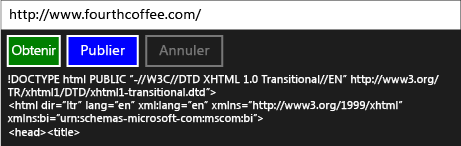

# Procédure pas à pas : connexion à l’aide de tâches et de requêtes HTTP XML

Cet exemple montre comment utiliser les interfaces [IXMLHTTPRequest2](/windows/win32/api/msxml6/nn-msxml6-ixmlhttprequest2) et [IXMLHTTPRequest2Callback](/windows/win32/api/msxml6/nn-msxml6-ixmlhttprequest2callback) avec des tâches pour envoyer des requêtes http et de publication à un service web dans une application plateforme Windows universelle (UWP). En combinant `IXMLHTTPRequest2` avec des tâches, vous pouvez écrire du code qui s’adapte à d’autres tâches. Par exemple, vous pouvez utiliser la tâche de téléchargement dans le cadre d’une chaîne des tâches. La tâche de téléchargements peut également répondre quand le travail est annulé.

> [!TIP]
> Vous pouvez également utiliser le kit de développement logiciel (SDK) REST C++ pour exécuter des requêtes HTTP à partir d’une application UWP à l’aide de l’application C++ ou d’une application de bureau C++. Pour plus d’informations, consultez [Kit de développement logiciel (SDK) C++ REST (nom de nom « Casablanca »)](https://github.com/Microsoft/cpprestsdk).

Pour plus d’informations sur les tâches, consultez [parallélisme des tâches](../../parallel/concrt/task-parallelism-concurrency-runtime.md). Pour plus d’informations sur l’utilisation des tâches dans une application UWP, consultez [programmation asynchrone en c++](/windows/uwp/threading-async/asynchronous-programming-in-cpp-universal-windows-platform-apps) et [création d’opérations asynchrones en C++ pour les applications UWP](../../parallel/concrt/creating-asynchronous-operations-in-cpp-for-windows-store-apps.md).

Ce document explique d'abord comment créer une `HttpRequest` et ses classes de prise en charge. Il montre ensuite comment utiliser cette classe à partir d’une application UWP qui utilise C++ et XAML.

Pour obtenir un exemple qui utilise `IXMLHTTPRequest2` mais n’utilise pas de tâches, consultez [démarrage rapide : connexion à l’aide de XML http request (IXMLHTTPRequest2)](/previous-versions/windows/apps/hh770550\(v=win.10\)).

> [!TIP]
> `IXMLHTTPRequest2`et `IXMLHTTPRequest2Callback` sont les interfaces que nous recommandons d’utiliser dans une application UWP. Vous pouvez également adapter cet exemple pour l'utilisation dans une application de bureau.

## Prérequis

La prise en charge UWP est facultative dans Visual Studio 2017 et versions ultérieures. Pour l’installer, ouvrez le Visual Studio Installer à partir du menu Démarrer de Windows, puis choisissez la version de Visual Studio que vous utilisez. Cliquez sur le bouton **modifier** et assurez-vous que la vignette **développement UWP** est cochée. Sous **composants facultatifs** , assurez-vous que l’option **Outils UWP C++** est cochée. Utilisez V141 pour Visual Studio 2017 ou V142 pour Visual Studio 2019.

## Définition des classes HttpRequest, HttpRequestBuffersCallback et HttpRequestStringCallback

Lorsque vous utilisez l'interface `IXMLHTTPRequest2` pour créer des requêtes Web via HTTP, vous implémentez l'interface `IXMLHTTPRequest2Callback` pour recevoir la réponse du serveur et réagir à d'autres événements. Cet exemple définit la classe `HttpRequest` pour créer des applications Web, et les classes `HttpRequestBuffersCallback` et `HttpRequestStringCallback` afin de traiter des réponses. Les classes `HttpRequestBuffersCallback` et `HttpRequestStringCallback` prennent en charge la classe `HttpRequest` ; vous travaillez uniquement avec la classe `HttpRequest` du code d'application.

Les méthodes `GetAsync`, `PostAsync` de la classe `HttpRequest` vous permettent de démarrer respectivement les opérations HTTP GET et POST. Ces méthodes utilisent la classe `HttpRequestStringCallback` pour lire la réponse du serveur comme une chaîne. Les méthodes `SendAsync` et `ReadAsync` vous permettent de transmettre un grand contenu en gros fragments. Ces méthodes retournent chaque [Concurrency :: Task](../../parallel/concrt/reference/task-class.md) pour représenter l’opération. Les méthodes `GetAsync` et `PostAsync` produisent la valeur de `task<std::wstring>`, où la partie `wstring` représente la réponse du serveur. Les méthodes `SendAsync` et `ReadAsync` produisent des valeurs `task<void>` ; ces tâches se terminent lorsque les opérations d’envoi et de lecture se terminent.

Étant donné que les `IXMLHTTPRequest2` interfaces agissent de façon asynchrone, cet exemple utilise [Concurrency :: task_completion_event](../../parallel/concrt/reference/task-completion-event-class.md) pour créer une tâche qui se termine après l’achèvement de l’objet de rappel ou annule l’opération de téléchargement. La classe `HttpRequest` crée une continuation basée sur des tâches depuis cette tâche afin de définir le résultat final. La classe `HttpRequest` utilise une continuation basée sur des tâches pour garantir que la tâche de continuation s"exécute même si la tâche précédente génère une erreur ou est annulée. Pour plus d’informations sur les continuations basées sur les tâches, consultez [parallélisme des tâches](../../parallel/concrt/task-parallelism-concurrency-runtime.md) .

Pour prendre en charge l'annulation, les classes `HttpRequest`, `HttpRequestBuffersCallback`, et `HttpRequestStringCallback` utilisent des jetons d'annulation. Les `HttpRequestBuffersCallback` `HttpRequestStringCallback` classes et utilisent la méthode [Concurrency :: cancellation_token :: register_callback](reference/cancellation-token-class.md#register_callback) pour permettre à l’événement d’achèvement de tâche de répondre à l’annulation. Ce rappel d'annulation abandonne le téléchargement. Pour plus d’informations sur l’annulation, consultez [annulation](../../parallel/concrt/exception-handling-in-the-concurrency-runtime.md#cancellation).

### Pour définir la classe HttpRequest

1. Dans le menu principal, choisissez **fichier**  >  **nouveau**  >  **projet**.

1. Utilisez le modèle **application vide C++ (Windows universel)** pour créer un projet d’application XAML vide. Cet exemple nomme le projet `UsingIXMLHTTPRequest2`.

1. Ajoutez un fichier d'en-tête au projet qui sera nommé HttpRequest.h et un fichier source nommé HttpRequest.cpp.

1. Dans pch.h, ajoutez ce code :

   [!code-cpp[concrt-using-ixhr2#1](../../parallel/concrt/codesnippet/cpp/walkthrough-connecting-using-tasks-and-xml-http-requests_1.h)]

1. Dans HttpRequest.h, ajoutez ce code :

   [!code-cpp[concrt-using-ixhr2#2](../../parallel/concrt/codesnippet/cpp/walkthrough-connecting-using-tasks-and-xml-http-requests_2.h)]

1. Dans HttpRequest.cpp, ajoutez ce code :

   [!code-cpp[concrt-using-ixhr2#3](../../parallel/concrt/codesnippet/cpp/walkthrough-connecting-using-tasks-and-xml-http-requests_3.cpp)]

## Utilisation de la classe HttpRequest dans une application UWP

Cette section montre comment utiliser la `HttpRequest` classe dans une application UWP. L'application fournit une zone d'entrée qui définit une ressource URL, et des commandes de bouton qui effectuent des opérations GET et POST, et un bouton de commande qui annule l'opération en cours.

### Pour utiliser la classe HttpRequest

1. Dans MainPage. xaml, définissez l’élément [StackPanel](/uwp/api/windows.ui.xaml.controls.stackpanel) comme suit.

   [!code-xml[concrt-using-ixhr2#A1](../../parallel/concrt/codesnippet/xaml/walkthrough-connecting-using-tasks-and-xml-http-requests_4.xaml)]

1. Dans MainPage.xaml.h, ajoutez la directive `#include`:

   [!code-cpp[concrt-using-ixhr2#A2](../../parallel/concrt/codesnippet/cpp/walkthrough-connecting-using-tasks-and-xml-http-requests_5.h)]

1. Dans MainPage. Xaml. h, ajoutez ces **`private`** variables membres à la `MainPage` classe :

   [!code-cpp[concrt-using-ixhr2#A3](../../parallel/concrt/codesnippet/cpp/walkthrough-connecting-using-tasks-and-xml-http-requests_6.h)]

1. Dans MainPage. Xaml. h, déclarez la **`private`** méthode `ProcessHttpRequest` :

   [!code-cpp[concrt-using-ixhr2#A4](../../parallel/concrt/codesnippet/cpp/walkthrough-connecting-using-tasks-and-xml-http-requests_7.h)]

1. Dans MainPage. Xaml. cpp, ajoutez les **`using`** instructions suivantes :

   [!code-cpp[concrt-using-ixhr2#A5](../../parallel/concrt/codesnippet/cpp/walkthrough-connecting-using-tasks-and-xml-http-requests_8.cpp)]

1. Dans MainPage.xaml.cpp, implémentez les méthodes `GetButton_Click`, `PostButton_Click`, et `CancelButton_Click` de la classe `MainPage`.

   [!code-cpp[concrt-using-ixhr2#A6](../../parallel/concrt/codesnippet/cpp/walkthrough-connecting-using-tasks-and-xml-http-requests_9.cpp)]

   > [!TIP]
   > Si votre application ne requiert pas la prise en charge de l’annulation, vous devez passer [Concurrency :: cancellation_token :: None](reference/cancellation-token-class.md#none) aux `HttpRequest::GetAsync` `HttpRequest::PostAsync` méthodes et.

1. Dans MainPage.xaml.cpp, implémentez la méthode `MainPage::ProcessHttpRequest`.

   [!code-cpp[concrt-using-ixhr2#A7](../../parallel/concrt/codesnippet/cpp/walkthrough-connecting-using-tasks-and-xml-http-requests_10.cpp)]

1. Dans les propriétés du projet, sous **éditeur de liens**, **Entrez**, spécifiez `shcore.lib` et `msxml6.lib` .

Voici l'application en cours d'exécution :

## Étapes suivantes

[Procédures pas à pas runtime d’accès concurrentiel](../../parallel/concrt/concurrency-runtime-walkthroughs.md)

## Voir aussi

[Parallélisme des tâches](../../parallel/concrt/task-parallelism-concurrency-runtime.md) 
[Annulation dans la bibliothèque de modèles parallèles](cancellation-in-the-ppl.md) 
[Programmation asynchrone en C++](/windows/uwp/threading-async/asynchronous-programming-in-cpp-universal-windows-platform-apps) 
[Création d’opérations asynchrones en C++ pour les applications UWP](../../parallel/concrt/creating-asynchronous-operations-in-cpp-for-windows-store-apps.md) 
[Démarrage rapide : connexion à l’aide de la requête http XML (IXMLHTTPRequest2)](/previous-versions/windows/apps/hh770550\(v=win.10\)) 
 [classe de tâche (Runtime d’accès concurrentiel)](../../parallel/concrt/reference/task-class.md) 
[Classe task_completion_event](../../parallel/concrt/reference/task-completion-event-class.md)
