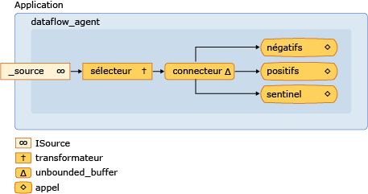

# <a name="walkthrough-creating-a-dataflow-agent"></a>Procédure pas à pas : création des agents de flux de données

Ce document montre comment créer des applications basées sur un agent basées sur un flux de données, au lieu d’un flux de contrôle.

Le *Workflow de contrôle* fait référence à l’ordre d’exécution des opérations dans un programme. Le contrôle de workflow est régi par l’utilisation de structures de contrôle telles que des instructions conditionnelles, des boucles, etc. Le *flux* de données fait également référence à un modèle de programmation dans lequel les calculs sont effectués uniquement lorsque toutes les données requises sont disponibles. Le modèle de programmation de flux de données est lié au concept de passage de message, dans lequel les composants indépendants d’un programme communiquent les uns avec les autres en envoyant des messages.

Les agents asynchrones prennent en charge les modèles de programmation de flux de contrôle et de flux de données. Bien que le modèle de flux de contrôle soit approprié dans de nombreux cas, le modèle de flux de données est approprié dans d’autres cas, par exemple, lorsqu’un agent reçoit des données et effectue une action basée sur la charge utile de ces données.

## <a name="prerequisites"></a>Conditions préalables requises

Lisez les documents suivants avant de commencer cette procédure pas à pas :

- [Agents asynchrones](../../parallel/concrt/asynchronous-agents.md)

- [Blocs de messages asynchrones](../../parallel/concrt/asynchronous-message-blocks.md)

- [Guide pratique pour utiliser un filtre de bloc de message](../../parallel/concrt/how-to-use-a-message-block-filter.md)

## <a name="top"></a> Sections

Cette procédure pas à pas contient les sections suivantes :

- [Création d’un agent de contrôle de workflow de base](#control-flow)

- [Création d’un agent de flux de données de base](#dataflow)

- [Création d’un agent de journalisation des messages](#logging)

## <a name="control-flow"></a>Création d’un agent de contrôle de workflow de base

Prenons l’exemple suivant qui définit la classe `control_flow_agent`. La classe `control_flow_agent` agit sur trois mémoires tampons de messages : une mémoire tampon d’entrée et deux mémoires tampons de sortie. La méthode `run` lit à partir de la mémoire tampon du message source dans une boucle et utilise une instruction conditionnelle pour diriger le déroulement de l’exécution du programme. L’agent incrémente un compteur pour les valeurs négatives non nulles et incrémente un autre compteur pour les valeurs positives non nulles. Une fois que l’agent a reçu la valeur de sentinelle zéro, il envoie les valeurs des compteurs aux tampons de messages de sortie. Les méthodes `negatives` et `positives` permettent à l’application de lire le nombre de valeurs négatives et positives de l’agent.

[!code-cpp[concrt-dataflow-agent#1](../../parallel/concrt/codesnippet/cpp/walkthrough-creating-a-dataflow-agent_1.cpp)]

Bien que cet exemple utilise le circuit de contrôle d’un agent, il démontre la nature série de la programmation basée sur le contrôle du Workflow. Chaque message doit être traité de manière séquentielle, même si plusieurs messages peuvent être disponibles dans la mémoire tampon des messages d’entrée. Le modèle de flux de données permet d’évaluer simultanément les deux branches de l’instruction conditionnelle. Le modèle de flux de données vous permet également de créer des réseaux de messagerie plus complexes qui agissent sur les données dès qu’elles sont disponibles.

[[Haut](#top)]

## <a name="dataflow"></a>Création d’un agent de flux de données de base

Cette section montre comment convertir la classe `control_flow_agent` pour utiliser le modèle de flux de données pour effectuer la même tâche.

L’agent de flux de données fonctionne en créant un réseau de mémoires tampons de messages, qui remplit chacune un rôle spécifique. Certains blocs de messages utilisent une fonction de filtre pour accepter ou rejeter un message en fonction de sa charge utile. Une fonction de filtre garantit qu’un bloc de message reçoit uniquement certaines valeurs.

#### <a name="to-convert-the-control-flow-agent-to-a-dataflow-agent"></a>Pour convertir l’agent de flux de contrôle en agent de flux de données

1. Copiez le corps de la classe `control_flow_agent` dans une autre classe, par exemple, `dataflow_agent`. Vous pouvez également renommer la classe `control_flow_agent`.

1. Supprimez le corps de la boucle qui appelle `receive` à partir de la méthode `run`.

[!code-cpp[concrt-dataflow-agent#2](../../parallel/concrt/codesnippet/cpp/walkthrough-creating-a-dataflow-agent_2.cpp)]

1. Dans la méthode `run`, après l’initialisation des variables `negative_count` et `positive_count`, ajoutez un objet `countdown_event` qui effectue le suivi du nombre d’opérations actives.

[!code-cpp[concrt-dataflow-agent#6](../../parallel/concrt/codesnippet/cpp/walkthrough-creating-a-dataflow-agent_3.cpp)]

   La classe `countdown_event` est présentée plus loin dans cette rubrique.

1. Créez les objets de mémoire tampon de message qui feront partie du réseau de flux de données.

[!code-cpp[concrt-dataflow-agent#3](../../parallel/concrt/codesnippet/cpp/walkthrough-creating-a-dataflow-agent_4.cpp)]

1. Connectez les tampons de messages pour former un réseau.

[!code-cpp[concrt-dataflow-agent#4](../../parallel/concrt/codesnippet/cpp/walkthrough-creating-a-dataflow-agent_5.cpp)]

1. Attendez que les objets `event` et `countdown event` soient définis. Ces événements indiquent que l’agent a reçu la valeur de sentinelle et que toutes les opérations sont terminées.

[!code-cpp[concrt-dataflow-agent#5](../../parallel/concrt/codesnippet/cpp/walkthrough-creating-a-dataflow-agent_6.cpp)]

Le diagramme suivant montre le réseau de flux de données complet pour la classe `dataflow_agent` :



Le tableau ci-dessous décrit les membres du réseau.

|Membre|Description|
|------------|-----------------|
|`increment_active`|Objet [Concurrency :: transformer](../../parallel/concrt/reference/transformer-class.md) qui incrémente le compteur d’événements actifs et passe la valeur d’entrée au reste du réseau.|
|`negatives`, `positives`|[Concurrency :: Call](../../parallel/concrt/reference/call-class.md) , qui incrémente le nombre de nombres et décrémente le compteur d’événements actifs. Les objets utilisent chacun un filtre pour accepter des nombres négatifs ou des nombres positifs.|
|`sentinel`|Objet [Concurrency :: Call](../../parallel/concrt/reference/call-class.md) qui accepte uniquement la valeur de sentinelle égale à zéro et décrémente le compteur d’événements actifs.|
|`connector`|Objet [Concurrency :: unbounded_buffer](reference/unbounded-buffer-class.md) qui connecte la mémoire tampon du message source au réseau interne.|

Étant donné que la méthode `run` est appelée sur un thread distinct, les autres threads peuvent envoyer des messages au réseau avant que le réseau soit entièrement connecté. Le membre de données `_source` est un objet `unbounded_buffer` qui met en mémoire tampon toutes les entrées envoyées de l’application à l’agent. Pour vous assurer que le réseau traite tous les messages d’entrée, l’agent lie d’abord les nœuds internes du réseau, puis lie le démarrage de ce réseau, `connector`, au membre de données `_source`. Cela garantit que les messages ne sont pas traités au fur et à mesure que le réseau est formé.

Étant donné que le réseau dans cet exemple est basé sur le flux de données, plutôt que sur le flux de contrôle, le réseau doit communiquer à l’agent qu’il a terminé de traiter chaque valeur d’entrée et que le nœud Sentinel a reçu sa valeur. Cet exemple utilise un objet `countdown_event` pour signaler que toutes les valeurs d’entrée ont été traitées et un objet [Concurrency :: Event](../../parallel/concrt/reference/event-class.md) pour indiquer que le nœud Sentinel a reçu sa valeur. La classe `countdown_event` utilise un objet `event` pour signaler quand une valeur de compteur atteint zéro. Le début du réseau de flux de données incrémente le compteur chaque fois qu’il reçoit une valeur. Chaque nœud de terminal du réseau décrémente le compteur après avoir traité la valeur d’entrée. Une fois que l’agent forme le réseau de flux de données, il attend que le nœud de sentinelle définisse l’objet `event` et que l’objet `countdown_event` signale que son compteur a atteint zéro.

L’exemple suivant montre les classes `control_flow_agent`, `dataflow_agent`et `countdown_event`. La fonction `wmain` crée un `control_flow_agent` et un objet `dataflow_agent` et utilise la fonction `send_values` pour envoyer une série de valeurs aléatoires aux agents.

[!code-cpp[concrt-dataflow-agent#7](../../parallel/concrt/codesnippet/cpp/walkthrough-creating-a-dataflow-agent_7.cpp)]

Cet exemple produit l’exemple de sortie suivant :

```Output
Control-flow agent:
There are 500523 negative numbers.
There are 499477 positive numbers.
Dataflow agent:
There are 500523 negative numbers.
There are 499477 positive numbers.
```

### <a name="compiling-the-code"></a>Compilation du code

Copiez l’exemple de code et collez-le dans un projet Visual Studio, ou collez-le dans un fichier nommé `dataflow-agent.cpp` puis exécutez la commande suivante dans une fenêtre d’invite de commandes Visual Studio.

**CL. exe/EHsc DataFlow-agent. cpp**

[[Haut](#top)]

## <a name="logging"></a>Création d’un agent de journalisation des messages

L’exemple suivant illustre la classe `log_agent`, qui ressemble à la classe `dataflow_agent`. La classe `log_agent` implémente un agent de journalisation asynchrone qui écrit des messages de journal dans un fichier et dans la console. La classe `log_agent` permet à l’application de classer les messages en tant qu’information, avertissement ou erreur. Elle permet également à l’application de spécifier si chaque catégorie de journal est écrite dans un fichier, la console, ou les deux. Cet exemple écrit tous les messages de journal dans un fichier et uniquement les messages d’erreur dans la console.

[!code-cpp[concrt-log-filter#1](../../parallel/concrt/codesnippet/cpp/walkthrough-creating-a-dataflow-agent_8.cpp)]

Cet exemple écrit la sortie suivante dans la console.

```Output
error: This is a sample error message.
```

Cet exemple génère également le fichier log. txt, qui contient le texte suivant.

```Output
info: ===Logging started.===
warning: This is a sample warning message.
error: This is a sample error message.
info: ===Logging finished.===
```

### <a name="compiling-the-code"></a>Compilation du code

Copiez l’exemple de code et collez-le dans un projet Visual Studio, ou collez-le dans un fichier nommé `log-filter.cpp` puis exécutez la commande suivante dans une fenêtre d’invite de commandes Visual Studio.

**CL. exe/EHsc log-Filter. cpp**

[[Haut](#top)]

## <a name="see-also"></a>Voir aussi

[Procédures pas à pas relatives au runtime d’accès concurrentiel](../../parallel/concrt/concurrency-runtime-walkthroughs.md)
