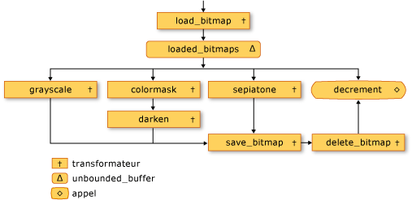
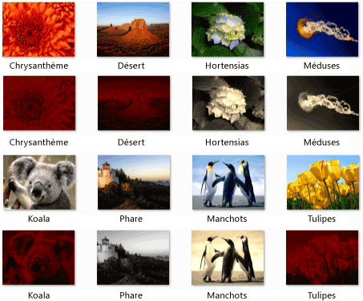

# Procédure pas à pas : Création d’un réseau de traitement d’Image

Ce document montre comment créer un réseau de blocs de messages asynchrones qui effectuent le traitement d’image.

Le réseau détermine les opérations à effectuer sur une image, en fonction de ses caractéristiques. Cet exemple utilise le *flux de données* modèle pour acheminer les images via le réseau. Dans le modèle de flux de données, les composants indépendants d’un programme communiquent entre eux en envoyant des messages. Lorsqu’un composant reçoit un message, il peut effectuer une action, puis passer le résultat de cette action à un autre composant. Comparez cela avec le *flux de contrôle* modèle, dans lequel une application utilise des structures de contrôle, par exemple, les instructions conditionnelles, les boucles et ainsi de suite, pour contrôler l’ordre des opérations dans un programme.

Un réseau basé sur les flux de données crée un *pipeline* de tâches. Chaque étape du pipeline effectue simultanément une partie de la tâche globale. Ce processus s'apparente à une chaîne de montage en construction automobile. Comme chaque véhicule passe via la ligne de montage, un poste assemble le châssis, un autre installe le moteur et ainsi de suite. En activant plusieurs véhicules d’être assemblés en même temps, la ligne de l’assembly fournit une productivité supérieure à l’assemblage des véhicules celui à la fois.

## Prérequis

Lisez les documents suivants avant de commencer cette procédure pas à pas :

- [Blocs de messages asynchrones](../../parallel/concrt/asynchronous-message-blocks.md)

- [Guide pratique pour utiliser un filtre de bloc de message](../../parallel/concrt/how-to-use-a-message-block-filter.md)

- [Procédure pas à pas : création d’un agent de flux de données](../../parallel/concrt/walkthrough-creating-a-dataflow-agent.md)

Nous vous recommandons également de comprendre les principes fondamentaux de GDI + avant de commencer cette procédure pas à pas.

##   Sections

Cette procédure pas à pas contient les sections suivantes :

- [Définition des fonctionnalités de traitement d’images](#functionality)

- [Création du réseau de traitement d’Image](#network)

- [Exemple complet](#complete)

##   Définition des fonctionnalités de traitement d’images

Cette section présente les fonctions de prise en charge par le réseau de traitement d’image pour travailler avec des images qui sont lus à partir du disque.

Les fonctions suivantes, `GetRGB` et `MakeColor`, extraire et combiner des composants individuels de la couleur donnée, respectivement.

[!code-cpp[concrt-image-processing-filter#2](../../parallel/concrt/codesnippet/cpp/walkthrough-creating-an-image-processing-network_1.cpp)]

La fonction suivante, `ProcessImage`, appelle la donnée [std::function](../../standard-library/function-class.md) objet à transformer la valeur de couleur de chaque pixel dans GDI + [Bitmap](/windows/desktop/api/gdiplusheaders/nl-gdiplusheaders-bitmap) objet. Le `ProcessImage` fonction utilise le [concurrency::parallel_for](reference/concurrency-namespace-functions.md#parallel_for) algorithme pour traiter chaque ligne de l’image bitmap en parallèle.

[!code-cpp[concrt-image-processing-filter#3](../../parallel/concrt/codesnippet/cpp/walkthrough-creating-an-image-processing-network_2.cpp)]

Les fonctions suivantes, `Grayscale`, `Sepiatone`, `ColorMask`, et `Darken`, appelez le `ProcessImage` fonction permettant de transformer la valeur de couleur de chaque pixel dans un `Bitmap` objet. Chacune de ces fonctions utilise une expression lambda pour définir la transformation de la couleur d’un pixel.

[!code-cpp[concrt-image-processing-filter#4](../../parallel/concrt/codesnippet/cpp/walkthrough-creating-an-image-processing-network_3.cpp)]

La fonction suivante, `GetColorDominance`, appelle également la `ProcessImage` (fonction). Toutefois, au lieu de modifier la valeur de chaque couleur, cette fonction utilise [concurrency::combinable](../../parallel/concrt/reference/combinable-class.md) objets pour calculer si le composant de couleur rouge, vert ou bleu domine l’image.

[!code-cpp[concrt-image-processing-filter#5](../../parallel/concrt/codesnippet/cpp/walkthrough-creating-an-image-processing-network_4.cpp)]

La fonction suivante, `GetEncoderClsid`, récupère l’identificateur de classe pour le type MIME donné d’un encodeur. L’application utilise cette fonction pour extraire l’encodeur pour une image bitmap.

[!code-cpp[concrt-image-processing-filter#6](../../parallel/concrt/codesnippet/cpp/walkthrough-creating-an-image-processing-network_5.cpp)]

[[Haut](#top)]

##   Création du réseau de traitement d’Image

Cette section décrit comment créer un réseau de blocs de messages asynchrones qui effectuent le traitement d’images sur chaque image JPEG (.jpg) dans un répertoire donné. Le réseau effectue les opérations de traitement d’image suivantes :

1. Pour toute image qui est créée par Tom, convertir en nuances de gris.

1. Pour toute image qui est le rouge comme couleur dominante, supprimer les composants verts et bleus, puis l’assombrir.

1. Pour toute autre image, appliquer le ton sépia.

Le réseau s’applique uniquement la première opération de traitement d’image qui correspond à l’une de ces conditions. Par exemple, si une image est créée par Tom et rouge comme couleur dominante, etc., l’image est uniquement convertie en nuances de gris.

Une fois que le réseau effectue chaque opération de traitement d’image, elle enregistre l’image sur le disque sous forme de fichier bitmap (.bmp).

Les étapes suivantes montrent comment créer une fonction qui implémente ce réseau de traitement d’images et applique ce réseau à chaque image JPEG dans un répertoire donné.

#### Pour créer le réseau de traitement d’image

1. Créer une fonction, `ProcessImages`, qui prend le nom d’un répertoire sur le disque.

   [!code-cpp[concrt-image-processing-filter#7](../../parallel/concrt/codesnippet/cpp/walkthrough-creating-an-image-processing-network_6.cpp)]

1. Dans le `ProcessImages` de fonction, créez un `countdown_event` variable. Le `countdown_event` classe est illustrée plus loin dans cette procédure pas à pas.

   [!code-cpp[concrt-image-processing-filter#8](../../parallel/concrt/codesnippet/cpp/walkthrough-creating-an-image-processing-network_7.cpp)]

1. Créer un [std::map](../../standard-library/map-class.md) objet associe un `Bitmap` objet avec son nom de fichier d’origine.

   [!code-cpp[concrt-image-processing-filter#9](../../parallel/concrt/codesnippet/cpp/walkthrough-creating-an-image-processing-network_8.cpp)]

1. Ajoutez le code suivant pour définir les membres du réseau de traitement d’image.

   [!code-cpp[concrt-image-processing-filter#10](../../parallel/concrt/codesnippet/cpp/walkthrough-creating-an-image-processing-network_9.cpp)]

1. Ajoutez le code suivant pour connecter le réseau.

   [!code-cpp[concrt-image-processing-filter#11](../../parallel/concrt/codesnippet/cpp/walkthrough-creating-an-image-processing-network_10.cpp)]

1. Ajoutez le code suivant pour envoyer le chemin d’accès complet de chaque fichier JPEG à la tête du réseau dans le répertoire.

   [!code-cpp[concrt-image-processing-filter#12](../../parallel/concrt/codesnippet/cpp/walkthrough-creating-an-image-processing-network_11.cpp)]

1. Attendez que le `countdown_event` variable atteigne la valeur zéro.

   [!code-cpp[concrt-image-processing-filter#13](../../parallel/concrt/codesnippet/cpp/walkthrough-creating-an-image-processing-network_12.cpp)]

Le tableau ci-dessous décrit les membres du réseau.

|Membre|Description|
|------------|-----------------|
|`load_bitmap`|Un [concurrency::transformer](../../parallel/concrt/reference/transformer-class.md) objet qui charge un `Bitmap` de l’objet à partir du disque et ajoute une entrée à la `map` objet à associer l’image à son nom de fichier d’origine.|
|`loaded_bitmaps`|Un [concurrency::unbounded_buffer](reference/unbounded-buffer-class.md) objet qui envoie les images chargées aux filtres de traitement d’image.|
|`grayscale`|Un `transformer` objet qui convertit les images créées par Tom en nuances de gris. Il utilise les métadonnées de l’image pour déterminer son auteur.|
|`colormask`|Un `transformer` objet qui supprime les composants de couleur vert et bleu à partir d’images qui ont le rouge comme couleur dominante.|
|`darken`|Un `transformer` objet assombrit les images qui ont le rouge comme couleur dominante.|
|`sepiatone`|Un `transformer` objet qui applique le ton sépia aux images qui ne sont pas créées par Tom et ne sont pas principalement en rouge.|
|`save_bitmap`|Un `transformer` objet qui enregistre le traité `image` sur le disque sous forme de bitmap. `save_bitmap` Récupère le nom de fichier d’origine à partir de la `map` de l’objet et remplace son extension de nom de fichier .bmp.|
|`delete_bitmap`|Un `transformer` objet qui libère la mémoire pour les images.|
|`decrement`|Un [concurrency::call](../../parallel/concrt/reference/call-class.md) objet qui joue le rôle du nœud terminal dans le réseau. Il décrémente le `countdown_event` objet pour signaler à l’application principale qu’une image a été traitée.|

Le `loaded_bitmaps` tampon de messages est important car, comme un `unbounded_buffer` de l’objet, il offre `Bitmap` objets à plusieurs destinataires. Lorsqu’un bloc cible accepte un `Bitmap` objet, le `unbounded_buffer` objet n’offre pas qui `Bitmap` objet à d’autres cibles. Par conséquent, l’ordre dans lequel vous liez les objets à un `unbounded_buffer` objet est important. Le `grayscale`, `colormask`, et `sepiatone` message blocs chaque utilisent un filtre pour accepter uniquement certaines `Bitmap` objets. Le `decrement` tampon de messages est une cible importante de la `loaded_bitmaps` mémoire tampon des messages, car il accepte tous les `Bitmap` les objets qui ont été rejetés par les autres mémoires tampons de messages. Un `unbounded_buffer` objet est nécessaire pour propager des messages dans l’ordre. Par conséquent, un `unbounded_buffer` objet bloque jusqu'à ce qu’un nouveau bloc de cible est lié et accepte le message si aucun bloc cible actuelles n’accepte ce message.

Si votre application nécessite ce message plusieurs bloque le traitement du message, au lieu de simplement le bloc d’un message qui accepte tout d’abord le message, vous pouvez utiliser un autre type de bloc de message, tel que `overwrite_buffer`. Le `overwrite_buffer` classe contient un message à la fois, mais elle propage ce message à chacun de ses cibles.

L’illustration suivante montre le réseau de traitement des images :

Le `countdown_event` objet dans cet exemple active le réseau de traitement d’image informer l’application principale lorsque toutes les images ont été traitées. Le `countdown_event` classe utilise un [concurrency::event](../../parallel/concrt/reference/event-class.md) objet pour signaler quand une valeur de compteur atteint zéro. L’application principale incrémente le compteur chaque fois qu’il envoie un nom de fichier pour le réseau. Le nœud de terminaison du réseau décrémente le compteur après le traitement de chaque image. Une fois que l’application principale parcourt le répertoire spécifié, il attend que le `countdown_event` objet signale que son compteur a atteint zéro.

L’exemple suivant montre la `countdown_event` classe :

[!code-cpp[concrt-image-processing-filter#14](../../parallel/concrt/codesnippet/cpp/walkthrough-creating-an-image-processing-network_13.cpp)]

[[Haut](#top)]

##   L’exemple complet

L'exemple de code suivant illustre l'exemple complet. Le `wmain` fonction gère la bibliothèque GDI + et appelle le `ProcessImages` fonction pour traiter le JPEG de fichiers dans le `Sample Pictures` directory.

[!code-cpp[concrt-image-processing-filter#15](../../parallel/concrt/codesnippet/cpp/walkthrough-creating-an-image-processing-network_14.cpp)]

L’illustration suivante montre un exemple de sortie. Chaque image source se situe au-dessus de son image modifiée correspondante.

`Lighthouse` est créée par Tom Alphin et par conséquent, est convertie en nuances de gris. `Chrysanthemum`, `Desert`, `Koala`, et `Tulips` ont rouge comme couleur dominante et par conséquent, les composants de couleur bleue et verte supprimés et sont assombrir. `Hydrangeas`, `Jellyfish`, et `Penguins` correspondent aux critères par défaut et sont par conséquent sépia tons.

[[Haut](#top)]

### Compilation du code

Copiez l’exemple de code et collez-le dans un projet Visual Studio ou collez-le dans un fichier nommé `image-processing-network.cpp` , puis exécutez la commande suivante dans une fenêtre d’invite de commandes Visual Studio.

**cl.exe /DUNICODE /EHsc image-processing-network.cpp /link gdiplus.lib**

## Voir aussi

[Procédures pas à pas relatives au runtime d’accès concurrentiel](../../parallel/concrt/concurrency-runtime-walkthroughs.md)
