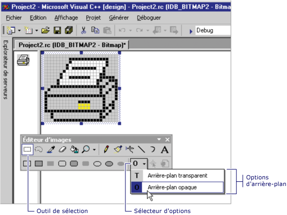

# Comment : utiliser la couleur

L' **éditeur d’images** contient de nombreuses fonctionnalités qui gèrent et personnalisent spécifiquement les couleurs. Vous pouvez définir une couleur de premier plan ou d’arrière-plan, remplir des zones délimitées avec des couleurs ou sélectionner une couleur dans une image à utiliser comme couleur de premier plan ou d’arrière-plan actuelle. Vous pouvez utiliser les outils de la [barre d’outils](./image-editor-for-icons.md) de l’éditeur d’images, ainsi que la palette de couleurs de la fenêtre **couleurs** pour créer des images.

Toutes les couleurs des images monochrome et 16 couleurs sont affichées dans la palette de **couleurs** de la fenêtre **couleurs** . Avec les 16 couleurs standard, vous pouvez créer vos propres couleurs personnalisées. La modification de l’une des couleurs de la palette modifie immédiatement la couleur correspondante dans l’image.

Lorsque vous utilisez des images d’icône de couleur et de curseur 256, la propriété **couleurs** dans le [fenêtre Propriétés](/visualstudio/ide/reference/properties-window) est utilisée. Pour plus d’informations, consultez [création d’une icône ou d’un curseur de couleur 256](./creating-an-icon-or-other-image-image-editor-for-icons.md).

Il est également possible de créer des images en couleurs vraies. Toutefois, les exemples de couleurs vraies n’apparaissent pas dans la palette complète de la fenêtre **couleurs** ; elles s’affichent uniquement dans la zone d’indicateur de couleur de premier plan ou d’arrière-plan. Les couleurs vraies sont créées à l’aide de la boîte de dialogue **Sélecteur de couleurs personnalisées** .

Vous pouvez enregistrer les palettes de couleurs personnalisées sur le disque et les recharger en fonction des besoins. La palette de couleurs que vous avez utilisée le plus récemment est enregistrée dans le registre et chargée automatiquement la prochaine fois que vous démarrez Visual Studio.

La fenêtre **couleurs** comporte deux parties :

- La **palette de couleurs**, qui est un tableau d’échantillons de couleurs qui représentent les couleurs que vous pouvez utiliser. Vous pouvez sélectionner les exemples pour choisir les couleurs de premier plan et d’arrière-plan lorsque vous utilisez les outils Graphics.

- **Indicateur de couleur**, qui affiche les couleurs de premier plan et d’arrière-plan et les sélecteurs pour l’écran et la couleur inverse.

    
   Fenêtre **couleurs**

> [!NOTE]
> Les outils **couleur d’écran** et **couleur inverse** sont uniquement disponibles pour les icônes et les curseurs.

Vous pouvez utiliser la fenêtre **couleurs** avec la [barre d’outils de l’éditeur d’images](./image-editor-for-icons.md).

- Pour afficher la fenêtre **couleurs** , cliquez avec le bouton droit dans un volet de l' **éditeur d’images** et choisissez afficher la fenêtre des **couleurs**, ou accédez à l' [image](./image-editor-for-icons.md)de menu Afficher les  >  **couleurs (fenêtre**).

- Pour masquer la fenêtre **couleurs** , Désépinglez la fenêtre (cette action permet à la fenêtre de se Masquer automatiquement lorsqu’elle n’est pas utilisée) ou sélectionnez le bouton **Fermer** .

La palette de **couleurs** affiche initialement 16 couleurs standard. Avec les couleurs affichées, vous pouvez également créer vos propres couleurs personnalisées. Vous pouvez ensuite enregistrer et charger une palette de couleurs personnalisées.

La boîte de dialogue **Sélecteur de couleurs personnalisé** vous permet de personnaliser les couleurs que vous utilisez pour votre image avec les propriétés suivantes :

|Propriété|Description|
|--------------------------|--------------------------|
|**Affichage des couleurs de dégradé**|Modifie les valeurs d’une couleur sélectionnée.  Placez le réticule sur la couleur que vous souhaitez modifier et déplacez le curseur vers le haut ou vers le haut pour modifier la luminosité ou les valeurs RVB de la couleur.|
|**Barre de luminosité**|Définit la luminosité de la couleur que vous sélectionnez dans la zone d' **affichage couleur de dégradé** .  Sélectionnez et faites glisser la flèche blanche vers le haut de la barre pour augmenter ou diminuer la luminosité. La zone de **couleur** affiche la couleur que vous avez sélectionnée et l’effet de la luminosité que vous avez définie.|
|**Couleur**|Répertorie la teinte (valeur de la roue chromatique) de la couleur que vous définissez. Les valeurs sont comprises entre 0 et 240, où 0 est rouge, 60 est jaune, 120 est vert, 180 est cyan, 200 est magenta et 240 est bleu.|
|**Teinte**|Répertorie la teinte (valeur de la roue chromatique) de la couleur que vous définissez. Les valeurs sont comprises entre 0 et 240, où 0 est rouge, 60 est jaune, 120 est vert, 180 est cyan, 200 est magenta et 240 est bleu.|
|**Sam**|Spécifie la valeur de saturation de la couleur que vous définissez. La saturation correspond à la quantité de couleur dans une teinte spécifiée. Les valeurs sont comprises entre 0 et 240.|
|**Lum**|Répertorie la luminosité (luminosité) de la couleur que vous définissez. Les valeurs sont comprises entre 0 et 240.|
|**Rouge**|Spécifie la valeur rouge de la couleur que vous définissez. Les valeurs sont comprises entre 0 et 255.|
|**Vert**|Spécifie la valeur verte de la couleur que vous définissez. Les valeurs sont comprises entre 0 et 255.|
|**Bleu**|Spécifie la valeur bleue de la couleur que vous définissez. Les valeurs sont comprises entre 0 et 255.|

Vous pouvez enregistrer et charger une palette de **couleurs** qui contient des couleurs personnalisées. Par défaut, la palette de **couleurs** la plus récemment utilisée est chargée automatiquement lorsque vous démarrez Visual Studio.

> [!TIP]
> Étant donné que l' **éditeur d’images** n’a aucun moyen de restaurer la palette de **couleurs** par défaut, vous devez enregistrer la palette de **couleurs** par défaut sous un nom tel que *standard. PAL* ou *default. PAL* pour pouvoir restaurer facilement les paramètres par défaut.

Utilisez la boîte de dialogue **charger la palette de couleurs** pour charger des palettes de couleurs spéciales à utiliser dans votre projet C++ avec les propriétés suivantes :

|Propriété|Description|
|-----------------|-----------------|
|**Look in**|Spécifie l’emplacement où vous souhaitez rechercher un fichier ou un dossier.  Sélectionnez la flèche pour choisir un autre emplacement ou sélectionnez l’icône de dossier dans la barre d’outils pour déplacer les niveaux vers le haut.|
|**Nom de fichier**|Offre un espace vous permettant de taper le nom du fichier que vous souhaitez ouvrir.  Pour trouver rapidement un fichier que vous avez ouvert précédemment, sélectionnez le nom de fichier dans la liste déroulante, s’il est disponible.  Si vous recherchez un fichier, vous pouvez utiliser des astérisques (*) comme caractères génériques. Par exemple, vous pouvez taper \* . \* pour afficher la liste de tous les fichiers. Vous pouvez également taper le chemin d’accès complet d’un fichier, par exemple, *C:\Mes Documents\MyColorPalette.PAL* ou *\\ \NetworkServer\MyFolder\MyColorPalette.PAL*.|
|**Type de fichiers**|Répertorie les types de fichiers à afficher.  Palette (*. PAL) est le type de fichier par défaut pour les palettes de couleurs.|

## Procédure

### Pour sélectionner les couleurs de premier plan ou d’arrière-plan

À l’exception de la **gomme**, les outils de la barre d’outils de l' **éditeur d’images** dessinent avec la couleur de premier plan ou d’arrière-plan actuelle lorsque vous appuyez respectivement sur le bouton gauche ou droit de la souris.

- Pour sélectionner une couleur de premier plan, avec le bouton gauche de la souris, sélectionnez la couleur souhaitée dans la palette de **couleurs** .

- Pour sélectionner une couleur d’arrière-plan, avec le bouton droit de la souris, sélectionnez la couleur souhaitée dans la palette de **couleurs** .

### Pour remplir une zone délimitée d’une image avec une couleur

L' **éditeur d’images** fournit l’outil de **remplissage** pour remplir toute zone d’image incluse avec la couleur de dessin actuelle ou la couleur d’arrière-plan actuelle.

### Pour utiliser l’outil remplissage

1. Utilisez la barre d’outils de l' **éditeur d’images** ou accédez à menu   >  **Outils** image et sélectionnez l’outil **remplissage** .

1. Si nécessaire, choisissez couleurs de dessin. Dans la [palette de couleurs](./image-editor-for-icons.md), sélectionnez le bouton gauche de la souris pour sélectionner une couleur de premier plan ou le bouton droit de la souris pour sélectionner une couleur d’arrière-plan.

1. Déplacez l’outil de **remplissage** vers la zone à remplir.

1. Sélectionnez le bouton gauche ou droit de la souris pour remplir respectivement la couleur de premier plan ou la couleur d’arrière-plan.

### Pour sélectionner une couleur d’une image à utiliser ailleurs

L’outil **Sélectionner une couleur** ou un sélecteur de couleurs permet d’apporter à toute couleur de l’image la couleur de premier plan ou d’arrière-plan actuelle, selon que vous appuyez sur le bouton gauche ou droit de la souris. Pour annuler l’outil **Sélectionner une couleur** , choisissez un autre outil.

1. Utilisez la barre d’outils de l' **éditeur d’images** ou accédez à menu   >  **Outils** image et sélectionnez l’outil **Sélectionner une couleur** .

1. Sélectionnez la couleur que vous souhaitez sélectionner dans l’image.

   > [!NOTE]
   > Une fois que vous avez sélectionné une couleur, l' **éditeur d’images** réactive l’outil le plus récemment utilisé.

1. Dessinez à l’aide du bouton gauche de la souris pour la couleur de premier plan ou du bouton droit de la souris pour la couleur d’arrière-plan.

### Pour choisir l’arrière-plan

Lorsque vous déplacez ou copiez une sélection à partir d’une image, les pixels de la sélection qui correspondent à la couleur d’arrière-plan actuelle sont, par défaut, transparents et ne masquent pas les pixels dans l’emplacement cible.

Vous pouvez passer d’un arrière-plan transparent (par défaut) à un arrière-plan opaque, puis revenir en arrière. Lorsque vous utilisez un outil de sélection, l' **arrière-plan transparent** et les options d' **arrière-plan opaques** s’affichent dans le sélecteur d' **options** de la barre d’outils de l' **éditeur d’images** .

 
**Options transparentes et opaques** dans la **barre d’outils de l’éditeur d’images**

#### Pour basculer entre un arrière-plan transparent et opaque

Dans la barre d’outils de l' **éditeur d’images** , sélectionnez le sélecteur d' **options** , puis choisissez l’arrière-plan approprié :

- **Arrière-plan opaque (O)**: l’image existante est masquée par toutes les parties de la sélection.

- **Arrière-plan transparent (T)**: l’image existante s’affiche à travers les parties de la sélection qui correspondent à la couleur d’arrière-plan actuelle.

> [!TIP]
> Pour un raccourci, dans le menu **image** , sélectionnez ou désactivez **dessin opaque**.

Vous pouvez modifier la couleur d’arrière-plan lorsqu’une sélection est déjà en vigueur pour changer les parties de l’image qui sont transparentes.

### Pour inverser les couleurs dans une sélection

L' **éditeur d’images** offre un moyen pratique d’inverser les couleurs dans la partie sélectionnée de l’image, ce qui vous permet de savoir comment une image s’affiche avec les couleurs inversées.

Pour inverser les couleurs dans la sélection actuelle, accédez à **image** menu  >  **inverser les couleurs**.

### Pour personnaliser ou modifier les couleurs de la palette de couleurs

1. Accédez à **image** du menu  >  **ajuster les couleurs**.

1. Dans la boîte de dialogue **Sélecteur de couleurs personnalisées** , définissez la couleur en tapant des valeurs RVB ou TSL dans les zones de texte appropriées ou choisissez une couleur dans la zone d' **affichage couleur de dégradé** .

1. Définissez la luminosité en déplaçant le curseur sur la barre de **luminosité** .

1. De nombreuses couleurs personnalisées sont tramées. Si vous voulez la couleur unie la plus proche de la couleur démultipliée, double-cliquez sur la zone **couleur** .

   Si vous décidez par la suite de choisir la couleur tramée, déplacez le curseur sur la barre de **luminosité** ou déplacez le réticule dans la zone d' **affichage des couleurs de dégradé** pour restaurer le tramage.

1. Sélectionnez **OK** pour ajouter la nouvelle couleur.

### Pour enregistrer une palette de couleurs personnalisées

1. Accédez à menu **image**  >  **enregistrer la palette**.

1. Accédez au répertoire où vous souhaitez enregistrer la palette, puis tapez le nom de cette dernière.

1. Sélectionnez **Enregistrer**.

### Pour charger une palette de couleurs personnalisées

1. Accédez à menu **image**  >  **charger la palette**.

1. Dans la boîte de dialogue **charger la palette de couleurs** , accédez au répertoire approprié, puis sélectionnez la palette que vous souhaitez charger. Les palettes de **couleurs** sont enregistrées avec l’extension de fichier. PAL.

## Spécifications

None

## Voir aussi

[Éditeur d’images pour les icônes](../windows/image-editor-for-icons.md) 
[Comment : créer une icône ou une autre image](../windows/creating-an-icon-or-other-image-image-editor-for-icons.md) 
[Comment : modifier une image](../windows/selecting-an-area-of-an-image-image-editor-for-icons.md) 
[Comment : utiliser un outil de dessin](../windows/using-a-drawing-tool-image-editor-for-icons.md) 
[Touches accélérateur](../windows/accelerator-keys-image-editor-for-icons.md) 
